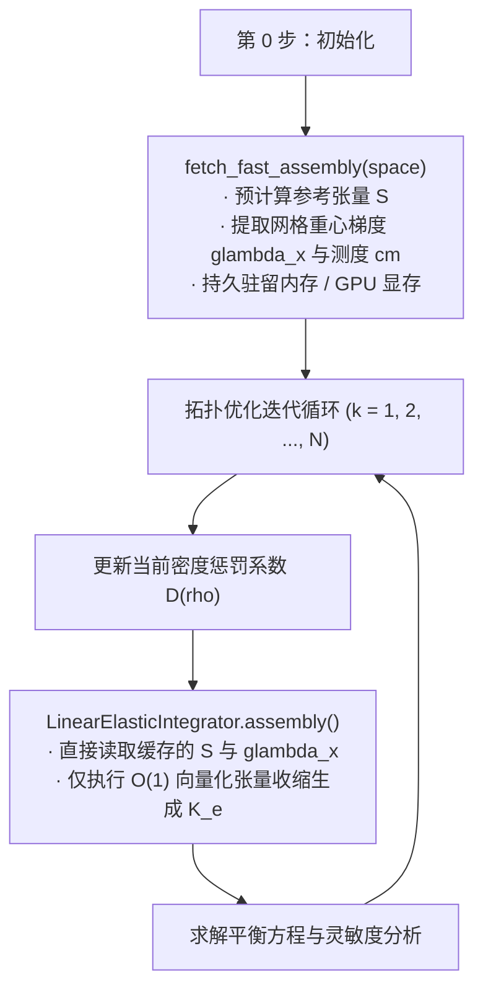

# 线弹性刚度积分器实现（LinearElasticIntegrator）

> `LinearElasticIntegrator` 是 SOPTX 平台中负责线弹性方程单元刚度矩阵计算的核心积分器组件。
> 针对拓扑优化高频迭代中“反复装配-反复求解”的计算瓶颈，该积分器深入践行了**“材料项-几何项-参考项”三项解耦分离**与**算子缓存机制**。
> 实现见 `src/soptx/fem/integrators/linear_elastic_integrator.py`；容量实测见 `experiments/fa_assembly_capability`；理论推导对照博士学位论文 §6.4.1。

---

## 1. 数学模型与三项解耦分离范式

在变密度拓扑优化中，材料插值模型使全局刚度矩阵 $\mathbf K(\boldsymbol{\rho})$ 随物理密度场 $\boldsymbol{\rho}$ 的演化而频繁更新。每单元刚度矩阵的一般弱形式定义为：
$$
\mathbf K_e(\rho_e) = \int_{\Omega_e} \mathbf B_e^{\mathsf T}\,\mathbf D(\rho_e)\,\mathbf B_e\,\mathrm{d}\boldsymbol{x}
$$
其中 $\mathbf B_e$ 为应变-位移矩阵，$\mathbf D(\rho_e) = \mathcal{M}(\rho_e)\,\mathbf D_0$ 为依赖于设计变量的材料本构张量。

### 1.1 单元无关-单元相关的三项解耦
设 $\hat{\Omega}$ 为参考单元，$\Omega_e$ 为物理单元，其仿射映射为 $\boldsymbol{x} = F_e(\hat{\boldsymbol{x}})$。雅可比矩阵为 $J_e = \frac{\partial \boldsymbol{x}}{\partial \hat{\boldsymbol{x}}}$，度量张量（第一基本形式）为 $G_e = J_e^{\mathsf T} J_e$。由链式法则 $\nabla_{\boldsymbol{x}}\phi_i = J_e^{-\mathsf T}\nabla_{\hat{\boldsymbol{x}}}\hat{\phi}_i$，标量场导数内积块为：
$$
\int_{\Omega_e} \nabla_{\boldsymbol{x}}\phi_i \cdot \nabla_{\boldsymbol{x}}\phi_j\,\mathrm{d}\boldsymbol{x} = \int_{\hat{\Omega}} (\nabla_{\hat{\boldsymbol{x}}}\hat{\phi}_i)^{\mathsf T} G_e^{-1} (\nabla_{\hat{\boldsymbol{x}}}\hat{\phi}_j)\,|J_e|\,\mathrm{d}\hat{\boldsymbol{x}}
$$
由此可将单元积分严格解耦为三类独立贡献：
1. **参考项（单元无关部分）**：$\nabla_{\hat{\boldsymbol{x}}}\hat{\phi}_i$，仅由参考单元形状、基函数阶次及求积规则决定，全域单元共享，**初始化后可终身复用**；
2. **几何项（单元相关部分）**：度量张量逆 $G_e^{-1}$ 与行列式 $|J_e|$，仅由单元几何坐标决定（在仿射网格上为单元内常量）；
3. **材料项（迭代相关部分）**：材料插值标量 $\mathcal{M}(\rho_e)$（如 SIMP/RAMP），仅由当前迭代的设计变量决定。

在仿射单纯形（三角形/四面体）情形下，$J_e$ 与 $G_e$ 在单元内为常数，积分简化为纯代数张量收缩：
$$
K_{ij}^{(e)}(\rho_e) = \mathcal{M}(\rho_e)\,|J_e|\sum_{k,l=1}^d (G_e^{-1})_{kl}\,\hat{S}_{ij}^{kl}, \qquad \hat{S}_{ij}^{kl} := \int_{\hat{\Omega}} \frac{\partial \hat{\phi}_i}{\partial \hat{x}_k}\frac{\partial \hat{\phi}_j}{\partial \hat{x}_l}\,\mathrm{d}\hat{\boldsymbol{x}}
$$
其中 $\hat{S} \in \mathbb R^{L \times L \times d \times d}$ 为参考单元四阶常数张量（$L$ 为单元局部标量自由度数）。

---

## 2. 两类参考张量预计算策略

SOPTX 在初始化阶段支持两类参考张量生成策略：

### 2.1 基于数值求积的预计算（Numerical Quadrature Precomputation）
给定参考单元的高斯积分点 $\boldsymbol{\xi}_q$ 与权重 $w_q$：
$$
\hat{S}_{ij}^{kl} = \sum_{q=1}^{N_Q} w_q\,\frac{\partial \hat{\phi}_i(\boldsymbol{\xi}_q)}{\partial \hat{x}_k}\frac{\partial \hat{\phi}_j(\boldsymbol{\xi}_q)}{\partial \hat{x}_l}
$$

### 2.2 基于重心坐标解析闭式积分的符号预计算（Symbolic Analytical Precomputation）
对于单纯形单元，$k$ 次拉格朗日基函数在参考单元上可严格展开为重心坐标单项式 $\prod_{r=0}^d \lambda_r^{I_r}$ 的有限线性组合。利用经典单纯形重心坐标闭式积分定理：
$$
\int_{\tau} \lambda_0^{I_0}\lambda_1^{I_1}\cdots\lambda_d^{I_d}\,\mathrm{d}\boldsymbol{x} = \frac{d!\,\boldsymbol{I}!}{(|\boldsymbol{I}|+d)!}\,|\tau|, \qquad \boldsymbol{I}! := \prod_{r=0}^d I_r!,\quad |\boldsymbol{I}| := \sum_{r=0}^d I_r
$$
SOPTX 通过 `LinearSymbolicIntegration` 在初始化阶段将被积多项式解析展开并精确求积，直接输出闭式精确的 $\hat{S}_{ij}^{kl}$，**彻底消除了高阶数值求积的阶数选取开销与数值截断误差**。

---

## 3. `LinearElasticIntegrator` 的三种组装变体

在 `src/soptx/fem/integrators/linear_elastic_integrator.py` 中，通过 `@assembly.register` 注册了三种单刚计算变体：

| 变体名称 | 注册标识 | 核心实现机制 | 运行时中间张量 |
| :--- | :--- | :--- | :--- |
| **标准分块积分** | `'standard'` | 逐方向导数分块数值求积，按 Lamé 常数分别缩并累加 | $9 \times (N_C, N_Q, L, L)$ |
| **Voigt 应变矩阵** | `'voigt'` | 构造 $\mathbf B$ 矩阵，调用 `einsum('q,c,cqki,kl,cqlj->cij')` 单步收缩 | $(N_C, N_Q, N_S, N_L)$（隐式物化多重临时缓冲） |
| **快速张量收缩** | `'fast'` | **三项解耦**：预计算参考张量 $\mathbf S$ + 常量重心梯度 `glambda_x` 向量化收缩 | $\mathbf S \in (L, L, d+1, d+1)$（与 $N_C, N_Q$ 无关） |

### 3.1 `fast` 变体的具体实现机理
在仿射单纯形网格上，由于 $\nabla_{\boldsymbol{x}}\phi_i = \sum_{k=0}^d \frac{\partial \phi_i}{\partial \lambda_k}\nabla_{\boldsymbol{x}}\lambda_k$：
1. **预计算（`fetch_fast_assembly`）**：
   $$S_{ijkl} = \sum_q w_q\,\frac{\partial \hat{\phi}_i}{\partial \lambda_k}\frac{\partial \hat{\phi}_j}{\partial \lambda_l} \in \mathbb R^{L \times L \times (d+1) \times (d+1)}$$
   几何量 `glambda_x` 为重心坐标物理梯度 $\nabla_{\boldsymbol{x}}\lambda \in \mathbb R^{N_C \times (d+1) \times d}$，在单元内恒定。
2. **张量收缩（`assembly`）**：
   $$A_{rs}^{(c)} = \sum_{k,l=0}^d S_{ijkl} \cdot (\nabla_{\boldsymbol{x}}\lambda_k)_{c,r} \cdot (\nabla_{\boldsymbol{x}}\lambda_l)_{c,s} \cdot |\Omega_c|$$
   ```python
   A_xx = bm.einsum('ijkl, ck, cl, c -> cij', S, glambda_x[..., 0], glambda_x[..., 0], cm)
   ```
3. **弹性本构装配**：直接将 $A_{rs}$ 与 Lamé 常数 $(\lambda, \mu)$ 线性组合（如 $K_{11} = D_{00}A_{xx} + D_{55}(A_{yy} + A_{zz})$），不经历任何积分点循环或全长四维张量分配。

### 3.2 适用网格类型与几何前置条件

`fast` 快速张量收缩的核心前提是**度量张量 $G_e = J_e^{\mathsf T} J_e$ 可移出积分号**，因此对网格类型有明确的几何约束与实现边界：

| 网格类型 | 对应拓扑 | 几何前置假设 | 支持状态 | 源码实现机理 |
| :--- | :--- | :--- | :---: | :--- |
| **仿射单纯形网格** | 2D 三角形（`tri3`, `tri6`, `tri10`）<br>3D 四面体（`tet4`, `tet10`, `tet20`） | **仿射映射（直边/直面）**<br>$\implies J_e$ 与 $\nabla\lambda$ 为单元内常数 | **完全支持（$p=1,2,3$ 验证全通）** | 预计算重心坐标参考张量 $\mathbf S$，与 `glambda_x` 直接收缩 |
| **规则张量积网格** | 2D 矩形（`quad4`, `quad9`, `quad16`）<br>3D 长方体（`hex8`, `hex27`, `hex64`） | **均匀矩形/长方体**<br>$\implies J_e$ 在所有积分点上恒定 | **完全支持（$p=1,2,3$ 验证全通）** | 提取 $J_e^{-\mathsf T}$，与参考项梯度张量 $\mathbf S$ 直接向量化收缩 |
| **一般非仿射等参网格** | 曲边四边形 / 六面体 / 多面体 | $J_e(\boldsymbol{\xi}_q)$ 随积分点空间变化 | **不支持 / 会防御报错** | 无法将度量张量移出积分号，`fast` 会抛 `ValueError`，需回退至 `'standard'` |

> 💡 **多项式阶数支持**：`fast` 变体完全原生支持任意高阶拉格朗日有限元空间（$p=1, 2, 3, \dots$）。单元局部自由度数 $L = \text{ldof}$ 会自动映射至四阶张量 $\mathbf S \in \mathbb R^{L \times L \times \dots}$ 的前两个轴，无论 $p=1$ 还是高阶 $p \ge 2$，收缩计算图形式均保持严格统一。

---

## 4. 算子缓存机制（`@enable_cache`）

拓扑优化具有“网格固定、几何不变、仅材料密度变化”的显著特征。SOPTX 在积分器中引入 `@enable_cache` 装饰器，实现算子级缓存管理：



- **零重复开销**：在数百步优化迭代中，几何量与参考积分张量计算开销被分摊为零；
- **设备端常驻**：结合 FEALPy 后端管理器，缓存张量在初始化时一次性推送到 GPU 显存，彻底避免了迭代过程中的 Host-Device 通信。

---

## 5. 与装配层级（`operator_level`）的正交关系

`assembly_method`（单刚怎么算）与 `operator_level`（单刚存在哪）是两个完全正交的架构维度：

| 维度 | 选项 | 核心职责 |
| :--- | :--- | :--- |
| **`assembly_method`** | `standard` / `voigt` / `fast` | 决定单元刚度矩阵 $K_e$ **本身的计算路径与中间存储** |
| **`operator_level`** | `fa` / `ea`（/`pa`/`ua`） | 决定 $K_e$ 算完后**存到哪一层**（拼装全局稀疏矩阵 / 缓存稠密单元矩阵 / 算子即时作用）|

无论全局算子采用全装配（FA）还是单元装配（EA），都推荐将 `assembly_method` 设为 `fast` 以最大化单刚生成效率并最小化内存峰值。

---

## 6. 程序接口与代码映射

| 数学/架构对象 | 源码映射（`soptx/fem/integrators/linear_elastic_integrator.py`）|
| :--- | :--- |
| **积分器主类** | `class LinearElasticIntegrator(LinearInt, OpInt, CellInt)` |
| **装配变体注册** | `@assembly.register('standard' | 'voigt' | 'fast' | 'standard_multiresolution' | 'voigt_multiresolution')` |
| **快速缓存获取** | `@enable_cache def fetch_fast_assembly(self, space)` |
| **符号解析积分** | `from soptx.fem.integrators.utils import LinearSymbolicIntegration` |
| **材料本构求值** | `material.elastic_matrix()` 与 `material.strain_matrix(...)` |

## 相关文档

- `docs/fem/huzhang-mixed-fem-implementation.md` —— 胡张混合有限元实现；
- `docs/fem/substructure-condensation-implementation.md` —— 子结构静力缩聚实现；
- `experiments/fa_assembly_capability/results_analysis.md` —— 装配层级与合并路线容量实测；
- `xtu-phd-thesis:thesis/body/chapter06/chapter06.tex#subsec:fast_assmbly` —— 博士学位论文理论推导原件。
