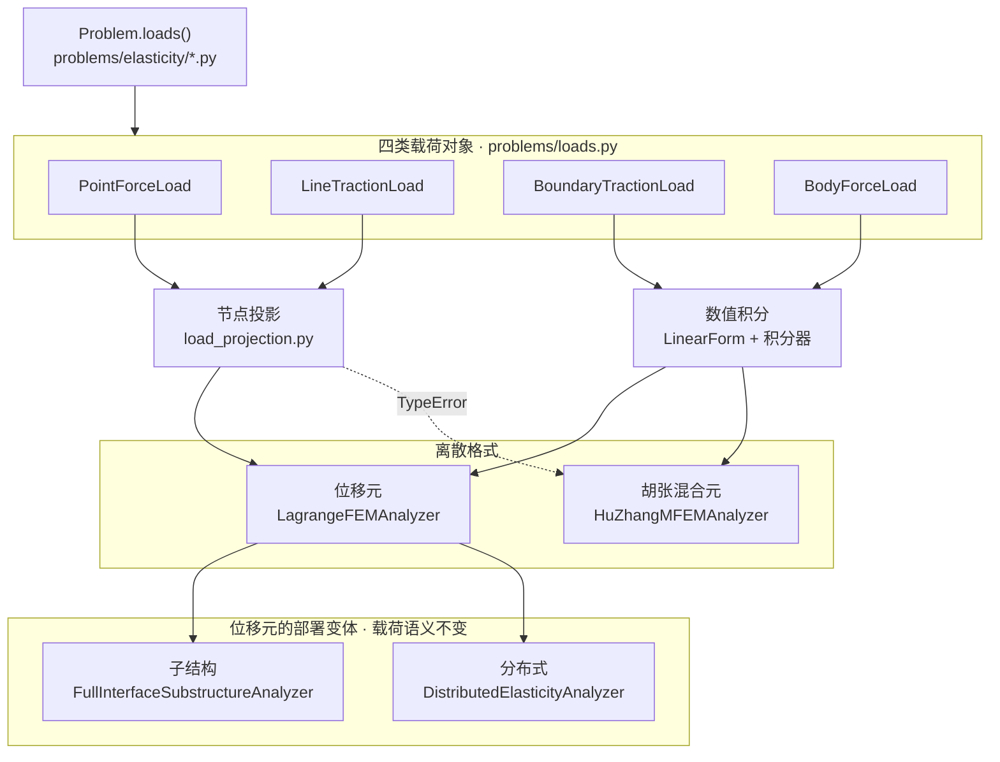

# 载荷处理架构

> `src/soptx/protocols/loads.py` 定义物理载荷的公共接口，`src/soptx/problems` 生产载荷对象，
> `src/soptx/fem` 把同一批对象离散成不同格式下的右端项。

## 1. 定位与边界

载荷对象只描述物理语义与作用的几何实体，不持有 `Mesh`、`FunctionSpace` 或 `Material`，也不规定装配方式。
同一个 `Load` 对象由位移元、胡张混合元、子结构分别解释，离散方式由消费方选择。

| 文件 | 职责 |
| --- | --- |
| [`protocols/loads.py`](../../src/soptx/protocols/loads.py) | `Load` 及四个子协议、`LoadProvider`，全部 `runtime_checkable` |
| [`problems/loads.py`](../../src/soptx/problems/loads.py) | 四个 frozen dataclass 的通用可调用实现 |
| [`problems/elasticity/`](../../src/soptx/problems/elasticity) | 具体基准算例：声明 `boundary_type`，在 `loads()` 中返回载荷对象 |
| [`fem/load_projection.py`](../../src/soptx/fem/load_projection.py) | `PointForce` 与 `LineTraction` 的唯一节点投影入口 |
| [`fem/boundary_loads.py`](../../src/soptx/fem/boundary_loads.py) | 局部牵引的 P1 迹 $L^2$ 投影与离散合力自检 |
| [`fem/integrators/face_source_integrator_lfem.py`](../../src/soptx/fem/integrators/face_source_integrator_lfem.py) | `LagrangeBoundarySourceIntegrator`：边界牵引的面积分 |
| [`fem/analyzers/lagrange_fem_analyzer.py`](../../src/soptx/fem/analyzers/lagrange_fem_analyzer.py) | 位移法右端项装配、`boundary_type` 分派、Dirichlet 强施加 |
| [`fem/analyzers/huzhang_mfem_analyzer.py`](../../src/soptx/fem/analyzers/huzhang_mfem_analyzer.py) | 混合法右端项装配、牵引强施加、位移弱施加 |
| [`fem/substructure/problem_adapter.py`](../../src/soptx/fem/substructure/problem_adapter.py) | 把 Problem 载荷与约束投影到子结构自由度 |

## 2. 架构总览

## 3. 分层职责

### 3.1 协议层：`protocols/loads.py`

`dimension` 是物理空间维数，`support_dimension` 是载荷作用的几何实体的维数；两者都描述物理对象，
不表示载荷最终通过节点写入还是数值积分装配。

| 协议 | `kind` | `support_dimension` | 求值方法 |
| --- | --- | --- | --- |
| `Load` | — | — | `kind` / `dimension` / `support_dimension` |
| `PointForce` | `"point_force"` | $0$ | `point`、`force(*, time)` |
| `LineTraction` | `"line_traction"` | $1$ | `is_load_line(points)`、`traction(points, *, tangents, time)` |
| `BoundaryTraction` | `"boundary_traction"` | `dimension - 1` | `is_load_boundary(points)`、`traction(points, *, normals, time)` |
| `BodyForce` | `"body_force"` | `dimension` | `body_force(points, *, time)` |
| `LoadProvider` | — | — | `loads()` |

`LineTraction` 与 `BoundaryTraction` 在二维的 `support_dimension` 同为 $1$，不是两个维数档：

| 协议 | 三维 | 二维 |
| --- | --- | --- |
| `BoundaryTraction` | 面，余维 $1$，泛函有界 | 边，余维 $1$，泛函有界 |
| `LineTraction` | 棱，余维 $2$，泛函无界 | 内部曲线，余维 $1$，泛函有界 |

三维实体的边载荷归 `LineTraction`；二维区域的边界线载荷用 `BoundaryTraction`，两者维数相同而实体位置不同，按边界实体走可让分析器统一积分。

### 3.2 问题层：`problems/loads.py`

| dataclass | 构造字段 | 实现协议 |
| --- | --- | --- |
| `PointForceLoad` | `point`、`vector` | `PointForce` |
| `LineTractionLoad` | `dimension`、`marker`、`value` | `LineTraction` |
| `BoundaryTractionLoad` | `dimension`、`marker`、`value` | `BoundaryTraction` |
| `BodyForceLoad` | `dimension`、`value` | `BodyForce` |

四个类均为 `frozen`，求值方法带 `@cartesian`（求值点是物理坐标）。
消费方一律按协议 `isinstance` 分派，不读 `kind`；`kind` 只作稳定的筛选标签。

### 3.3 离散层：两种离散手段

| 手段 | 适用载荷 | 入口 | 返回排布 |
| --- | --- | --- | --- |
| 节点投影 | `PointForce`、`LineTraction` | `load_projection.project_nodal_loads` | 节点优先，`dim * node + component` |
| 数值积分 | `BoundaryTraction`、`BodyForce` | `LinearForm` + `SourceIntegrator` / `LagrangeBoundarySourceIntegrator` | 由 `TensorFunctionSpace.dof_priority` 决定 |

`project_nodal_loads` 收到 `BodyForce` 或 `BoundaryTraction` 时显式报错，不静默忽略；两种手段不可互换。
节点优先的返回值由装配方对齐到 `TensorFunctionSpace` 的实际排布，现状见 §7。

## 4. 非体力载荷的装配门禁

`LagrangeFEMAnalyzer._non_body_loads_by_boundary_type` 是唯一的分派点：只消费外载的
`assemble_external_load`（子结构缩聚走这条）与求解全尺度系统的两个 `apply_bc` 变体都经过它。

| `pde.boundary_type` | 行为 |
| --- | --- |
| `'mixed'` | 装配点力、线载荷与边界牵引，以及伴随载荷列 |
| `'dirichlet'` | 自然边界项不进入右端；`loads()` 若仍给出非体力载荷则报错，不静默丢弃 |
| 其他 | 报错：装配语义未定义 |

制造解问题（`problems/elasticity/_base.AllDisplacementBoundaryMixin`）的 `boundary_type` 即 `'dirichlet'`。

## 5. 载荷与离散格式的支持矩阵

| 载荷 | 位移元 `LagrangeFEMAnalyzer` | 胡张混合元 `HuZhangMFEMAnalyzer` |
| --- | --- | --- |
| `PointForce` | `project_point_force(mode="exact")` | `TypeError`；需先按特征尺度正则化为 `BoundaryTraction`（§6.3） |
| `LineTraction` | `project_line_traction(degree=scalar_space.p)` | `TypeError`；同上 |
| `BoundaryTraction` | `LagrangeBoundarySourceIntegrator` 面积分 | `set_dirichlet_bc` 迹强插值（标记粒度见 §6.5） |
| `BodyForce` | `SourceIntegrator` 体积分 | 同左；填入分块右端第二行时取负 |

胡张混合法拒绝 `PointForce` 与 `LineTraction`，两者理由不同：

| 载荷 | 拒绝理由 |
| --- | --- |
| `PointForce` | 连续层就无界：$\delta_{\boldsymbol{x}_0} \notin V^*$，应力法向迹空间 $H^{-1/2}(\partial\Omega)$ 也容纳不下点测度 |
| `LineTraction`（三维棱） | 余维 $2$，与点力同类，连续层无界 |
| `LineTraction`（二维内部曲线） | 余维 $1$，泛函在 $[H^1(\Omega)]^2$ 上有界；被拒的原因是混合位移空间 $V = [L_2(\Omega)]^d$ 无迹，余维不小于 $1$ 的配对都不存在 |

`BoundaryTraction` 一行的两种做法来自变分格式的差别：表面牵引 $\boldsymbol{\sigma}\boldsymbol{n} = \boldsymbol{t}$
在位移法中是自然边界条件，经边界虚功积分进入 $\boldsymbol{F}$；在胡张混合法中是本质边界条件，
在应力法向迹自由度上强插值。

## 6. 离散规则

### 6.1 线载荷的 `degree` 要求

`project_line_traction` 把命中节点按线方向排序，每 `degree` 个区间归为一个 `degree` 阶 Lagrange
线单元，单元内用 `degree + 2` 点 Gauss–Legendre 积分形成一致节点力。

| 约束 | 判据 |
| --- | --- |
| `degree` 取值 | 必须等于提供 `node_coordinates` 的位移空间阶次，不能沿用默认值 |
| 命中节点数 $n$ | $n \geqslant \texttt{degree} + 1$ 且 $(n - 1) \bmod \texttt{degree} = 0$ |
| 单元内几何 | 插值点共线且等距，偏差判据为 $10^{-9} \times$ 单元长度 |
| 参考单元节点 | $\xi_i = -1 + 2i/\texttt{degree}$，与 fealpy Lagrange 空间在直边上的插值点排布一致 |

常值线载荷 $q$、单元长度 $h$ 下的解析一致节点力：

| `degree` | 单元节点力 |
| --- | --- |
| $1$ | $qh/2,\ qh/2$ |
| $2$ | $qh/6,\ 4qh/6,\ qh/6$ |
| $3$ | $qh/8,\ 3qh/8,\ 3qh/8,\ qh/8$ |

把高阶空间的插值点当作 P1 节点串处理会保持合力、却给出错误的节点力分布，只核对合力发现不了这种偏差。

### 6.2 点力的两种投影模式

| `mode` | 前置条件 | 行为 | 使用方 |
| --- | --- | --- | --- |
| `"exact"` | 作用点在无穷范数下与唯一插值节点的距离 $\leqslant$ `tolerance`（默认 $10^{-10}$） | 整个合力写入该节点；命中数不为 $1$ 时报错 | `LagrangeFEMAnalyzer` |
| `"nearest_boundary"` | 必须给出 `domain` | 先按作用点所在的坐标面筛候选节点，再取最近距离，并列时均分合力 | 子结构 `problem_adapter` |

坐标面筛选保证边界载荷不会被吸附到内部节点上。作用点恰好落在节点上时两种模式给出同一结果。

`"exact"` 指载荷向量装配无误差，不指解的精度：$d \geqslant 2$ 时点力问题的连续解不在
$[H^1(\Omega)]^d$ 中，$h \to 0$ 时加载点位移无极限，远场仍收敛。见
`dut-postdoc:concepts/external-loads.md` §3.1–3.2。

### 6.3 集中力的正则化

`HuZhangMFEMAnalyzer` 不接受 `PointForce`（§5）。物理上的集中力按特征尺度摊成局部均布牵引，
在 problem 层写成 `BoundaryTraction`，不由分析器转换。
[`FixedFixed`](../../src/soptx/problems/elasticity/fixed_fixed.py) 是现成实现：

| 量 | 取值 |
| --- | --- |
| 合力 | $P = -3\ \mathrm{N}$ |
| 载荷区宽度 | `load_width`（记 $w$），默认 $1\ \mathrm{mm}$ |
| 牵引强度 | `traction_intensity` $= P/w$，载荷区内常值 |
| 载荷对象 | `BoundaryTractionLoad` |

仓库不提供 `PointForceLoad` 到 `BoundaryTractionLoad` 的自动转换。$w$ 是建模量——压头宽度、
接触区尺寸——它决定加载点附近的应力集中程度；$w \to 0$ 时连续解退化为点力解，$d \geqslant 2$
时该解不在 $[H^1(\Omega)]^d$ 中（§6.2）。分析器代选一个 $w$ 就是改题。

这一步与 `mode="nearest_boundary"` 不是同一件事：后者的弥散宽度由网格间距决定，加密网格时
载荷本身在变；正则化的 $w$ 是固定物理量，网格加密时离散解收敛到该 $w$ 对应的连续解。

位移元读同一个 problem，两条路径因此看到同一个连续载荷，可做受控比较（§6.4）。

### 6.4 边界面选取语义与 P1 迹投影

`LagrangeBoundarySourceIntegrator` 的 `threshold` 为 callable 时，判定只在**面重心**上做一次：
重心落在载荷区内，整个面按 `source` 积分；落在区外，整个面完全不参与。载荷区端点落在某个面内部时，
该面被整体计入或整体丢弃，离散合力相对解析合力的偏差最多为一个面的贡献，且没有任何报错。

| 场景 | 做法 |
| --- | --- |
| 载荷区端点与网格面端点对齐 | 直接用 `LagrangeBoundarySourceIntegrator`（本仓库全部基准算例如此） |
| 端点无法对齐 | 用 `project_patch_traction_to_p1_trace` 先投影到边界连续 P1 迹空间 |

装配后可用 `soptx.fem.check_boundary_load_resultant` 把离散合力与解析合力比对，
把这种静默偏差变成一个可断言的量。

强施加与弱施加对同一个连续牵引给出的离散载荷本不相同：弱施加走边界数值积分，强施加走迹空间插值；
牵引在单元内部不连续时两者都不精确，且强施加没有出路——跨边连续的迹空间在跳变点处只有一个单值自由度。
`project_patch_traction_to_p1_trace` 求解

$$
\int_{\Gamma_N} \boldsymbol{w}_h \cdot \boldsymbol{t}_h \,\mathrm{d}s
= \int_{\Gamma_N} \boldsymbol{w}_h \cdot \bar{\boldsymbol{t}}_l \,\mathrm{d}s,
\qquad \forall\, \boldsymbol{w}_h \in [W_h^1(\Gamma_N)]^d
$$

把区间常值牵引投影为连续分片线性的 `P1TraceLoad`，两条离散路径由此看到同一个离散载荷泛函。

| 实现要点 | 说明 |
| --- | --- |
| 右端项 | 按载荷区与单元的解析重叠积分，不用数值积分——被积函数在单元内不连续时数值积分本身就是误差源 |
| 守恒性 | 常数落在投影空间内，故合力与一阶矩被精确保持 |
| 质量矩阵 | $(n_{\text{cells}} + 1)$ 阶三对角阵，当前按稠密矩阵组装求解 |
| 自检 | `P1TraceLoad.resultant()` 返回沿线合力 |

### 6.5 载荷区标记的判定粒度

`is_load_boundary` 只用于选边界实体，不用于在实体内部逐点掩膜牵引值：两条离散路径都在实体重心上
判定一次，命中则整个实体按 `traction` 求值。

| 路径 | 标记判定点 | 值求值点 |
| --- | --- | --- |
| 弱施加 `LagrangeBoundarySourceIntegrator` | 面重心，`threshold` 每面只调用一次 | 面上的积分点，不再掩膜 |
| 强施加 `HuZhangMFEMAnalyzer._prescribed_traction_on_edges` | `bm.mean(points, axis=-2)`，即边重心 | 边上的迹插值点 `(NEb, p+1, GD)`，不再掩膜 |

两条路径漏掉这条约定的后果不同。弱施加只是少积一段边界虚功，偏差止于载荷本身；强施加会连带改掉
边界条件——`boundary_interpolate` 把整条命中边的全部迹自由度写进 `isDDof`，被掩膜为零的插值点
不退出约束集，而是被强加 $\sigma_{\boldsymbol{n}\boldsymbol{n}} = 0$。

| 触发条件 | 表现 |
| --- | --- |
| `is_traction_boundary` 用 `logical_not` 挖除对称面或位移边界，且载荷区端点与挖除区相邻 | 端点迹自由度被钉为零，离散合力出现亏损，无任何报错 |
| 亏损量 | 端点处的迹系数乘该阶 Newton–Cotes 端点权（$p = 2, 3, 4$ 分别为 $1/6$、$1/8$、$7/90$），故随阶次变化 |
| 检出手段 | `check_boundary_load_resultant`，或与位移法比对柔顺度 |

`_prescribed_traction` 保留逐点语义，只服务于按点集求值的单元测试；进入 `set_dirichlet_bc` 的
必须是 `_prescribed_traction_on_edges`。

## 7. 已知限制

| 限制 | 位置 |
| --- | --- |
| `operator_level='fa'` 的对称消元没有重叠归约插入点，只支持单 rank | `lagrange_fem_analyzer.apply_bc('fa')` |
| `operator_level='ea'` 不支持伴随双列右端项 | `lagrange_fem_analyzer.apply_bc('ea')` |
| `boundary_type` 只定义了 `'mixed'` 与 `'dirichlet'` | `_non_body_loads_by_boundary_type` |
| 子结构的分布载荷装配只验证了 $p=1$ 全尺度 Lagrange 空间 | `problem_adapter._assemble_integrated_load` |
| 宏观角点系统只支持 `PointForce` 与 `LineTraction`，且按 `degree=1` 投影 | `problem_adapter.project_problem_conditions_to_macro_system` |
| 完整接口缩聚拒绝作用在子结构内部自由度上的载荷与约束 | `problem_adapter.project_problem_conditions_to_interface_system` |
| `CantileverMiddle2d._step_traction` 只接受按面成批的求值点 `(..., NP, GD)`，纯点集报错 | `problems/elasticity/cantilever.py` |
| 节点投影相加时 `dof_priority=True` 的转置分支无测试覆盖，`src/` 中三处 `TensorFunctionSpace(` 均以 `shape=(-1, ...)` 构造，该分支走不到 | `lagrange_fem_analyzer._assemble_non_body_loads` |

## 相关文档

- [`huzhang-mixed-fem-implementation.md`](huzhang-mixed-fem-implementation.md) — 胡张元特有的边界与载荷实现要点（角点松弛对边界项的作用等）
- [`substructure-condensation-implementation.md`](substructure-condensation-implementation.md) — 静力缩聚的求解流程与载荷投影上下文
- [`../problems/engineering-benchmarks.md`](../problems/engineering-benchmarks.md) — 各基准算例的载荷与约束设置
- `dut-postdoc:concepts/external-loads.md` — 载荷正则性、集中力适定性与 P1 迹投影的连续层理论
- `dut-postdoc:concepts/huzhang/huzhang-mixed-fem.md` — 胡张混合变分格式的推导，含边界条件的自然／本质归属
