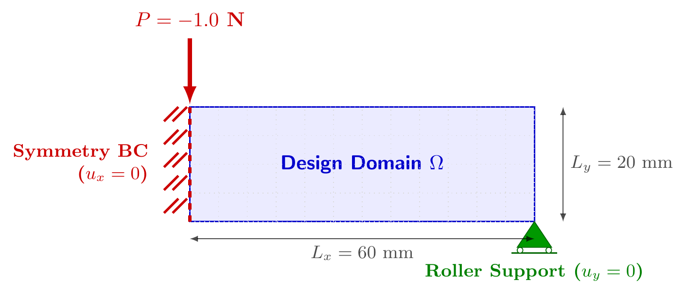
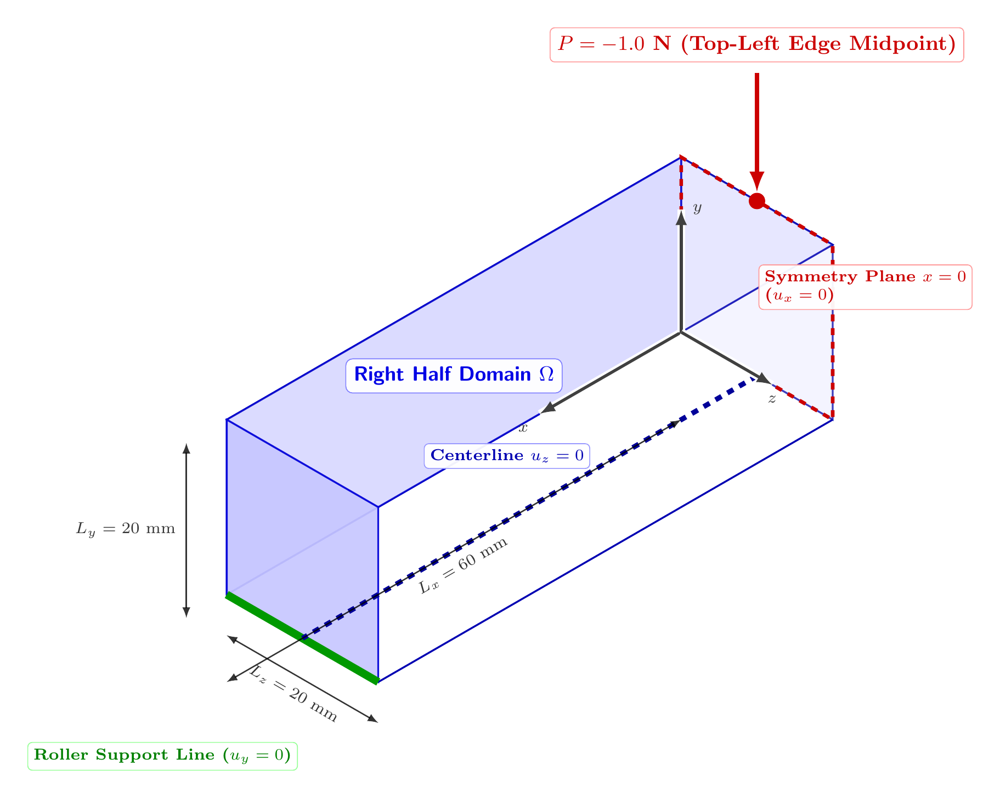
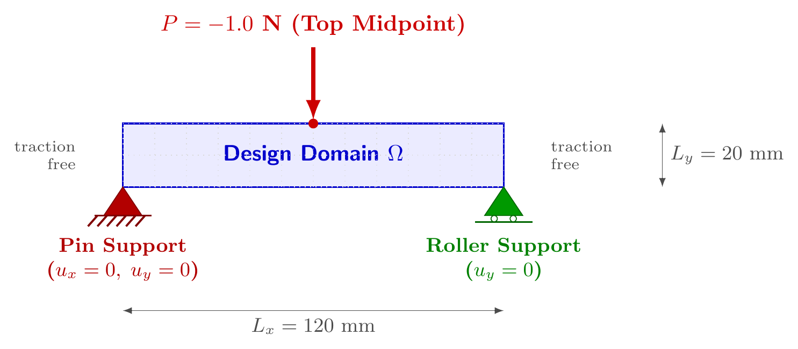
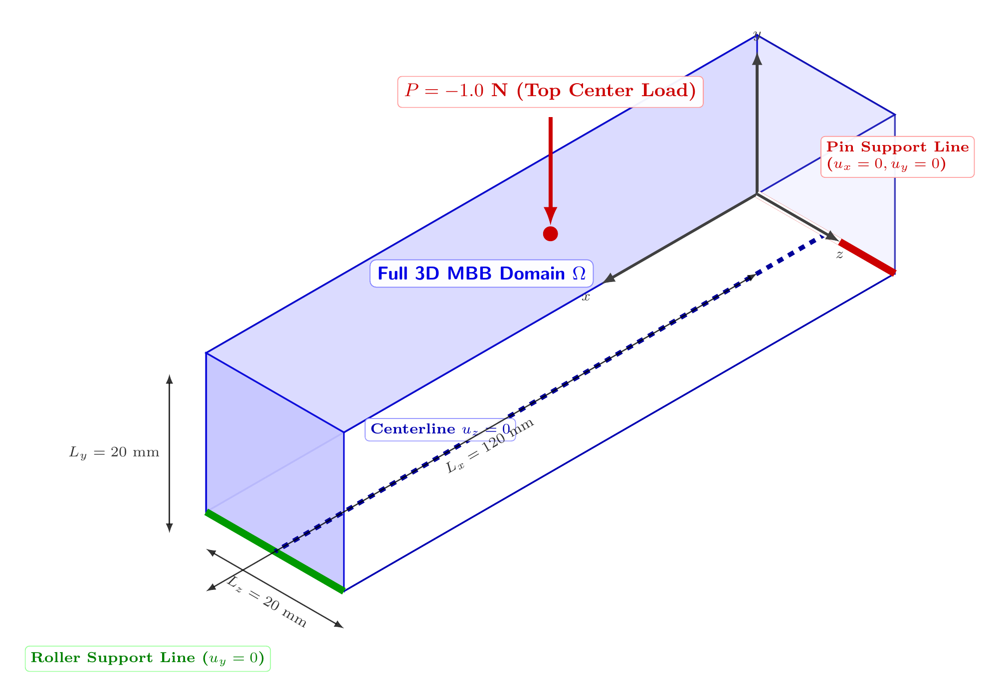
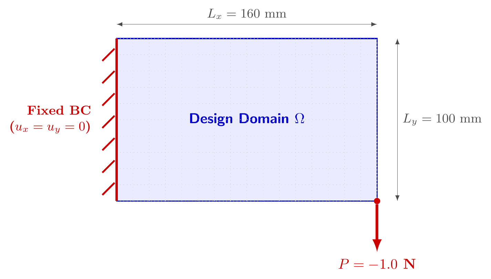
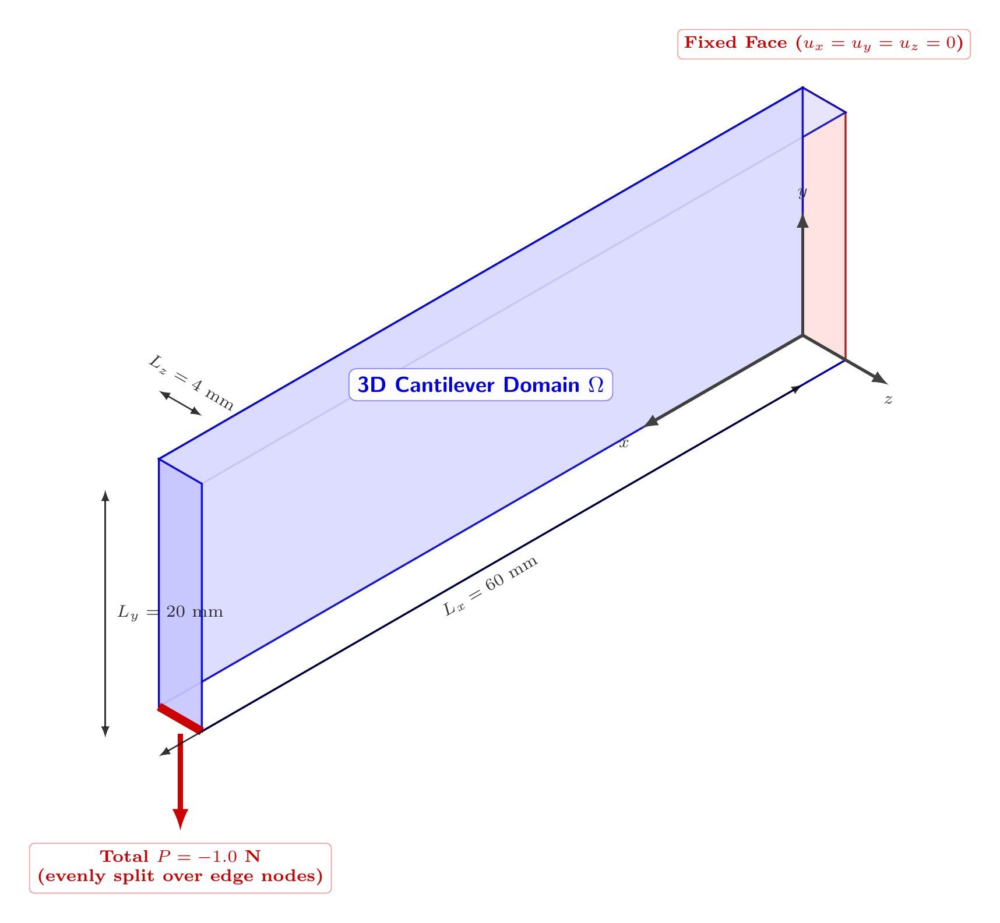
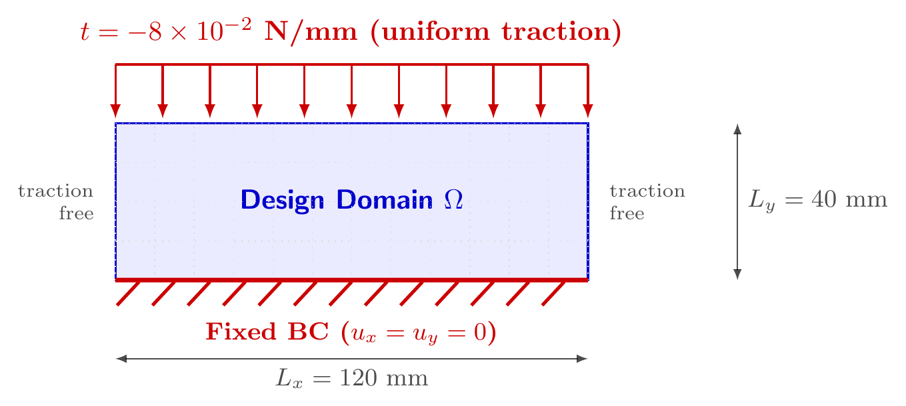
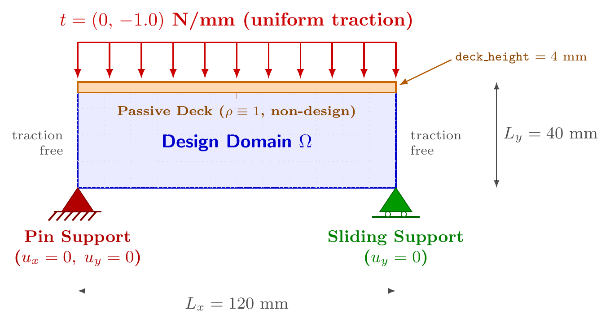
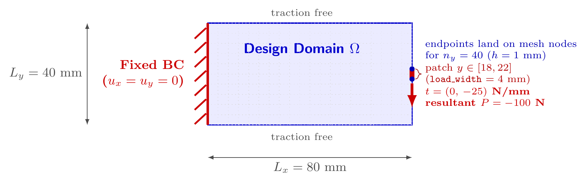
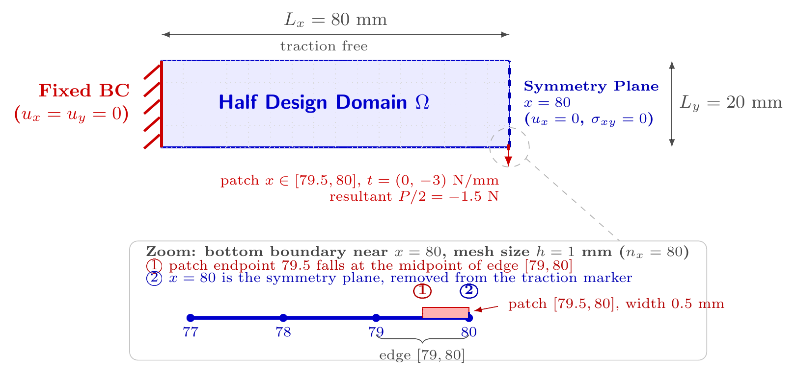

# 工程基准算例

本文档说明 **没有解析解**的工程基准问题。与[制造解](manufactured-elasticity.md)不同，这类问题没有精确位移场；载荷是真实物理载荷（集中力、分布力等），而非从精确解反推的体积力。实现位于 `soptx.problems.elasticity`。

---

## 与制造解问题的区别

| | 制造解 | 工程基准 |
|---|---|---|
| 精确解 | 有，界面暴露 `disp_solution` / `stress_solution` | 无 |
| 体力 | 由精确解反推 ($b = -\nabla\cdot\sigma(u_\mathrm{exact})$) | 通常为零（忽略自重） |
| 验证判据 | L2 收敛阶 + 真相对残差 | 真相对残差 + 载荷等效性 |
| 用途 | 验证离散格式的正确性 | 验证载荷路径装配的正确性；演示工程问题的求解流程 |
| `boundary_type` | `dirichlet` 或 `mixed`（全 Dirichlet 或 Dirichlet + Neumann） | `mixed`（Dirichlet 约束 + 集中力/分布力） |

---

## 载荷对象与分组

工程基准通过 `loads()` 返回结构化载荷对象，不再使用 `load_type` 或按分析器拆分的
旧载荷函数。当前契约包括 `PointForce`、`LineTraction`、`BoundaryTraction` 和
`BodyForce`；LFEM、Hu--Zhang 与子结构路径分别解释同一组物理载荷对象。

按载荷对象类型分四组。组别决定离散路径、哪些分析器能消费，以及需要检查哪些离散规则：

| 组 | 载荷对象 | 离散路径 | Hu--Zhang 可消费 |
| --- | --- | --- | --- |
| A | `PointForce` | 节点投影，`mode="exact"` | 否，`_validated_loads` 报 `TypeError` |
| B | `LineTraction` | 节点投影，按线单元算一致节点力 | 否，同上 |
| C | `BoundaryTraction`，载荷区是整条边界 | 面积分 / 迹强插值 | 是 |
| D | `BoundaryTraction`，载荷区是边界上一段 | 面积分 / 迹强插值 | 是 |

C 与 D 的差别只在载荷区是不是整条边界，而这一条决定了两条离散规则要不要逐个算例检查：

| | A、B 组 | C 组 | D 组 |
| --- | --- | --- | --- |
| 载荷区端点与网格是否对齐 | 不适用 | 载荷区端点是几何角点，对任何网格都对齐 | 必须检查 |
| 载荷区标记的判定粒度 | 不适用 | `marker` 无排除项，不会触发 | 必须检查 |
| 额外验证 | 无 | 无 | `check_boundary_load_resultant` |

两条规则的实现口径见
[`../fem/load-handling-implementation.md`](../fem/load-handling-implementation.md) 的 6.3 与 6.4 节。

---

## 验证判据

没有解析解，验证依据两条数值判据：

1. **真相对残差** $\|Ku - F\| / \|F\|$
2. **载荷等效性** $\left|\sum F_{\sigma_h} - P\right|$ — 等效节点力装配无丢力/多分力，且必须在 `apply_bc` *之前*测量（否则被强加自由度吞掉的载荷不可见）

两条判据都只验证装配，不验证收敛。收敛阶验证要求连续解具备 $H^1$ 正则性，A、B 组的奇异
载荷不满足（见 A 组），因此论文的收敛算例取 D 组的 `FixedFixedBeamHalfDomain2d`。

---

## A 组：集中力

载荷对象是 `PointForceLoad`，作用点与总力绑定在同一个对象上。`LagrangeFEMAnalyzer` 按
`mode="exact"` 投影：作用点必须与唯一插值节点重合，命中数不为 $1$ 时报错。

`mode="exact"` 保证的是载荷向量装配无误差：$\delta$ 与基函数配对就是基函数在该点的取值，
不含求积误差。它不保证解收敛——$d \geqslant 2$ 时 $\delta \notin H^{-1}$，连续问题的解不在
$[H^1(\Omega)]^d$ 中（二维 $\boldsymbol{u} \sim \log r$，三维 $\boldsymbol{u} \sim r^{-1}$，
应变能发散）：

| 性质 | 结论 |
| --- | --- |
| 固定 $h$ 下的可解性 | 成立，点值泛函在有限维 $V_h$ 上有界 |
| $h \to 0$ 的全局收敛 | 不成立，二维 $H^1$ 范数按 $O(\log(1/h))$ 增长，加载点位移无极限 |
| 远场收敛 | 在不含作用点的子域上仍收敛 |
| 加载点位移、邻域应力与柔顺度 | 随 $h$ 无极限；固定网格下仍是良定义的优化目标，但跨网格不可比，不能作收敛判据 |

适定性推导见 `dut-postdoc:concepts/external-loads.md` §3。

Hu--Zhang 混合元拒绝这类载荷：混合位移空间 $V = [L_2(\Omega)]^d$ 没有连续点值定义，
应力法向迹空间也容纳不下点测度。需要用混合法处理集中力时，先在物理特征尺度上把它正则化为
局部均布牵引，即改用 D 组的形式。

---

### HalfMBBBeamRight2d

二维 MBB 梁的对称右半域。

#### 问题描述

区域为 $[0,60]\times[0,20]$ mm，采用 plane stress（默认 $E=1$ MPa，$\nu=0.3$）。
全梁左右对称，取右半域建模：



- **左边界** ($x=0$)：一排滚轴支座 $\rightarrow$ $u_x = 0$（对称约束）
- **右下角** ($x=60$, $y=0$)：固定铰支座 $\rightarrow$ $u_y = 0$
- **左上角** ($x=0$, $y=20$)：竖直向下集中力 $P = -1$ N

#### 接口

集中力由一个 `PointForceLoad` 同时描述作用点和力向量：

```python
from soptx.problems import HalfMBBBeamRight2d

problem = HalfMBBBeamRight2d(
    domain=(0.0, 60.0, 0.0, 20.0),
    P=-1.0,
    E=1.0,
    nu=0.3,
    plane_type="plane_stress",
)

# 边界标记（按位移分量分离，与 is_dirichlet_boundary 返回格式一致）
is_dirichlet_dof_x, is_dirichlet_dof_y = problem.is_dirichlet_boundary()

# 集中力载荷对象
(load,) = problem.loads()
assert load.point == (0.0, 20.0)
assert load.vector == (0.0, -1.0)
```

`PointForceLoad` 的几何位置与总力彼此绑定，装配器负责将其投影到离散自由度。

#### 使用示例

```python
from fealpy.mesh import TriangleMesh
from soptx.fem.analyzers import LagrangeFEMAnalyzer
from soptx.materials import IsotropicLinearElasticMaterial
from soptx.problems import HalfMBBBeamRight2d

problem = HalfMBBBeamRight2d(domain=(0.0, 60.0, 0.0, 20.0))
material = IsotropicLinearElasticMaterial(
    hypothesis=problem.plane_type,
    youngs_modulus=problem.E,
    poisson_ratio=problem.nu,
    enable_logging=False,
)
mesh = TriangleMesh.from_box(list(problem.domain), nx=60, ny=20)

analyzer = LagrangeFEMAnalyzer(problem=problem, material=material, mesh=mesh)
analyzer.solve()
```

完整可运行脚本见 `examples/lagrange_elasticity/concentrated_load_demo.py`。

---

### HalfMBBBeamRight3d

三维 MBB 梁的对称右半域，`HalfMBBBeamRight2d` 的三维推广。

#### 问题描述

区域默认为 $[0,60]\times[0,20]\times[0,20]$ mm，三维线弹性（默认 $E=1$ MPa，$\nu=0.3$）。



- **左对称面** ($x=0$)：$u_x = 0$
- **右下底线** ($x=L_x$, $y=0$)：$u_y = 0$
- **底面中心平面** ($y=0$, $z=L_z/2$)：$u_z = 0$，消去沿 $z$ 的刚体平动
- **左上顶线中点** ($x=0$, $y=L_y$, $z=L_z/2$)：竖直向下集中力 $P = -1$ N

三处位移约束分别对应对称、竖向支承与面外定位，缺一会留下刚体模式。

#### 使用示例

```python
from soptx.problems import HalfMBBBeamRight3d

problem = HalfMBBBeamRight3d(
    domain=(0.0, 60.0, 0.0, 20.0, 0.0, 20.0),
    P=-1.0,
    E=1.0,
    nu=0.3,
)

(load,) = problem.loads()
assert load.point == (0.0, 20.0, 10.0)
assert load.vector == (0.0, -1.0, 0.0)
```

---

### FullMBBBeam2d

完整二维 MBB 梁，不利用对称性简化（对应 Huang et al. 2023 第 4.1 节）。

#### 问题描述

区域默认为 $[0,120]\times[0,20]$ mm，采用 plane stress（默认 $E=1$ MPa，$\nu=0.3$）。



- **左下角** ($x=0$, $y=0$)：固定铰支座 $\rightarrow$ $u_x = 0$, $u_y = 0$
- **右下角** ($x=L_x$, $y=0$)：滚轴支座 $\rightarrow$ $u_y = 0$
- **顶边中点** ($x=L_x/2$, $y=L_y$)：竖直向下集中力 $P = -1$ N

与 `HalfMBBBeamRight2d` 是同一个物理问题的两种建模方式：后者取右半域，在对称面上加
$u_x = 0$ 并把合力折半。同一目标体积分数下两者的最优拓扑互为镜像。

#### 使用示例

```python
from soptx.problems import FullMBBBeam2d

problem = FullMBBBeam2d(
    domain=(0.0, 120.0, 0.0, 20.0),
    P=-1.0,
    E=1.0,
    nu=0.3,
    plane_type="plane_stress",
)

(load,) = problem.loads()
assert load.point == (60.0, 20.0)
```

---

### FullMBBBeam3d

完整三维 MBB 梁实体模型（与 Huang et al. 2023 Section 4.1 设置一致）。

#### 问题描述

区域默认为 $[0,120]\times[0,20]\times[0,20]$ mm（也可指定通用比例如 $[0,6]\times[0,1]\times[0,1]$），三维线弹性模型（默认 $E=1$ MPa，$\nu=0.3$）。
该问题未利用对称性简化，而是对整体全尺寸 3D 梁实体建模：



- **左下底线** ($x=0$, $y=0$)：固定铰支座 $\rightarrow$ $u_x = 0, u_y = 0$
- **右下底线** ($x=L_x$, $y=0$)：滑移支座 $\rightarrow$ $u_y = 0$
- **底面中心线** ($y=0$, $z=L_z/2$)：$u_z = 0$（防止刚体运动）
- **顶面中心点** ($x=L_x/2$, $y=L_y$, $z=L_z/2$)：竖直向下集中荷载 $P = -1$ N ($y$ 方向)

#### 接口

```python
from soptx.problems import FullMBBBeam3d

problem3d = FullMBBBeam3d(
    domain=(0.0, 120.0, 0.0, 20.0, 0.0, 20.0),
    P=-1.0,
    E=1.0,
    nu=0.3,
)

# 边界标记 (x, y, z 分量分离)
is_dof_x, is_dof_y, is_dof_z = problem3d.is_dirichlet_boundary()

# 集中力载荷对象
(load,) = problem3d.loads()
assert load.vector == (0.0, -1.0, 0.0)
```

#### 使用示例

```python
from fealpy.mesh import HexahedronMesh
from soptx.fem.analyzers import LagrangeFEMAnalyzer
from soptx.materials import IsotropicLinearElasticMaterial
from soptx.problems import FullMBBBeam3d

problem3d = FullMBBBeam3d(domain=(0.0, 6.0, 0.0, 1.0, 0.0, 1.0))
material3d = IsotropicLinearElasticMaterial(
    hypothesis=problem3d.plane_type,
    youngs_modulus=problem3d.E,
    poisson_ratio=problem3d.nu,
    enable_logging=False,
)
mesh3d = HexahedronMesh.from_box(list(problem3d.domain), nx=24, ny=8, nz=8)

analyzer3d = LagrangeFEMAnalyzer(problem=problem3d, material=material3d, mesh=mesh3d)
analyzer3d.solve()
```

---

### CantileverCorner2d

二维悬臂梁，右下角受集中载荷。

#### 问题描述

区域默认为 $[0,160]\times[0,100]$ mm，采用 plane stress（默认 $E=1$ MPa，$\nu=0.3$）。



- **左边界** ($x=0$)：完全固支，$u_x = u_y = 0$
- **右下角** ($x=160$, $y=0$)：竖直向下集中力 $P = -1$ N
- **其余边界**：零牵引

`loads()` 返回一个 `PointForceLoad`，其位置和力向量完整描述该集中荷载。

```python
from soptx.problems import CantileverCorner2d

problem = CantileverCorner2d(
    domain=(0.0, 160.0, 0.0, 100.0),
    P=-1.0,
    E=1.0,
    nu=0.3,
    plane_type="plane_stress",
)
```

---

## B 组：线载荷

载荷对象是 `LineTractionLoad`，描述作用在一条直线上的总力。`project_line_traction`
把命中节点按线方向排序，每 `degree` 个区间归为一个 `degree` 阶 Lagrange 线单元做积分，
`degree` 必须等于提供节点坐标的位移空间阶次，否则节点数与单元划分对不上。Hu--Zhang
混合元同样拒绝这类载荷，理由与 A 组相同。

---

### CantileverRightBottomEdge3d

三维悬臂梁，右端底边受载。

#### 问题描述

区域默认为 $[0,60]\times[0,20]\times[0,4]$ mm，三维线弹性（默认 $E=1$ MPa，$\nu=0.3$）。



- **左端面** ($x=0$)：完全固支，$u_x = u_y = u_z = 0$
- **右端底边** ($x=60$, $y=0$)：沿负 $y$ 方向的总力 $P = -1$ N，由 `LagrangeFEMAnalyzer`
  在被标记的边上节点之间均匀分配
- **其余边界**：零牵引

`loads()` 返回一个 `LineTractionLoad`；装配器沿目标边积分，并保持给定总合力。

```python
from soptx.problems import CantileverRightBottomEdge3d

problem = CantileverRightBottomEdge3d(
    domain=(0.0, 60.0, 0.0, 20.0, 0.0, 4.0),
    P=-1.0,
    E=1.0,
    nu=0.3,
)
```

---

## C 组：满布边界牵引

载荷区是一整条（面）边界：端点就是几何角点，对任何网格都与网格面对齐；`marker` 由整条
边界的坐标判定用 `logical_or` 拼成，没有排除项。位移元按面积分弱施加，Hu--Zhang 在应力
法向迹自由度上强插值，两条路径都不需要额外处理，D 组那两条检查在这里恒不触发。

---

### BearingDevice2d

二维轴承装置，顶边整边受均布压载。

#### 问题描述

区域默认为 $[0,120]\times[0,40]$ mm（长宽比 3:1），采用 plane stress。



- **底边** ($y=0$)：完全固支，$u_x = u_y = 0$
- **顶边** ($y=40$)：竖直向下均布牵引 $t = (0, -8\times 10^{-2})$ N/mm（`t` 为牵引强度，非合力）
- **左右侧边**：自由，零牵引

`loads()` 返回一个 `BoundaryTractionLoad`；其 `is_load_boundary()` 与 `traction()` 分别描述加载边界和牵引向量。

注意：构造器默认 $\nu = 0.5$ 面向 Hu--Zhang 混合元的不可压测试；纯位移元使用时应传入可压缩的
Poisson 比（如 $\nu = 0.3$），否则会体积锁定。

```python
from soptx.problems import BearingDevice2d

problem = BearingDevice2d(
    domain=(0.0, 120.0, 0.0, 40.0),
    t=-8.0e-2,
    E=1.0,
    nu=0.3,
    plane_type="plane_stress",
)
```

---

### SimplySupportedBridge2d

二维简支桥梁，顶边整边受均布压载（博士论文算例 3.2）。

#### 问题描述

区域默认为 $[0,120]\times[0,40]$ mm（长宽比 3:1），采用 plane stress（默认
$E=350$ MPa，$\nu=0.3$）。



- **左下角** ($x=0$, $y=0$)：固定铰支座 $\rightarrow$ $u_x = 0$, $u_y = 0$
- **右下角** ($x=120$, $y=0$)：滑动铰支座 $\rightarrow$ $u_y = 0$
- **顶边** ($y=40$)：竖直向下均布牵引 $t = (0, -1)$ N/mm，`t` 是牵引强度而非合力
- **其余边界**：自由，零牵引

位移约束只落在两个角节点上，与 `BearingDevice2d` 的整边固支不同。载荷对象的 `marker`
直接就是 `_on_top_boundary`，连 `logical_or` 都没有。

#### 桥面被动区

顶部厚 `deck_height` 的条带（单元重心满足 $y > 40 - \texttt{deck\_height}$）是桥面实体，
属非设计域，拓扑优化中密度锁定为 $1$。`get_passive_element_mask(mesh)` 按单元重心判定，
返回形状 $(NC,)$ 的布尔张量，不依赖单元编号顺序，结构化三角/四边形网格通用；只支持单元
密度表征，节点密度下无对应实现。构造时校验 $0 \le \texttt{deck\_height} \le$ 区域高度。

#### 使用示例

```python
from soptx.problems import SimplySupportedBridge2d

problem = SimplySupportedBridge2d(
    domain=(0.0, 120.0, 0.0, 40.0),
    t=-1.0,
    E=350.0,
    nu=0.3,
    plane_type="plane_stress",
    deck_height=4.0,
)

passive = problem.get_passive_element_mask(mesh)
```

---

## D 组：局部边界牵引

载荷区是边界上一段长度有限的区段。三个算例共用同一套离散规则，写新算例时逐条检查。

### 检查一：载荷区端点是否落在网格节点上

端点落在网格面内部时，该面上的被积函数在面内跳变，两条离散路径看到的离散载荷都不对，且都不报错：

| 路径 | 表现 |
| --- | --- |
| Lagrange 位移元 | 高斯积分作用在面内跳变的被积函数上，等效节点力不精确 |
| Hu--Zhang 混合元 | 迹空间跨面连续，跳变点上只有一个单值自由度，阶跃根本表示不出来 |

端点对不对齐由网格决定，不是模型的固有属性：加密网格能让它消失。`load_width` 是物理特征
尺度（接触宽度、垫板长度），由建模确定后固定，不作为对齐网格的旋钮（见
`dut-postdoc:concepts/external-loads.md` §3.4）。
确实无法对齐时，用 `traction` 参数注入 `project_patch_traction_to_p1_trace` 投影出的连续
P1 迹载荷——几何、材料与边界标记全部不变，只替换牵引函数，两条路径由此看到同一个离散载荷泛函。

### 检查二：`marker` 的排除项是否压在载荷区端点上

`marker` 只回答"这条边（面）属不属于牵引边界"，按边重心判定一次；载荷区形状由 `value`
函数逐点决定。`marker` 里如果有 `logical_not` 排除项（对称面、位移边界），而载荷区端点正好
落在排除线上，强施加路径上就会出现：`value` 给出非零牵引，`marker` 把整条边抹掉，而该迹
自由度已被登记为强约束——载荷缺失被改写成强加 $\sigma_{nn} = 0$。这一条与网格无关，是模型
的固有属性，加密网格不会让它消失。

装配完成、施加边界条件之前，用 `soptx.fem.check_boundary_load_resultant` 把离散合力与
解析合力比对，把这两种静默偏差变成一个可断言的量。

---

### CantileverMiddle2d

二维悬臂梁，右端中部局部区段受载。

#### 问题描述

区域默认为 $[0,80]\times[0,40]$ mm（长宽比 2:1），采用 plane stress（默认
$E=70000$ MPa，$\nu=0.25$）。



- **左边界** ($x=0$)：完全固支，$u_x = u_y = 0$
- **右边界中部**（$x=80$，$y$ 落在以中线为中心、长 `load_width` 的区间内）：竖直向下均布牵引，合力 $P = -100$ N
- **顶、底边界**：自由，零牵引

| `load_width` | 载荷区 | $ny=40$（$h=1$）下的端点 |
| --- | --- | --- |
| $4.0$（默认） | $[18, 22]$ | 落在网格节点 |
| $6.0$（论文算例） | $[17, 23]$ | 落在网格节点 |

两种取值下检查一都不触发；`is_traction_boundary` 是右、顶、底三条边的 `logical_or`，
没有排除项，检查二也不触发。这是 D 组里唯一两条都不命中的算例。

#### 求值点形状约束

`_step_traction` 只接受按面成批的求值点 $(\ldots, NP, GD)$，纯点集 $(NP, GD)$ 显式报错：
后者只能退化为逐点阶跃判断，会在载荷区端点顶点处向相邻边泄漏二次插值尾巴，使 Hu--Zhang
本质边界的有效合力偏大 $2|t|h/6$（$80\times40$ 基准算例约 $+5.6\%$）。

#### 使用示例

```python
from soptx.problems import CantileverMiddle2d

problem = CantileverMiddle2d(
    domain=(0.0, 80.0, 0.0, 40.0),
    P=-100.0,
    load_width=6.0,
    E=70000.0,
    nu=0.25,
    plane_type="plane_stress",
)
```

---

### FixedFixedBeamCenterLoad2d

二维两端固支梁全域基准。物理定义与博士论文第五章的 Hu--Zhang 算例一致，不采用对称半域简化。

#### 问题描述

区域为 $[0,160]\times[0,20]$ mm，采用 plane stress（默认 $E=30$ MPa，$\nu=0.4$）。

- **左、右边界**（$x=0$ 与 $x=160$）：完全固支，$u_x=u_y=0$
- **下边界中点**（$x=80$）：长度 $l=1$ mm 的局部均布竖向牵引，合力 $P=-3$ N
- **其余上、下边界**：零牵引

#### 统一载荷接口

`FixedFixedBeamCenterLoad2d` 只定义一个物理问题，不按有限元类型拆分：

- `loads()` 返回同一个 `BoundaryTractionLoad`，其 `is_load_boundary()` 描述受牵引边界，`traction()` 给出牵引向量；
- Lagrange 位移元与 Hu--Zhang 混合元直接消费该对象，并按各自变分形式离散；
- 两条路径共享 `P`、`load_width`、材料参数与完整设计域，不做半域载荷折算。

```python
from soptx.problems import FixedFixedBeamCenterLoad2d

problem = FixedFixedBeamCenterLoad2d(
    domain=(0.0, 160.0, 0.0, 20.0),
    P=-3.0,
    load_width=1.0,
    E=30.0,
    nu=0.4,
    plane_type="plane_stress",
)
```

#### 载荷区与网格的对齐

检查一在这里命中与否由 $nx$ 决定，载荷区间是 $[79.5, 80.5]$：

| $nx$ | $h$ | 载荷区端点 | 端点所在的边 |
| --- | --- | --- | --- |
| $160$ | $1.0$ | 落在边中点 | 牵引在边内部跳变 |
| $320$ | $0.5$ | 落在网格节点 | 整条在载荷区内或整条在载荷区外 |

$nx=160$ 是论文算例用的网格，端点不对齐，因此做两条路径的受控比较时必须注入
投影后的连续 P1 迹载荷：

```python
from soptx.fem import project_patch_traction_to_p1_trace
from soptx.problems import FixedFixedBeamCenterLoad2d

nx = 160
problem = FixedFixedBeamCenterLoad2d(
    domain=(0.0, 160.0, 0.0, 20.0),
    P=-3.0,
    load_width=1.0,
)
common_load = project_patch_traction_to_p1_trace(
    line=(problem.domain[0], problem.domain[1]),
    n_cells=nx,
    level=problem.traction_level,
    patch=problem.traction_patch,
    intensity=problem.traction_intensity,
)
problem = FixedFixedBeamCenterLoad2d(
    domain=(0.0, 160.0, 0.0, 20.0),
    P=-3.0,
    load_width=1.0,
    traction=common_load,
)
```

---

### FixedFixedBeamHalfDomain2d

`FixedFixedBeamCenterLoad2d` 的对称半域版本，是本仓库唯一同时命中两条检查的算例。

#### 问题描述

完整域 $[0,160]\times[0,20]$ mm 关于竖直中线 $x=80$ 对称，本类只离散左半域
$[0,80]\times[0,20]$ mm，材料参数与全域模型一致（默认 $E=30$ MPa，$\nu=0.4$）。



- **左端** ($x=0$)：完全固支，$u_x = u_y = 0$
- **对称面** ($x=80$)：法向位移 $u_x = 0$，切向牵引 $\sigma_{xy} = 0$
- **底边载荷区** ($y=0$，$x \in [79.5, 80]$)：竖直均布牵引，合力 $P/2 = -1.5$ N
- **其余上、下边界**：自由，零牵引

载荷区宽 `load_width/2`，合力自动折半，不需要手工折算；构造时校验载荷区不越过左半域左端。
半域柔顺度是完整结构的一半，报告完整结构柔顺度时乘 $2$。

#### 两条检查都命中

| 检查 | 命中原因 |
| --- | --- |
| 一 | $nx=80$ 时 $h=1$，载荷区左端 $79.5$ 落在边 $[79, 80]$ 的中点 |
| 二 | `is_traction_boundary` 用 `logical_not` 挖掉对称面，载荷区右端 $80$ 正好在挖除线上 |

因此该算例必须注入 P1 迹载荷；Hu--Zhang 路径上 `marker` 也必须按边重心判定，逐点掩膜会
把载荷区右端的迹自由度连同约束一起钉为零。

#### 使用示例

```python
from soptx.fem import project_patch_traction_to_p1_trace
from soptx.problems import FixedFixedBeamHalfDomain2d

nx = 80
problem = FixedFixedBeamHalfDomain2d(
    domain=(0.0, 80.0, 0.0, 20.0), P=-3.0, load_width=1.0,
)

common_load = project_patch_traction_to_p1_trace(
    line=(problem.domain[0], problem.domain[1]),
    n_cells=nx,
    level=problem.traction_level,
    patch=problem.traction_patch,
    intensity=problem.traction_intensity,
)

problem = FixedFixedBeamHalfDomain2d(
    domain=(0.0, 80.0, 0.0, 20.0),
    P=-3.0,
    load_width=1.0,
    traction=common_load,
)
```
