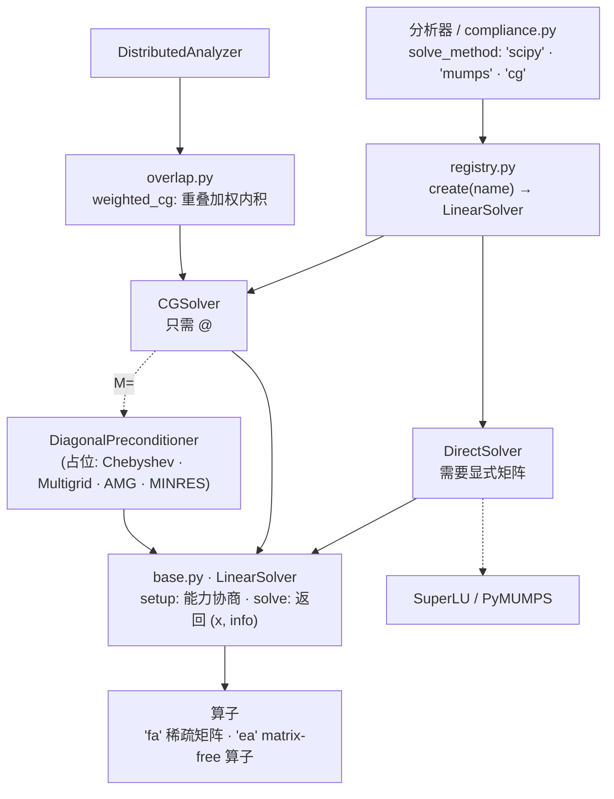

# 求解器

本文说明 SOPTX 自有求解层 `soptx.solvers` 的结构、接口与各分析器上的可用组合。
默认值与运行行为以源码为事实源。

## 架构总览

## 包结构

| 模块 | 内容 | 状态 |
|------|------|------|
| `base.py` | `LinearSolver` 基类, 能力标签, `SolveInfo` 契约, `ConvergedReason` | 已实现 |
| `registry.py` | `register` / `create` / `available` | 已实现 |
| `direct.py` | `DirectSolver` (scipy SuperLU / MUMPS), 函数式 `spsolve` | 已实现 |
| `cg.py` | `CGSolver`, 函数式 `cg` | 已实现 |
| `overlap.py` | `weighted_cg` / `weighted_norm` | 已实现 |
| `preconditioners.py` | `DiagonalPreconditioner` | 已实现 |
| `preconditioners.py` | `ChebyshevSmoother` | 占位 |
| `multigrid.py` | `Multigrid` | 占位 |
| `amg.py` | `AMGSolver` | 占位 |
| `minres.py` | `MINRESSolver` | 占位 |

占位类的构造函数抛 `NotImplementedError`, 未登记到注册表。对外只暴露
`soptx/solvers/__init__.py` 导出的名字。`direct.py` 与 `cg.py` 由 `fealpy.solver`
移植而来, 此后以本仓库为准演化。

## 统一接口

直接法、Krylov 迭代、预条件子与多重网格都是 `LinearSolver`。

| 成员 | 说明 |
|------|------|
| `requires` | `setup` 需要算子提供的能力标签集合 |
| `setup(op)` | 能力协商后绑定算子, 直接法在此分解; 返回 `self` |
| `solve(b, x0=None)` | 返回 `(x, info)` |
| `__matmul__(r)` | 预条件子模式: 零初值求解一次 |

`M=` 位与 `solver=` 位可互换填入, 组合合法性由调用点负责。

| 标签 | 探测方式 | 需要它的求解器 |
|------|----------|----------------|
| `CAP_MATRIX` | 算子有 `to_scipy` 或 `tocsr` | `DirectSolver`, `AMGSolver` |
| `CAP_DIAGONAL` | 算子有 `diagonal` 或 `diags` | 暂无 |
| `CAP_HIERARCHY` | 保留 | 暂无 |

`setup` 缺能力时抛 `OperatorCapabilityError`。'ea' 层级的 matrix-free 算子只支持 `@`,
直接法在其上于 `setup` 处被拒。

## 注册表

| 键 | 类 | 预置参数 |
|----|----|----------|
| `scipy` | `DirectSolver` | `backend='scipy'` |
| `mumps` | `DirectSolver` | `backend='mumps'` |
| `cg` | `CGSolver` | 无 |

`create(name, **kwargs)` 造出未 `setup` 的实例; `available()` 返回已注册键。
注册表只造实例, 能不能用在 `setup` 里协商。

## `info` 契约

| 键 | 说明 |
|----|------|
| `niter` | 迭代次数; 直接法记 1 |
| `relres` | 真残差 $\|b - Ax\| / \|b\|$; 无法廉价得到时为 `None` |
| `converged` | 是否按判据正常退出 |
| `reason` | 可选, `ConvergedReason` (取值沿用 PETSc `KSPConvergedReason`); `reason > 0` 与 `converged` 必须一致 |

## `DirectSolver`

| 参数 | 默认 | 说明 |
|------|------|------|
| `backend` | `'scipy'` | `'scipy'` 或 `'mumps'` |
| `sym` | 0 | MUMPS 对称性标志: 0 非对称, 1 对称正定, 2 一般对称; 非零时只传下三角, 不校验矩阵是否真对称 |
| `residual_tol` | 1e-8 | `converged = relres <= residual_tol` |

`setup` 分解并缓存, `solve` 只回代; `close()` / `with` / 析构释放。MUMPS 路径只支持
一维右端项, 自行初始化 MPI。scipy 路径复制矩阵后分解, 不改写调用方持有的矩阵。
函数式 `spsolve(A, b, solver, sym)` 每次重新分解。

两条 MUMPS 路径的 `job` 划分不同, 不要混谈: `DirectSolver.setup` 走 `job=4` (分析 +
数值分解), `_solve` 走 `job=3` (只回代), 因子在实例内缓存; 函数式 `spsolve` 的
`_mumps_solve` 走 `job=6`, 三阶段一次做完。`job=4` 仍把分析与数值分解绑在一起, 稀疏
结构不变、只有数值改变的重复求解 (拓扑优化每步在同一网格上重装配) 因此每次都在重做
符号分析; 拆成全程一次 `job=1` 加每步 `job=2` 是尚未做的改造, 与下文「分解不跨调用
复用」是两层不同的浪费。

两条路径都用 `set_centralized_sparse` 传矩阵、在 host 上取回解, 只能单进程运行, 无法
比较 MPI × 线程布局; 改成分布式输入需设 `ICNTL(18)=3`。当前两个后端 SuperLU 与
PyMUMPS 都是 CPU 求解器, 求解层没有 GPU 直接法后端。

直接法的并行模型、三阶段接口语义与各实现的 GPU 支持对照见
`dut-postdoc:concepts/linear-solvers/direct-methods.md`, 本文只记录本仓库的实现事实。

## `CGSolver`

要求算子对称正定, 'fa' 与 'ea' 都可用。

| 参数 | 默认 | 说明 |
|------|------|------|
| `M` | `None` | 预条件子, 任意支持 `@` 的对象 |
| `atol` / `rtol` | 1e-12 / 1e-8 | `rtol` 参照初始残差 $\|r_0\|$, 不是 $\|b\|$ |
| `maxit` | 10000 | `None` 不设上限 |
| `norm_type` | `'natural'` | 判据范数: `'natural'` $\sqrt{r^{\mathsf T} M^{-1} r}$ / `'unpreconditioned'` $\|r\|_2$ / `'preconditioned'` $\|M^{-1} r\|_2$ |
| `divtol` | 1e5 | 判据量相对初值放大超过该倍数即停机 |
| `monitor` / `print_level` | `None` / 1 | 残差回调; 0 静默, 1 摘要, 2 每步 |
| `dot_product` | `None` | 自定义内积, 分布式时传重叠加权内积; 只支持一维右端项 |
| `residual_refresh` | 0 | 大于 0 时每隔该步数重算真残差参与判定 |

停机判据对齐 MFEM, 批量右端项逐列独立判定; 非正曲率一律停机
(`DIVERGED_INDEFINITE_MAT`)。`info['relres']` 是报告量, 与停机判据不同口径。

## 预条件子与分布式

`DiagonalPreconditioner(diag)`: 构造时校验 `diag` 一维且严格为正, `M @ r = r / diag`。

`weighted_cg(operator, load, *, dof_comm, ...)`: 把 `dof_comm.dot` 注入
`CGSolver` 的 `dot_product`; `dof_comm=None` 时退化为普通内积, 不依赖 `mpi4py`。
默认 `maxiter` 1000, `rtol` 1e-10, `atol` 1e-12, `residual_refresh` 20
(来自 `soptx.core.numerics`)。

## 各分析器的可用组合

| 分析器 | 状态方程 | 可用 `solve_method` | 默认 |
|--------|----------|---------------------|------|
| `LagrangeFEMAnalyzer` | 对称正定 | `'fa'`: `'scipy'` / `'mumps'` / `'cg'`; `'ea'`: `'cg'` | `'mumps'` |
| `HuZhangMFEMAnalyzer` | 对称不定鞍点 | `'scipy'` / `'mumps'` | `'mumps'` |
| `DistributedAnalyzer` | 重叠副本布局, 对称正定 | `'cg'` (`weighted_cg`) | `'cg'` |

`LagrangeFEMAnalyzer` 的 `'cg'` 选项 (`kwargs` 优先于构造时 `solver_options`):
`maxiter` 5000, `atol` 1e-12, `rtol` 1e-12, `precond` `None` 或 `'jacobi'`,
`residual_refresh` 0; 开 Jacobi 后 `norm_type` 改为 `'unpreconditioned'`,
`residual_refresh` 未指定时取 50。`'mumps'` 读 `kwargs['sym']`。迭代解法的初值经
`kwargs['x0']` 显式给出。两个分析器的分解都不跨调用复用, 求解后即 `close()`。

`HuZhangMFEMAnalyzer` 对 `'cg'` 直接拒绝, 对称不定的迭代路径待 `MINRESSolver` 落地。

`compliance.py` 在 `HuZhangMFEMAnalyzer` 且 `state_variable='u'` 时用 `create('mumps')`
解一次应力矩阵。

## 依赖

`mumps` 后端需要 PyMUMPS (`pip install pymumps`) 与系统 MUMPS 库
(Debian/Ubuntu: `libdmumps-5-dev`)。`scipy` 与 `cg` 随 SciPy 自带。

## 测试与示例

| 路径 | 覆盖 |
|------|------|
| `tests/unit/test_solvers_direct*.py` | `spsolve`, `DirectSolver` |
| `tests/unit/test_solvers_cg*.py` | `cg`, `CGSolver` |
| `examples/linear_solvers/` | 直接法: 完整矩阵残差、收敛阶、矩阵是否被改写、`sym` 守卫; CG 按预条件子分 case (无预条件、Jacobi): 与直接法一致、'fa' / 'ea' 同解、判据范数、真残差、批量右端项、`info` 契约、逐层迭代数与收敛阶 |

> 机器相关的运行环境配置(如 MPI ABI)不在本仓库文档范围, 见各机器的环境说明。
