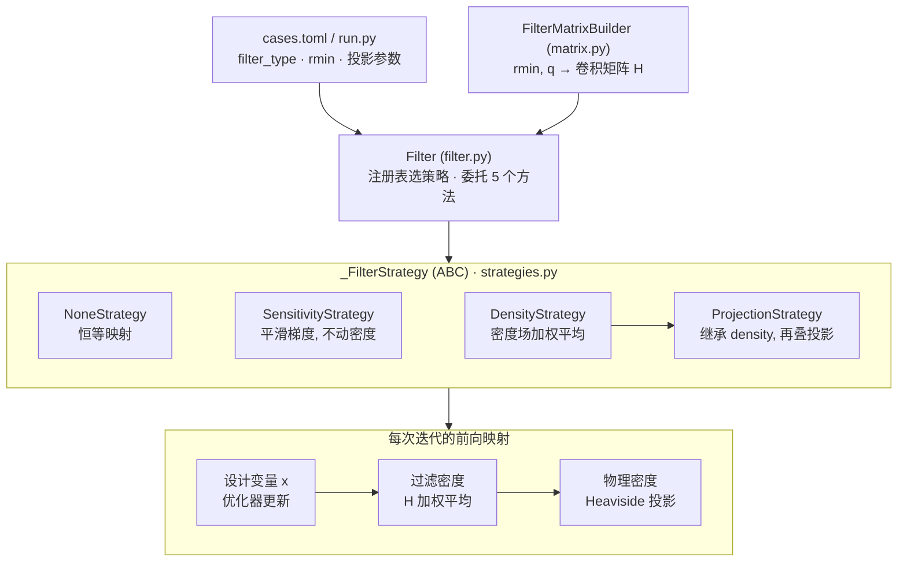
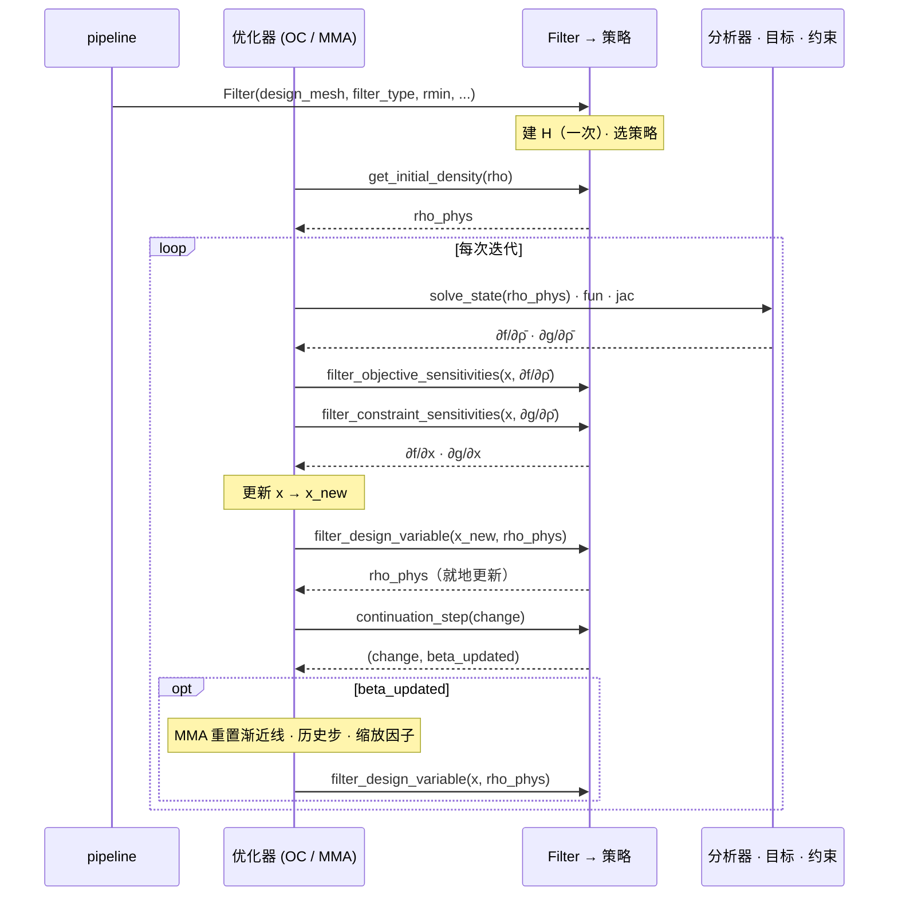

# 拓扑优化过滤器设计架构

> `src/soptx/topology/filters` 把优化器持有的设计变量 $x$ 映射为分析器消费的物理密度 $\bar\rho$，
> 并把灵敏度沿同一条链回传。本文只写架构与实现契约，方法学见
> `dut-postdoc:concepts/density-topopt/regularization-and-length-scale-control.md`（下称「概念页」）。
> 记号沿用代码：设计变量 $x$ 对应概念页的 $\rho$，$m$ 为测度权重，$\mathbf H_s = \mathbf H m$ 为归一化因子。

## 1. 定位

优化器（`OCOptimizer`、`MMAOptimizer`、`ALMMAOptimizer`）持有一个 `Filter` 对象。分析器、目标与
约束只见 $\bar\rho$，优化器只见 $x$，两者之间的映射与伴随全部由本包完成。材料插值、目标与约束
的定义、网格与 `meshdata` 的生产、优化器状态的重置都不在本包内。

| 文件 | 职责 |
| --- | --- |
| [`filter.py`](../../src/soptx/topology/filters/filter.py) | 门面 `Filter`：建 $\mathbf H$、按注册表选策略、转发五个方法 |
| [`matrix.py`](../../src/soptx/topology/filters/matrix.py) | `FilterMatrixBuilder`：由网格与 `rmin`、`q` 构建稀疏 $\mathbf H$ |
| [`strategies.py`](../../src/soptx/topology/filters/strategies.py) | 抽象基类 `_FilterStrategy` 与四个策略 |
| [`structured.py`](../../src/soptx/topology/filters/structured.py) | 规则三维数组上的独立旁路，不经过门面（§6） |
| [`__init__.py`](../../src/soptx/topology/filters/__init__.py) | 惰性导出表 `_EXPORTS` |

## 2. 架构总览



配置层给出 `filter_type`、`rmin` 与投影参数；`Filter` 把配置翻译成一个策略对象并向优化器暴露
统一接口；策略层实现映射。`FilterMatrixBuilder` 只依赖网格，不知道策略的存在。

## 3. 分层职责

### 3.1 配置：`Filter` 的构造参数

```python
Filter(design_mesh, filter_type, rmin=None, density_location=None, disp_mesh=None,
       filter_q=1, projection_params=None, enable_logging=True, logger_name=None)
```

| 参数 | 含义 |
| --- | --- |
| `design_mesh` | 设计变量所在网格，决定 $\mathbf H$ 的维数、测度权重 $m$ 与计算设备 |
| `filter_type` | `'none' / 'sensitivity' / 'density' / 'projection'` |
| `rmin` | 过滤半径，物理长度单位；`filter_type != 'none'` 时必须为正 |
| `density_location` | `'element' / 'node' / 'element_multiresolution'`，见 §5.2 |
| `disp_mesh` | 位移网格，仅 `element_multiresolution` 需要 |
| `filter_q` | 通用路径的权重幂次，见 §3.3 |
| `projection_params` | 仅 `'projection'` 时透传给 `ProjectionStrategy` |

`filter_type` 压平了一条两级链：

| `filter_type` | 作用空间 | 与上一级的关系 | 概念页 |
| --- | --- | --- | --- |
| `'none'` | — | 恒等映射，不建 $\mathbf H$ | — |
| `'sensitivity'` | 梯度空间 | 只平滑灵敏度，密度恒等于设计变量 | §2.1 |
| `'density'` | 密度空间 | 测度加权卷积，线性算子 | §2.2 |
| `'projection'` | 密度空间 | 在 `'density'` 之上再叠 Heaviside 投影与 $\beta$ 延拓 | §4.1–4.2 |

投影参数的默认值只在 `ProjectionStrategy` 的签名里维护，`Filter` 只透传调用方显式给出的键。

### 3.2 门面：`Filter`

- 仅当 `filter_type != 'none'` 且 `rmin > 0` 时调用 `FilterMatrixBuilder(...).build()`，否则 `_H = None`。
- 按 `FILTER_STRATEGY_REGISTRY` 查 `filter_type` 实例化策略，把 `H`、`design_mesh`、
  `density_location`、`disp_mesh` 传入，`'projection'` 时再并入 `projection_params`。
- `get_initial_density`、`filter_design_variable`、`filter_objective_sensitivities`、
  `filter_constraint_sensitivities`、`continuation_step` 原样委托给策略。
- 只读属性 `has_projection` 与 `beta` 供优化器查询。判断链中是否含投影用 `has_projection`，不比字符串。

### 3.3 矩阵构建：`FilterMatrixBuilder`

输入 `(mesh, rmin, density_location, q)`，输出 `COOTensor` 形式的 $\mathbf H$，在 CPU 上构建一次，
之后是常矩阵。`build()` 按网格能否提供结构化元数据分派，不看 `mesh_type` 字符串：

| 条件（先命中先返回） | 路径 |
| --- | --- |
| 密度在单元上，`meshdata` 给全 `nx, ny, hx, hy`，`nx*ny == NC`，`nz ∈ {None, 1}` | `_compute_weighted_matrix_2d` |
| 上条元数据齐备，另给 `nz, hz`，`nx*ny*nz == NC` | `_compute_weighted_matrix_3d` |
| 其余 | `_compute_weighted_matrix_general` |

胡张算例的棋盘式交叉三角网格 $NC = 2 n_x n_y$，即使 `meshdata` 带着 `nx/ny/hx/hy` 也落到通用路径。

| 路径 | 权重 | 邻域搜索 | 适用性 |
| --- | --- | --- | --- |
| 结构化 | 线性锥形 $\max(0,\, r_{\min} - d)$ | 按 $i \cdot n_y + j$ 索引算术枚举窗口 | 仅均匀笛卡尔网格 |
| 通用 | PolyFilter $(1 - d/r_{\min})^{q}$，对角元恒为 $1$ | `bm.query_point` KD-tree | 任意网格 |

两条路径只在 $q = 1$ 时一致（常数因子被归一化约掉），$q > 1$ 是 Giraldo-Londoño & Paulino (2020)
的 PolyFilter 核（概念页 §3.1），因此 $q$ 由调用方显式给定，库默认 $1$。现有三个 pipeline 均钉 `filter_q=3`，写实验设置时应按三次核陈述，不能称「线性密度过滤」。

### 3.4 策略：`_FilterStrategy` 与四个实现

抽象基类规定五个方法，`continuation_step` 有默认实现（原样返回 `(change, False)`），只有
`ProjectionStrategy` 覆写。四个实现的差别：

| 策略 | 改密度 | 改目标梯度 | 改约束梯度 | 持有状态 |
| --- | --- | --- | --- | --- |
| `NoneStrategy` | 否 | 否 | 否 | 无 |
| `SensitivityStrategy` | 否 | 是，启发式格式 | 否 | $\mathbf H$、$m$、$\mathbf H_s$ |
| `DensityStrategy` | 是，测度加权卷积 | 是，卷积的伴随 | 是，同目标 | $\mathbf H$、$m$、$\mathbf H_s$ |
| `ProjectionStrategy` | 是，卷积后再投影 | 是，先乘投影导数再走伴随 | 是，同目标 | 上项加 $\beta$ 计数器与 $\tilde\rho$ 缓存 |

`ProjectionStrategy(DensityStrategy)` 的每个方法先 `super()` 走密度过滤，再叠投影或其导数。
测度权重 $m$：`element` 取单元测度，`node` 把单元测度均分到顶点再累加；$\mathbf H_s = \mathbf H m$，
单元大小不等时同样成立（概念页 §3.2–3.3）。公式不在本文重复，只列各策略的计算步骤与概念页的对应：

| 策略 | 前向 | 伴随 | 概念页 |
| --- | --- | --- | --- |
| `DensityStrategy` | 乘 $m$，乘 $\mathbf H$，除 $\mathbf H_s$ | 除 $\mathbf H_s$，乘 $\mathbf H$，乘 $m$ | §2.2、§5 |
| `SensitivityStrategy` | 恒等 | 目标梯度乘 $m \odot x$ 后卷积，再除 $\max(10^{-3}, x) \odot \mathbf H_s$；约束梯度不动 | §2.1 |
| `ProjectionStrategy` | 密度过滤后把 $\tilde\rho$ clip 到 $[0,1]$，施加 `'tanh'`（默认）或 `'exponential'` 投影 | 先乘投影导数，再走密度过滤的伴随 | §4.1 |

`_apply_projection` 与 `_apply_projection_derivative` 成对维护。

## 4. 与优化器的运行期协议



`ProjectionStrategy` 在 `get_initial_density` 与 `filter_design_variable` 中缓存 $\tilde\rho$，
灵敏度方法从缓存读取投影导数，缓存为空时抛 `RuntimeError`，所以灵敏度回传必须在最近一次
前向映射之后。`rho_phys` 由策略就地更新并返回同一对象。

`continuation_step` 返回 `(change, beta_updated)`，`beta_updated` 为真时 `change` 被强制为 `1.0`，
防止外层循环在 $\beta$ 刚更新时按收敛判据退出：

| `continuation_strategy` | 触发条件 | 更新 |
| --- | --- | --- |
| `'additive'` | `beta < beta_max` 且计数达 `continuation_iter` | 加 `beta_increment`，上限 `beta_max`，对齐 PolyStress |
| `'multiplicative'`（默认） | 上条，或 `change <= 0.01` | 乘 `beta_multiplier`，上限 `beta_max` |

filters 只发信号，重置由优化器完成：`MMAOptimizer` / `ALMMAOptimizer` 在惩罚因子 $\ge 3$ 后才调用
`continuation_step`，收到 `beta_updated` 后置空目标缩放因子、重置渐近线与历史步、用当前 $x$
重算 `rho_phys` 再 `continue`；目标缩放因子的初始化也看 `has_projection`（含投影时缩放到 10）。
`OCOptimizer` 收到后直接 `continue`。

## 5. 数据契约

### 5.1 `meshdata`

`meshdata` 是各 pipeline 手工挂在 FEALPy 网格上的字典，唯一消费者是 `FilterMatrixBuilder.build()`，
一律用 `get` 探测，缺键退回通用路径：

| 键 | 用途 | 缺失后果 |
| --- | --- | --- |
| `nx, ny, hx, hy`（`nz, hz`） | 结构化路径的分派与索引算术 | 退回通用路径，结果不变，更慢 |
| `domain` | `bm.query_point` 的 `box_size` | 由节点坐标现算包围盒 |
| `mesh_type` | 仅供阅读 | 无影响 |

通用路径固定 `periodic=[False, False, False]`，`domain` 当前对数值结果没有影响。

### 5.2 `density_location` 与张量形状

| `density_location` | $x$ | $\bar\rho$ | $m$ | 额外要求 |
| --- | --- | --- | --- | --- |
| `'element'` | `(NC,)` | `(NC,)` | 单元测度 | — |
| `'node'` | `(NN,)` | `(NN,)` | 节点控制体积 | — |
| `'element_multiresolution'` | `(NC_disp · n_sub,)` | `(NC_disp, n_sub)` | 子单元测度 | 必须给 `disp_mesh` |

多分辨率下 $x$ 与 $\bar\rho$ 形状不同，策略层用 `soptx.fem.utils` 的
`reshape_multiresolution_data` / `reshape_multiresolution_data_inverse` 互转；$\mathbf H$ 建在子单元
网格上。`density` / `physical_density` 可以是裸 `TensorLike` 或 FEALPy `Function`，各方法通过
`rho_phys[:]` 就地写入，对两种容器一致。

## 6. 独立旁路 `structured.py`

基于 `scipy.ndimage.convolve` 的规则三维网格过滤器，直接处理 `(nx, ny, nz)` 形状的 NumPy 数组，
提供灵敏度过滤、密度过滤及其伴随与锥形核构造，核按真实物理距离构造，`lru_cache` 缓存核与边界
截断后的权重和。消费者为 `experiments/{piml_substructure_topopt, topopt_simp_substructure}` 与
`examples/topopt_platform/topopt_3d_simp_real.py`，测试在 `tests/unit/test_structured_topology_filter.py`。
需要稀疏 $\mathbf H$、非结构网格或投影链时用 `Filter`，只在规则数组上做一次锥形过滤时用它。

## 7. 扩展点

- 新策略：在 `strategies.py` 实现五个方法，注册到 `FILTER_STRATEGY_REGISTRY`，加入 `__init__._EXPORTS`；
  若是密度链的后处理，继承 `DensityStrategy`。
- 新权重核或分派路径：改 `FilterMatrixBuilder.build()` 的分派与对应 `_compute_weighted_matrix_*`，输出 COO。
- 新投影函数：同时改 `_apply_projection` 与 `_apply_projection_derivative`。
- 新延拓策略：改 `ProjectionStrategy.continuation_step`，保持返回契约与强制 `change = 1.0`。

## 8. 已知限制

1. `SensitivityStrategy` 的 `element_multiresolution` 分支直接读 `meshdata['nx'/'ny']` 并对 `n_sub`
   开平方，隐含均匀笛卡尔加正方形子单元，与 `build()` 的能力分派不同步。
2. 同一分支的 `filter_design_variable` 未给 `physical_density_filter` 赋值，末尾 `return` 必抛
   `UnboundLocalError`，说明该组合无测试覆盖。
3. $\mathbf H$ 的设备迁移不一致：`SensitivityStrategy` 先比对设备，`DensityStrategy` 无条件
   `device_put` 且要求 COO 格式（CSR 在 GPU 下出错）。
4. `_compute_weighted_matrix_2d/3d` 逐单元构建邻域索引列表，大网格上成瓶颈；通用路径是全向量化的。
5. `strategies.py` 末尾的 `continuation_step_backup` 是死代码。
6. 结构化路径写死 $i \cdot n_y + j$ 的字典序编号，与 FEALPy `from_box` 当前行为绑定，无运行期断言。
