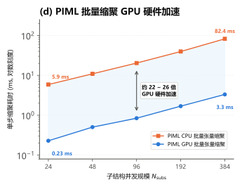

# PIML 子结构分析

## 1. 研究范围与算例设计

本实验验证 `shape_function_route` 与 `reduced_stiffness_route` 的局部刚度构造正确性、误差传递阶次、全系统求解保真度与批量缩聚的设备性能，两条路线各自并列 2 层与 15 层两种网络配置。各算例统一采用 Q1 单元、$5\times 5$ 的块内划分，覆盖局部缩聚、接口装配求解和内部位移恢复，不包含优化器密度更新；除 15 层配置外，各算例采用相同的训练配置。现有产物均由 2 层配置产出，15 层配置补齐后需逐项重跑对照。

| 验证内容 | 算例与网络 | 主要指标 |
|---|---|---|
| 2 层网络 | Huang2022 二维 `CantileverCorner2d`、Huang2023 三维 `FullMBBBeam3d`，`ShapeFunctionSurrogateNet`（隐层宽 256）与 `PIMLSurrogateNet`（隐层宽 128），SiLU 激活 | 解层误差与训练成本 |
| 15 层网络 | `FullMBBBeam2d`，同两个网络类的 15 层 tanh/elu 交替配置 | 解层误差与训练成本，与 2 层配置对照 |

### 1.1 学习目标与接口迹空间

一个待训练的网络由空间维数 $d$、块内单元数 `n_fine`、接口迹空间与学习目标四项属性唯一确定。学习目标决定网络预测对象与局部刚度构造方式，迹空间决定接口保留的自由度规模：`full_trace` 保留全部接口自由度（$n_b$ 个），`linear_corner` 只保留宏观角点自由度（$n_c$ 个）；$n_i$ 记单块内部自由度数。

| 学习目标 | 迹空间 | 网络预测对象 | 局部刚度来源 | 内部位移恢复 |
|---|---|---|---|---|
| 形函数预测 | `full_trace` | $\widehat{\mathbf{B}}_j$，$n_i\times n_b$ | 变分重构 $\widetilde{\mathbf{K}}_r^j=(\widehat{\mathbf{H}}_j^{T})^{\mathsf{T}}\mathbf{K}^j\widehat{\mathbf{H}}_j^{T}$，其中 $\widehat{\mathbf{H}}_j^{T}=[\widehat{\mathbf{B}}_j;\mathbf{T}_j]$ | 同一预测量延拓 $\mathbf{u}_i^j=\widehat{\mathbf{B}}_j\mathbf{q}_j$ |
| 形函数预测 | `linear_corner` | $\widehat{\mathbf{B}}_j$，$n_i\times n_c$ | 同式，取 $\mathbf{T}_j=\mathbf{L}_j$ | 同式，取 $\mathbf{q}_j=\mathbf{u}_c^j$ |
| 降阶刚度直接预测 | `full_trace` | $\widehat{\mathbf{K}}_r^j$，$n_b\times n_b$ | 网络直接输出 | 降阶刚度不能唯一确定内部延拓，回落到精确延拓 $\mathbf{u}_i^j=\mathbf{B}_j\mathbf{q}_j$ |
| 降阶刚度直接预测 | `linear_corner` | $\widehat{\mathbf{K}}_r^j$，$n_c\times n_c$ | 网络直接输出 | 同上，取 $\mathbf{q}_j=\mathbf{u}_c^j$ |

### 1.4 网络实现与可配置项

两条路线的网络类 `ShapeFunctionSurrogateNet` 与 `PIMLSurrogateNet` 都是骨干 `MLP` 的薄包装（[`src/soptx/ml/substructure/nets.py`](../../src/soptx/ml/substructure/nets.py)），层数与激活由构造函数参数给出：

```python
class ShapeFunctionSurrogateNet(MLP):

    def __init__(
        self,
        input_dim: int,
        output_dim: int,
        hidden_dims: tuple[int, ...],
        *,
        activation: ActivationSpec = nn.SiLU,
    ) -> None:
        super().__init__(
            input_dim=input_dim,
            output_dim=output_dim,
            hidden_dims=tuple(hidden_dims),
            activation=activation,
        )
```

两个类的构造函数体逐字相同，差别仅在 `output_dim` 的语义：形函数路线为 $n_i\times m$，降阶刚度路线为 Cholesky 因子的下三角独立条目数。降阶刚度路线的实质内容不在网络类，而在训练目标与推理重构两处：拟合目标 $\mathbf{L}_j=\mathrm{chol}\!\left((\mathbf{R}_{\perp}^j)^{\mathsf{T}}\mathbf{K}_s^j\mathbf{R}_{\perp}^j\right)$ 的构造见 [`train_reduced_stiffness_surrogate`](../../src/soptx/fem/substructure/case_setup.py)，推理侧按 $\mathbf{R}_{\perp}^j\mathbf{L}_j\mathbf{L}_j^{\mathsf{T}}(\mathbf{R}_{\perp}^j)^{\mathsf{T}}$ 重构见 [`PIMLStaticCondensation`](../../src/soptx/fem/substructure/piml_surrogate.py)，参数化性质见第 2.3 节。

---

## 2. 2 层网络

### 2.1 网络与训练配置

块内单元数 `n_fine` 是方法的自由参数：它决定网络的输入维（`n_fine` 各分量之积）、输出维与接口自由度规模，因此每个 `n_fine` 对应一族独立的网络——同一 `n_fine` 下的网络与具体问题无关，换 `n_fine` 则须重新训练。子结构划分 `n_sub` 不进网络，可自由更换，这正是问题无关性的确切边界。

设空间维数为 $d$、`n_fine` 各方向均为 $m$（一阶四边形 / 六面体单元），则各维度量有闭式：

$$n_i = d\,(m-1)^d,\qquad n_b = d\left[(m+1)^d-(m-1)^d\right],\qquad n_r = n_b - n_{\mathrm{rigid}},\qquad n_{\mathrm{rigid}}=\begin{cases}3,& d=2\\[2pt] 6,& d=3\end{cases}$$

其中 $n_b$ 为 `full_trace` 的接口自由度；`linear_corner` 下接口退化到 $2^d$ 个角点，接口自由度为 $n_c = d\,2^d$，相应地 $n_r = n_c - n_{\mathrm{rigid}}$。网络输入维为 $m^d$，输出维为 $n_i\times n_r$（网络只预测变形分量，刚体分量解析给出）。

本报告固定 $m=5$，四种维数与迹空间组合的实例化如下：

| $d$ | 迹空间 | `n_fine` | 输入维 $m^d$ | $n_i$ | 接口自由度 | $n_r$ | 输出维 $n_i\times n_r$ |
|---|---|---|---|---|---|---|---|
| 2 | `full_trace` | `[5, 5]` | 25 | 32 | $n_b=40$ | 37 | 1,184 |
| 2 | `linear_corner` | `[5, 5]` | 25 | 32 | $n_c=8$ | 5 | 160 |
| 3 | `full_trace` | `[5, 5, 5]` | 125 | 192 | $n_b=456$ | 450 | 86,400 |
| 3 | `linear_corner` | `[5, 5, 5]` | 125 | 192 | $n_c=24$ | 18 | 3,456 |

两条路线的网络均为 2 层 SiLU MLP，`ShapeFunctionSurrogateNet` 隐层宽 256，`PIMLSurrogateNet` 隐层宽 128。记隐层宽为 $H$、输出维为 $d_{\mathrm{out}}$，网络为三个线性层与两次 SiLU 交替，输出层不加激活：

$$
\mathbf{y} = \mathbf{W}_3\,\sigma\!\big(\mathbf{W}_2\,\sigma(\mathbf{W}_1\boldsymbol{\rho}^j+\mathbf{b}_1)+\mathbf{b}_2\big)+\mathbf{b}_3,
\qquad
\sigma(x)=\frac{x}{1+e^{-x}}
$$

其中 $\mathbf{W}_1\in\mathbb{R}^{H\times m^d}$、$\mathbf{W}_2\in\mathbb{R}^{H\times H}$、$\mathbf{W}_3\in\mathbb{R}^{d_{\mathrm{out}}\times H}$，$\mathbf{b}_1,\mathbf{b}_2\in\mathbb{R}^{H}$、$\mathbf{b}_3\in\mathbb{R}^{d_{\mathrm{out}}}$。

两个网络类的实现与可配置项见第 1.4 节，本节一律传 `(H, H)`，激活取默认的 SiLU。宽度的实际取值：形函数路线的 256 由 `cases.toml` 的标量字段 `hidden_dim` 指定，在调用点展开为 `(256, 256)`；降阶刚度路线的 `(128, 128)` 写在 `src/soptx/fem/substructure/case_setup.py` 的模块常量 `_REDUCED_STIFFNESS_HIDDEN_DIMS` 中，尚未接到 `cases.toml`。

训练为全批量 Adam（`examples/piml_substructure_elasticity/verify_shape_function_route.py`）：

```python
net = ShapeFunctionSurrogateNet(
    input_dim=N_FINE[0] * N_FINE[1],
    output_dim=ev.n_i * ev.n_reduced,
    hidden_dim=hidden_dim,
)

optimizer = optim.Adam(net.parameters(), lr=learning_rate)
criterion = nn.MSELoss()
for _ in range(n_epochs):
    optimizer.zero_grad()
    loss = criterion(net(X), Y)
    loss.backward()
    optimizer.step()
```

网络类可跨配置复用，上面的训练循环则不能：全批量前向在第 3 节的 40 万样本下不可行。

**训练与优化协议**：

| 项 | $d=2$ | $d=3$ |
|---|---|---|
| 回归目标 | 形函数路线为变形分量 $\mathbf{M}_j$，降阶刚度路线为 Cholesky 独立条目 | 同左 |
| 学习率 $\eta$ | $0.005$ | 同左 |
| 训练集 $N_{\text{train}}$ | $2000$ | $400{,}000$ |
| 留出集 $N_{\text{eval}}$ | 形函数路线 $200$，降阶刚度路线 $100$ | 待定 |
| 训练轮数 | $4000$，全批量 | 待定；$400{,}000$ 样本下全批量不可行，须改小批量 |
| 随机种子 | $2026$ | 同左 |

$d=3$ 一列的训练集规模取自 Huang 2023 §3.3，其余空缺项无文献或实测依据。该维数下的网络架构不是本节的 2 层配置，而是 15 层拆分配置，见 3 节。

### 2.2 形函数预测 `shape_function_route`

本节按 `full_trace` 与 `linear_corner` 两条迹空间逐一考察同一个问题：网络预测的内部延拓 $\widehat{\mathbf{B}}_j$ 经变分重构式构造后，局部刚度与解层结果是否与精确静力缩聚基准一致。

$$
\widetilde{\mathbf{K}}_r^j=(\widehat{\mathbf{H}}_j^{T})^{\mathsf{T}}\mathbf{K}^j\widehat{\mathbf{H}}_j^{T},
\qquad
\mathbf{K}_r^j=\mathbf{T}_j^{\mathsf{T}}\mathbf{K}_s^j\mathbf{T}_j=(\mathbf{H}_j^{T})^{\mathsf{T}}\mathbf{K}^j\mathbf{H}_j^{T}
$$

$$
\varepsilon_N=\frac{\lVert\widehat{\mathbf{B}}_j-\mathbf{B}_j\rVert_F}{\lVert\mathbf{B}_j\rVert_F},
\qquad
\varepsilon_K=\frac{\lVert\widetilde{\mathbf{K}}_r^j-\mathbf{K}_r^j\rVert_F}{\lVert\mathbf{K}_r^j\rVert_F}
$$

构造实现为两步：

$$
\mathbf{K}^j=\begin{bmatrix}\mathbf{K}_{ii}^j & \mathbf{K}_{ib}^j\\[2pt] (\mathbf{K}_{ib}^j)^{\mathsf{T}} & \mathbf{K}_{bb}^j\end{bmatrix}
\;\longmapsto\;
\Big(\mathbf{K}_{ii}^j,\ \mathbf{K}_{ib}^j\mathbf{T}_j,\ \mathbf{T}_j^{\mathsf{T}}\mathbf{K}_{bb}^j\mathbf{T}_j\Big)
$$

$$
\mathbf{K}_r^j=\mathbf{T}_j^{\mathsf{T}}\mathbf{K}_{bb}^j\mathbf{T}_j+\mathbf{A}+\mathbf{A}^{\mathsf{T}}+\mathbf{B}_j^{\mathsf{T}}\mathbf{K}_{ii}^j\mathbf{B}_j,
\qquad
\mathbf{A}=(\mathbf{K}_{ib}^j\mathbf{T}_j)^{\mathsf{T}}\mathbf{B}_j
$$

两条迹空间共用核心库的同一段构造（`src/soptx/fem/substructure/piml_surrogate.py`），传入网络输出 $\widehat{\mathbf{B}}_j$ 即得 $\widetilde{\mathbf{K}}_r^j$；`full_trace` 取 $\mathbf{T}_j=\mathbf{I}$，`linear_corner` 取 $\mathbf{T}_j=\mathbf{L}_j$。

```python
class ShapeFunctionCondensation(StaticCondensationBase):

    def _trace_blocks(self, K_local: Any) -> Tuple[Any, Any, Any]:
        """把局部刚度的分块映射到当前迹空间."""
        K_ii = K_local[..., self.i_dofs[:, None], self.i_dofs]
        K_ib = K_local[..., self.i_dofs[:, None], self.b_dofs]
        K_bb = K_local[..., self.b_dofs[:, None], self.b_dofs]
        if self.trace_matrix is None:
            return K_ii, K_ib, K_bb
        T = self.trace_matrix
        return K_ii, K_ib @ T, bm.matrix_transpose(T) @ K_bb @ T

    @staticmethod
    def _variational_stiffness(
        K_ii: Any, K_ib_t: Any, K_bb_t: Any, B: Any
    ) -> Any:
        """在已切片的迹空间分块上展开变分式."""
        A = bm.matrix_transpose(K_ib_t) @ B
        return (
            K_bb_t + A + bm.matrix_transpose(A)
            + bm.matrix_transpose(B) @ K_ii @ B
        )
```

#### `full_trace`：解层与精确缩聚一致

产物 `shape_function_full_trace_2d`（`FullMBBBeam2d`，24 子结构，2000 组 / 4000 轮）。分三层读：

| 层次 | 指标 | 实测 |
|---|---|---|
| 恒等式层（不含网络） | 精确内部延拓 $\mathbf{B}_j$ 代入变分重构式的相对误差 | `6.33e-16` |
| | 刚体解析分量相对偏差 | `3.96e-16` |
| | 12 量级扰动扫描的 $\log$-$\log$ 斜率 | `2.0030`（解析对照运行 `2.0000`，理论 2） |
| | 拟合放大系数 | `0.84` |
| 网络层（留出集 200 样本） | 内部延拓自身预测误差 $\varepsilon_N$ | 均值 $8.97\%$，最大 $14.60\%$ |
| | 经变分重构式构造后的缩聚刚度误差 $\varepsilon_K$ | 均值 $0.44\%$，最大 $1.22\%$ |
| 解层（在役密度场） | 局部刚度相对误差 | 均值 $0.09\%$，最大 $0.15\%$ |
| | 接口位移相对误差 | $0.15\%$ |
| | 全场回填位移相对误差 | $0.15\%$ |
| | 结构柔度相对误差 | $0.20\%$ |

恒等式层的三项都在机器精度上成立，说明变分构造与解析刚体分解本身不引入误差；斜率 `2.0030` 证实二阶压缩在 12 个扰动量级上稳定。网络层 $8.97\%\to 0.44\%$ 的落差（约 20 倍）正是这一机理的实测体现。解层四项均在 $0.2\%$ 以内，且从局部刚度到柔度未见放大——本条路线与精确缩聚一致。

#### `linear_corner`：现有产物不构成判定

`cases.toml` 已按与 `full_trace` 相同的 2000 组 / 4000 轮登记该工况，但现有产物 `eq17_second_order_linear_corner.json` 由 300 组 / 300 轮的欠拟合配置产出，其网络层与解层数字（$\varepsilon_N$ 均值 $46.3\%$、全场位移误差 $99.9\%$、柔度误差 $96.4\%$）是欠拟合后果，不作能力判定。

产物中两类与训练无关的诊断量仍可读：

| 诊断量 | `full_trace` | `linear_corner` | 读法 |
|---|---|---|---|
| 精确内部延拓 $\mathbf{B}_j$ 代入变分重构式的相对误差 | `6.33e-16` | `1.39e-15` | 变分恒等式在角点迹下同样成立 |
| 扰动扫描 $\log$-$\log$ 斜率 | `2.0030` | `2.0026` | 二阶压缩机理不依赖迹空间，与上文推导一致 |
| 拟合放大系数 | `0.84` | `7.78` | 同样的 $\varepsilon_N$ 下角点迹的刚度误差约高一个量级，对拟合质量的要求更严 |
| 刚体分量密度无关性 | `5.0e-16` | `5.3e-16` | 刚体响应是几何恒等式，两者都成立 |
| 刚体解析分量相对偏差 | `3.96e-16` | `1.193` | **待查**：角点迹下用于拆分的解析 $\boldsymbol{\Phi}_i^j$ 与真实刚体响应不符 |

最后一行是重跑前必须先解决的问题。密度无关性成立而解析偏差为 $\mathcal{O}(1)$，说明失配出在 `verify_shape_function_route.py` 的 `linear_corner` 分支重构 $\mathbf{R}_q^j$ 与 $\boldsymbol{\Phi}_i^j$ 的基选取上（该分支还把刚体模态数与角点变形维数写死为 3 与 5，见 2.1 节的维数闭式），不是物理层面的失效。排查并按登记配置重跑后，本格才可与 `full_trace` 并列比较。


### 2.3 降阶刚度预测：Cholesky 零空间参数化与留出集精度

`reduced_stiffness_route` 由网络直接输出降阶刚度，没有变分重构式那样的误差抵消机理，解层精度直接由拟合质量决定；参数化本身的精度上限与刚体零空间约束则由代数构造保证。产物 `piml_exact_comparison.json`（`FullMBBBeam2d`，24 子结构，`full_trace`）：

| 指标 | 实测 |
|---|---|
| 训练集最终 MSE | `2.04e-05` |
| 留出集（100 样本）降阶刚度相对误差 | 均值 $4.30\%$，最大 $8.09\%$ |
| 在役密度场降阶刚度相对误差 | 均值 $2.90\%$，最大 $5.83\%$ |
| 参数化误差上限 | `3.84e-08` |
| 刚体零空间污染比（最大 / 均值） | `3.85e-15` / `1.11e-15` |
| 刚体基残差 | `8.77e-17` |

两点读数：

1. **刚体零空间约束在机器精度上成立。** $\widehat{\mathbf{K}}_r^j=\mathbf{R}_{\perp}^j\mathbf{C}_j\mathbf{C}_j^{\mathsf{T}}(\mathbf{R}_{\perp}^j)^{\mathsf{T}}$ 的构造使 $\widehat{\mathbf{K}}_r^j\mathbf{R}_q^j$ 恒为零；实测污染比 `3.85e-15` 与参数化误差上限 `3.84e-08` 都远低于任何物理误差量级，本路线的解层误差不来自刚体不变性破坏。
2. **误差来自拟合本身。** 留出集 $4.30\%$ 与在役 $2.90\%$ 的降阶刚度误差量级一致，且都比形函数路线经变分重构式构造后的 $0.44\%$ 高一个量级；差别在于有没有一阶敏感度抵消，不在于物理先验是否满足。

### 2.4 全局求解保真度与两条路线对比

`FullMBBBeam2d` 的求解域为 $[0,12]\times[0,2]$，划分为 $12\times 2$ 共 24 个子结构，单块包含 $5\times 5$ Q1 单元，全尺度细网格共 682 自由度。


在完全一致的物理问题、网格离散与在役密度场下，对比形函数变分路线与直接预测刚度路线的解层精度：

| 评估指标 | 直接预测刚度路线 $\widehat{\mathbf{K}}_r^j$ | 预测形函数变分路线 $\widetilde{\mathbf{K}}_r^j$ | 变分路线精度提升倍数 |
|:---|:---:|:---:|:---:|
| **局部刚度最大相对差** | 5.83% | **0.15%** | **38.9 倍** |
| **接口位移相对误差** | 2.05% | **0.15%** | **13.7 倍** |
| **全场回填位移相对误差** | 2.01% | **0.15%** | **13.4 倍** |
| **全局结构柔度相对误差** | 3.64% | **0.20%** | **18.2 倍** |

#### 误差传递与机理剖析

1. **变分形函数路线**：得益于变分重构式的二次型抵消机理，局部刚度误差仅为 $0.15\%$；在全局 24 子结构装配求解后，误差平稳传递至接口位移（$0.15\%$）、全场回填位移（$0.15\%$）与结构柔度（$0.20\%$），全场未出现病态放大。
2. **刚度直接预测路线**：Cholesky 参数化已在机器精度上满足对称半正定与刚体零空间约束（见 2.3 节），其解层误差来自拟合误差本身——网络直接输出的降阶刚度不具备变分重构式的一阶敏感度抵消，局部刚度误差以一阶量级进入装配求解，故解层位移与柔度误差比变分路线高 10~18 倍。

---

## 3. 15 层网络（待实现）

15 层配置尚无产物，`cases.toml` 也未登记该工况。网络结构侧的限制已解除，余下的是训练规模与拆分策略。

| 目标配置 | 现状 | 待实现 |
|---|---|---|
| 15 层隐藏层 | 见第 1.4 节代码：两个网络类已暴露 `hidden_dims`，可直接构造任意层数 | 无需改动网络类，只需登记工况 |
| tanh/elu 逐层交替 | 见第 1.4 节代码：网络类已暴露 `activation`，骨干 `MLP` 支持逐层激活序列 | 无需改动网络类，只需登记工况 |
| 4 网络拆分并行 | 无对应实现 | 输出分块与多网络组合，以及拆分后的装配 |
| 40 万训练样本 | 脚本已支持 `n_train` 字段，未在该规模下运行 | 确认采样耗时与显存开销 |

上述目标配置的层数、激活方式、拆分策略与样本量取自 Huang 2023 §3.3，该处描述的是 $N=3$、$m=5$ 的三维工况。

---

## 4. 批量缩聚设备性能

### 4.1 耗时与加速比曲线



### 4.2 实测数据与性能对比

测试设备为单卡 **NVIDIA GeForce RTX 5080 (16GB VRAM)**，算例为 3D $4\times 4\times 4$ 六面体网格子结构（$n_i=81, n_b=294$）：

| 子结构并发数 $N_{\mathrm{subs}}$ | 传统有限元 CPU 批量缩聚 (ms) | PIML GPU 批量缩聚 (ms) | 单卡 GPU 硬件加速比 |
|:---:|:---:|:---:|:---:|
| **24** | 5.89 | **0.23** | **25.7×** |
| **48** | 10.93 | **0.50** | **21.7×** |
| **96** | 20.34 | **0.84** | **24.1×** |
| **192** | 39.63 | **1.69** | **23.5×** |
| **384** | 82.43 | **3.32** | **24.8×** |

### 4.3 硬件级加速机理

1. **密集张量批量并行（Batched GEMM）**：PIML 代理模型将原本涉及串行高斯消元和矩阵求逆的缩聚过程，转化为神经网络前向推理与基于批处理爱因斯坦求和的密集张量运算，完全契合现代 GPU Tensor Core 的并行架构；
2. **数据全流程显存驻留**：输入单元密度向量与输出等效缩聚刚度全程 100% 驻留 GPU 显存，彻底消除了 CPU 与 GPU 之间高频的主机总线（PCIe）通信延迟。

---

## 5. 测试环境与软硬件配置

* **操作系统**：Ubuntu 24.04 LTS (WSL2)
* **计算软件栈**：Python 3.12.13, PyTorch 2.13.0 (+cu130), FEALPy, NumPy 2.2.6
* **硬件设备**：
  * CPU: 13th Gen Intel Core i9-13900K
  * GPU: NVIDIA GeForce RTX 5080 (16GB GDDR7, 标称显存带宽 960 GB/s)

