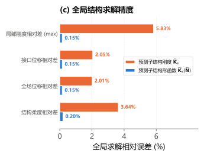

# PIML 子结构分析

## 1. 研究范围与验证对象

本文研究给定材料场下的 PIML 子结构静力分析，覆盖 `full_trace + PIML` 和 `linear_corner + PIML` 两种组合，考察预测方法、参数化方式及网络配置对局部预测精度、全局分析精度和计算成本的影响。验证范围包括局部算子预测与构造、接口装配求解和内部位移恢复，不包含优化器密度更新。

| PIML 分析组合 | 精度参考基准 | 主要评价内容 |
|---|---|---|
| `full_trace + PIML` | `full_trace + 精确` | 完整接口空间下的局部预测误差及其对全局分析的影响 |
| `linear_corner + PIML` | `linear_corner + 精确` | 角点线性接口空间下的局部预测误差及其对全局分析的影响 |

## 2. 子结构网络构建

网络构建是样本生成与训练之前的第一步：先确定子结构、接口空间和预测目标，再据此创建输入输出维度匹配的网络。本节说明当前入口的构建方式；网络完成实例化仅表示结构已建立，预测精度须由后续训练和验证确定。

### 2.1 子结构配置与接口空间

下面集中列出直接调用 `IndependentTargetProvider` 时需要设置的参数，再创建子结构及接口空间。

`IndependentTargetProvider` 是单个子结构的标签生成器：它只构造一个参考子结构（`SubstructurePrototype`）、该子结构的局部接口迹基 $\mathbf T_j$ 以及独立条目编解码器，用于确定网络维度（2.2 节）、生成精确标签（第 3 节）和局部预测验证（第 5 节）。它不包含整体排列、全局接口自由度或迹延拓 $\mathbf P$；第 6 节整体分析复用其参考子结构与编解码器，整体结构另由 `GlobalAssembler` 与 `build_substructures` 创建，与 [精确子结构分析 §2.1](../analysis_capability_substructure/results_analysis.md) 相同。

相关源码：[src/soptx/fem/substructure/independent_targets.py](../../src/soptx/fem/substructure/independent_targets.py)

```python
from soptx.fem.substructure.independent_targets import IndependentTargetProvider

# 子结构配置.
cell_size = (1.0, 1.0, 1.0)    # 三维单位立方体.
n_fine = (5, 5, 5)             # 各方向细单元数, 共 125 个细单元; 每个分量至少为 2.
nu = 0.3                       # 泊松比.
trace_kind = "linear_corner"   # 接口空间: linear_corner 或 full_trace.
hypothesis = None             # 三维各向同性线弹性; 二维可选 plane_stress 或 plane_strain.

# 创建单个参考子结构及其接口迹基.
provider = IndependentTargetProvider(
    cell_size=cell_size,
    n_fine=n_fine,
    nu=nu,
    trace_kind=trace_kind,
    hypothesis=hypothesis,
)

# 内部固定 E_base=1.0, penal=1.0, rho_min=0.0.
# 单元归一化杨氏模量 E_e/E_0 在后续样本生成或结构分析时传入.

# 读取几何、材料、接口自由度及网络输入输出维度.
metadata = provider.metadata()
```

### 2.2 子结构网络构建

| 路线 | 网络输入 | 网络输出 | 输入维度 | 输出维度 |
|---|---|---|---|---|
| `shape` | 各细单元的归一化杨氏模量 $E_e/E_0$ | 内部形函数的独立分量 | `input_dim` | `shape_output_dim` |
| `stiffness` | 各细单元的归一化杨氏模量 $E_e/E_0$ | 缩聚刚度的独立条目 | `input_dim` | `stiffness_output_dim` |

相关源码：[src/soptx/ml/substructure/independent_training.py](../../src/soptx/ml/substructure/independent_training.py)、[src/soptx/ml/substructure/nets.py](../../src/soptx/ml/substructure/nets.py)

```python
import torch
from torch import nn
from soptx.ml.substructure.nets import IndependentOutputNet, SplitOutputNet

# 网络配置: 每次构建一条预测路线的网络.
route = "shape"          # 预测路线: shape 或 stiffness.
num_networks = 4         # 当前路线的子网络数; shape 为 4, stiffness 为 1.
seed = 2026              # 本项目的网络初始化随机种子.

#每个子网络含 15 个隐藏层, 逐层宽度及激活函数如下.
# 输出层不加激活; activations 的长度与 hidden_dims 相同.
hidden_dims = (
    60, 80, 100, 120, 140, 160, 180, 200,
    180, 160, 140, 120, 100, 80, 60,
)
activations = (
    nn.Tanh, nn.ELU, nn.Tanh, nn.ELU, nn.Tanh,
    nn.ELU, nn.Tanh, nn.ELU, nn.ELU, nn.Tanh,
    nn.ELU, nn.Tanh, nn.ELU, nn.Tanh, nn.ELU,
)

# 从子结构配置确定输入输出维度.
input_dim = metadata["n_cells"]
shape_output_dim = metadata["n_shape_targets"]
stiffness_output_dim = metadata["n_stiffness_targets"]
output_dims = {"shape": shape_output_dim, "stiffness": stiffness_output_dim}
output_dim = output_dims[route]

# 按连续索引均衡分组, 余数优先分配给前面的子网络.
size, remainder = divmod(output_dim, num_networks)
groups, start = [], 0
for i in range(num_networks):
    stop = start + size + (i < remainder)
    groups.append(tuple(range(start, stop)))
    start = stop

# 显式传入输入维度、输出维度、隐藏层及激活函数.
torch.manual_seed(seed)
if num_networks == 1:
    network = IndependentOutputNet(
        input_dim=input_dim,
        output_dim=output_dim,
        hidden_dims=hidden_dims,
        activation=activations,
    )
else:
    network = SplitOutputNet(
        input_dim=input_dim,
        output_dim=output_dim,
        hidden_dims=hidden_dims,
        activation=activations,
        output_groups=tuple(groups),
    )
network = network.to(dtype=torch.float64)
```

## 3. 样本生成

沿用第 2 节的 `provider` 与子结构配置，先采样材料输入，再通过局部精确有限元计算生成两条预测路线的训练标签。此过程不使用网络预测。

### 3.1 材料输入采样

相关源码：[src/soptx/ml/substructure/independent_training.py](../../src/soptx/ml/substructure/independent_training.py)

```python
# 样本配置.
n_train = 400_000           # 训练样本数; 在 m=5 时采用 400,000 个样本.
n_validation = 40_000       # 验证样本数; 本项目设置, 用于后续选模.
min_modulus = 1e-6          # 归一化杨氏模量下界; 本项目设置, 避免零刚度奇异.
generation_batch_size = 32  # 每批计算精确标签的样本数.
sampling_seed = 2026        # 材料采样随机种子, 与网络初始化种子分别设置.
```

每个样本包含 `metadata["n_cells"]` 个归一化杨氏模量 $x_e=E_e/E_0$。当前实现对各样本、各细单元独立均匀采样，范围为 $[\texttt{min\_modulus},1)$。

### 3.2 预测目标生成与保存

相关源码：[src/soptx/fem/substructure/independent_targets.py](../../src/soptx/fem/substructure/independent_targets.py)、[src/soptx/ml/substructure/independent_training.py](../../src/soptx/ml/substructure/independent_training.py)

`provider` 根据材料输入执行局部精确有限元计算，提取内部形函数的独立分量和缩聚刚度的独立条目，作为两条路线的监督标签。

设内部自由度数为 $n_i$、接口自由度数为 $n_q$、刚体模态数为 $n_{\mathrm{rigid}}$。从接口刚体模态矩阵中选取 $n_{\mathrm{rigid}}$ 个线性无关的行，其索引作为待补全自由度；其余索引按升序组成集合 $\mathcal F$，满足 $|\mathcal F|=n_q-n_{\mathrm{rigid}}$。两条路线的标签定义为

$$
\mathbf y_{\mathrm{shape}}
=\operatorname{vec}_{\mathrm{row}}\!\left(\mathbf B_{:,\mathcal F}\right),
\qquad
\mathbf y_{\mathrm{stiffness}}
=\operatorname{vech}_{\mathrm{row}}\!\left((\mathbf K_r)_{\mathcal F,\mathcal F}\right).
$$

其中，$\mathbf B$ 和 $\mathbf K_r$ 分别为精确内部形函数矩阵与缩聚刚度矩阵；$\operatorname{vec}_{\mathrm{row}}$ 表示逐行展平，$\operatorname{vech}_{\mathrm{row}}$ 表示逐行提取下三角条目（包含对角线），顺序与 `encode()` 实现一致。标签维度分别为

$$
\dim\mathbf y_{\mathrm{shape}}=n_i(n_q-n_{\mathrm{rigid}}),
\qquad
\dim\mathbf y_{\mathrm{stiffness}}
=\frac{(n_q-n_{\mathrm{rigid}})(n_q-n_{\mathrm{rigid}}+1)}{2}.
$$

这里由 `prepare_training_data()` 组织训练集、验证集及元数据. 它派生两条独立随机流, 再分别调用不限定样本用途的 `generate_samples()` 分批写盘.

```python
from pathlib import Path
from soptx.ml.substructure.independent_training import prepare_training_data

# 从仓库根目录运行; 每次生成使用新目录, 不覆盖已有数据.
samples_dir = Path(
    "experiments/analysis_capability_piml_substructure/outputs/"
    "independent_15_layer/samples/example_run"
)

# 内部分批采样 inputs, 调用 targets = provider(inputs), 并保存两条路线的标签.
dataset_dir = prepare_training_data(
    provider,
    samples_dir,
    n_train=n_train,
    n_validation=n_validation,
    batch_size=generation_batch_size,
    min_modulus=min_modulus,
    seed=sampling_seed,
)
```

样本生成运行命令：

```bash
# 生成训练集和验证集
python run.py \
  --generate-samples \
  --dim 3 --cell-size 1.0 1.0 1.0 --n-fine 5 \
  --trace-kind linear_corner \
  --n-train 400000 --n-validation 40000 \
  --generation-batch-size 32 --min-modulus 1e-6 \
  --seed 2026
```

| 保存文件 | 内容与形状 |
|---|---|
| `train_inputs.npy` / `validation_inputs.npy` | 材料输入，形状为 `(样本数, input_dim)` |
| `train_shape_targets.npy` / `validation_shape_targets.npy` | 形函数独立分量，形状为 `(样本数, shape_output_dim)` |
| `train_stiffness_targets.npy` / `validation_stiffness_targets.npy` | 刚度独立条目，形状为 `(样本数, stiffness_output_dim)` |
| `manifest.json` | 子结构配置、采样设置、样本数及完成标记 |

### 3.3 样本生成结果

已有运行记录中，三维子结构采用 $5\times5\times5$ 个细单元，`linear_corner` 工况已生成两条路线共用的材料输入及各自的监督标签，结果如下。

| 接口空间 | 训练样本数 | 验证样本数 | 标签 | 数据目录 / 登记状态 |
|---|---:|---:|---|---|
| `linear_corner` | 400,000 | 40,000 | 形函数独立分量、刚度独立条目 | [samples/20260922T065924289373Z](outputs/independent_15_layer/samples/20260922T065924289373Z/) |
| `full_trace` | — | — | — | 本配置尚未登记 |

## 4. 网络训练

沿用第 2 节创建的 `network`、`route` 和 `provider`，读取第 3 节生成的 `dataset_dir`，训练当前预测路线并保存验证损失最低的模型。

### 4.1 训练配置与监督损失

相关源码：[src/soptx/ml/substructure/training.py](../../src/soptx/ml/substructure/training.py)

```python
from soptx.ml.substructure.training import TrainingConfig

# 优化器配置.
optimizer = "adam"       # adam、adamw 或 sgd; 默认 adam.
optimizer_params = {
    "lr": 1e-3,          # 初始学习率.
    "weight_decay": 0.0, # 权重衰减系数.
}

# 本项目训练流程配置.
epochs = 500              # 最大训练轮数.
training_batch_size = 256  # 训练或验证的批量大小, 与样本生成批量分别设置.
patience = 40            # 验证损失连续未改善的提前停止轮数; 0 表示不提前停止.
training_seed = 2026     # 每轮训练样本随机排列的种子.
device = "cpu"           # 训练设备: cpu 或 cuda.

config = TrainingConfig(
    epochs=epochs,
    batch_size=training_batch_size,
    optimizer=optimizer,
    optimizer_params=optimizer_params,
    patience=patience,
    seed=training_seed,
)

```

设一批含 $N$ 个样本，$\widehat{\mathbf B}_s$、$\widehat{\mathbf K}_{r,s}$ 为网络输出补全后的矩阵，$\mathbf B_s$、$\mathbf K_{r,s}$ 为精确标签补全后的矩阵，则

$$
\mathcal L_{\mathrm{shape}}
=\frac{1}{N n_i n_q}\sum_{s=1}^{N}
\left\|\widehat{\mathbf B}_s-\mathbf B_s\right\|_{\mathrm F}^{2},
\qquad
\mathcal L_{\mathrm{stiffness}}
=\frac{1}{N n_q^{2}}\sum_{s=1}^{N}
\left\|\widehat{\mathbf K}_{r,s}-\mathbf K_{r,s}\right\|_{\mathrm F}^{2}.
$$

### 4.2 训练执行与模型保存

相关源码：[src/soptx/ml/substructure/independent_training.py](../../src/soptx/ml/substructure/independent_training.py)

```python
from pathlib import Path
from soptx.ml.substructure.independent_training import train_networks

# 从仓库根目录运行; 每次训练使用新目录, 不覆盖已有结果.
training_dir = Path(
    "experiments/analysis_capability_piml_substructure/outputs/"
    "independent_15_layer/training/example_run"
)

# 读取当前路线的输入和标签, 训练第 2 节创建的网络.
results = train_networks(
    dataset_dir,
    training_dir,
    networks={route: network},
    codecs=provider.codecs,
    provider_metadata=provider.metadata(),
    route=route,
    device=device,
    config=config,
)
```

网络训练运行命令：

```bash
# 用训练集更新网络，用验证集选择并保存最佳权重。
# 数据集已确定接口空间 (linear_corner 或 full_trace) 及子结构配置。
# 接口空间及子结构配置从 manifest.json 自动读取，此处仅设置网络和训练参数。
DATASET="outputs/independent_15_layer/samples/<时间戳>"
python run.py \
  --train --dataset "$DATASET" \
  --route shape --num-networks 4 \
  --optimizer adam --lr 1e-3 --weight-decay 0.0 \
  --epochs 500 --batch-size 256 --patience 40 \
  --seed 2026 --device cpu
```

| 保存文件 | 内容 |
|---|---|
| `run_config.json` | 数据集来源、训练参数、路线、设备及损失配置 |
| `shape_best.pt` 或 `stiffness_best.pt` | 当前路线的最佳模型权重、网络结构、数据集元数据、最佳轮次及对应的优化器和调度器状态 |
| `shape_history.json` 或 `stiffness_history.json` | 各轮训练损失、验证损失和学习率 |
| `summary.json` | 实际训练轮数、最佳轮次、最佳验证损失及权重路径 |

### 4.3 网络训练结果

以下为已有三维 $m=5$、15 隐藏层网络的训练记录，使用第 3.3 节登记的数据集：

| 接口空间 | 路线 | 网络数量 | 实际训练轮数 | 最佳轮次 | 最佳验证 MSE | 结果目录 / 汇总 |
|---|---|---:|---:|---:|---:|---|
| `linear_corner` | 形函数 | 4 | 500 | 498 | $6.409\times10^{-6}$ | [训练目录](outputs/independent_15_layer/training/20260922T065924289373Z/) · [汇总](outputs/independent_15_layer/training/20260922T065924289373Z/summary.json) |
| `linear_corner` | 直接刚度 | 1 | 46 | 6 | $9.765\times10^{-7}$ | [训练目录](outputs/independent_15_layer/training/20260922T065924289373Z/) · [汇总](outputs/independent_15_layer/training/20260922T065924289373Z/summary.json) |
| `full_trace` | 形函数 | — | — | — | — | 尚未登记 |
| `full_trace` | 直接刚度 | — | — | — | — | 尚未登记 |

## 5. 局部预测验证

加载训练过程中验证损失最低的网络权重，在独立测试样本上进行局部预测，并与相同子结构配置、相同接口空间下的精确有限元结果比较。

### 5.1 模型加载与局部预测

相关源码：[src/soptx/ml/substructure/validation.py](../../src/soptx/ml/substructure/validation.py)、[src/soptx/ml/substructure/independent_checkpoints.py](../../src/soptx/ml/substructure/independent_checkpoints.py)、[local_validation.py](local_validation.py)

```python
from pathlib import Path
from soptx.ml.substructure.validation import load_local_model
from experiments.analysis_capability_piml_substructure.local_validation import (
    evaluate_local_predictions,
)

# 测试配置.
n_test = 1_000           # 本项目设置: 独立测试样本数.
test_seed = 2027         # 测试采样种子, 与训练及验证采样区分.
test_batch_size = 32     # 每批预测及精确计算的样本数.
device = "cpu"
checkpoint_path = training_dir / f"{route}_best.pt"
test_dir = Path(
    "experiments/analysis_capability_piml_substructure/outputs/"
    "independent_15_layer/local_validation/example_run"
)

# 加载当前路线的最佳模型, 核对网络结构与子结构配置.
network = load_local_model(
    checkpoint_path=checkpoint_path,
    provider=provider,
    route=route,
    device=device,
)

# 独立采样, 执行网络预测及同接口空间下的精确计算.
results = evaluate_local_predictions(
    network=network,
    provider=provider,
    route=route,
    n_test=n_test,
    min_modulus=min_modulus,
    batch_size=test_batch_size,
    seed=test_seed,
    device=device,
    output_dir=test_dir,
)
```

测试时，网络先预测独立分量，再通过对应的 `decode()` 补全为矩阵：

| 路线 | 预测矩阵 | 精确参考 |
|---|---|---|
| `shape` | 内部形函数矩阵 $\widehat{\mathbf B}$ | 精确内部形函数矩阵 $\mathbf B$ |
| `stiffness` | 缩聚刚度矩阵 $\widehat{\mathbf K}_r$ | 精确缩聚刚度矩阵 $\mathbf K_r$ |

形函数路线还需构造完整位移延拓矩阵，并通过变分形式得到局部刚度：

$$
\widehat{\mathbf H}
=\begin{bmatrix}\widehat{\mathbf B}\\\mathbf T\end{bmatrix},
\qquad
\widetilde{\mathbf K}_r
=\widehat{\mathbf H}^{\mathsf T}\mathbf K\widehat{\mathbf H}.
$$

其中，$\mathbf T$ 为接口边界插值矩阵，$\mathbf K$ 按内部、边界自由度顺序排列。

### 5.2 局部预测精度评价

相关源码：[src/soptx/ml/substructure/validation.py](../../src/soptx/ml/substructure/validation.py)、[local_validation.py](local_validation.py)

对每个测试样本分别计算相对 Frobenius 误差：

$$
e_B=\frac{\|\widehat{\mathbf B}-\mathbf B\|_{\mathrm F}}{\|\mathbf B\|_{\mathrm F}},
$$

$$
e_{K,\mathrm{shape}}=
\frac{\|\widetilde{\mathbf K}_r-\mathbf K_r\|_{\mathrm F}}{\|\mathbf K_r\|_{\mathrm F}},
\qquad
e_{K,\mathrm{stiffness}}=
\frac{\|\widehat{\mathbf K}_r-\mathbf K_r\|_{\mathrm F}}{\|\mathbf K_r\|_{\mathrm F}}.
$$

| 路线 | 精度指标 | 约束检查 |
|---|---|---|
| `shape` | 内部形函数误差 $e_B$、变分重构刚度误差 $e_{K,\mathrm{shape}}$ | 刚体再现残差 $\widehat{\mathbf B}\mathbf R_q-\boldsymbol\Phi_i$ |
| `stiffness` | 直接预测刚度误差 $e_{K,\mathrm{stiffness}}$ | 对称性残差、刚体零空间残差 $\widehat{\mathbf K}_r\mathbf R_q$ |

其中，$\mathbf R_q$ 为接口刚体模态矩阵，$\boldsymbol\Phi_i$ 为对应的内部刚体响应。直接刚度路线还应检查变形子空间上的最小特征值，因为约束补全不自动保证正定性。

局部预测验证运行命令：

```bash
# 加载该权重，对新材料样本进行预测，并与精确计算结果比较。
# 使用第 4 节已登记的模型权重；重新训练后替换为实际训练结果目录。
TRAINING_DIR="$HOME/workspace/data/soptx/piml_substructure/independent_15_layer/training/20260922T065924289373Z"
# 预测路线与子结构配置从权重元数据自动恢复，重新生成独立测试样本。
python run.py --validate-local \
  --checkpoint "$TRAINING_DIR/shape_best.pt" \
  --n-test 1000 --test-batch-size 32 --min-modulus 1e-6 \
  --seed 2027 --device cpu
```

| 保存文件 | 内容 |
|---|---|
| `inputs.npy` | 独立测试材料输入 |
| `per_sample.jsonl` | 逐样本误差、绝对与相对约束残差、变形子空间最小特征值及分类 |
| `config.json` | 子结构配置、采样参数、测试随机流和权重来源（含 SHA256） |
| `summary.json` | 指标均值、95% 分位数、最大值及特征值分类数量；失败时记录已完成样本数与原因 |

### 5.3 局部预测验证结果

三维子结构采用 $5\times5\times5$ 个细单元，分别使用 15 隐藏层形函数网络和直接刚度网络的最佳权重，各在 1,000 个独立测试样本上完成局部验证。测试种子为 2027，归一化杨氏模量采样下界为 $10^{-6}$，计算批量为 32，设备为 CPU。

| 接口空间 | 路线 | 样本数 | 相对误差指标 | 均值 | 95% 分位数 | 最大值 | 结果目录 / 汇总 |
|---|---|---:|---|---:|---:|---:|---|
| `linear_corner` | `shape` | 1,000 | 内部形函数 | 2.545% | 3.082% | 3.921% | [结果目录](outputs/independent_15_layer/local_validation/20260926T085943268831Z_shape/) · [汇总](outputs/independent_15_layer/local_validation/20260926T085943268831Z_shape/summary.json) |
| `linear_corner` | `shape` | 1,000 | 变分重构刚度 | 0.197% | 0.291% | 0.484% | [结果目录](outputs/independent_15_layer/local_validation/20260926T085943268831Z_shape/) · [汇总](outputs/independent_15_layer/local_validation/20260926T085943268831Z_shape/summary.json) |
| `linear_corner` | `stiffness` | 1,000 | 直接预测刚度 | 3.059% | 3.918% | 5.570% | [结果目录](outputs/independent_15_layer/local_validation/20260926T093319513325Z_stiffness/) · [汇总](outputs/independent_15_layer/local_validation/20260926T093319513325Z_stiffness/summary.json) |

## 6. 整体结构分析验证

当前整体结构验证采用随机材料悬臂，6.1—6.3 分别说明装配求解、精度评价与结果登记。具有解析位移解的常应变补丁试验作为后续验证方案，单独列于 6.4。

| 验证算例 | 参考解 | 验证目的 | 实现状态 |
|---|---|---|---|
| 均匀材料常应变补丁试验 | 仿射位移解析解 | 检查基本正确性及常应变再现能力 | 待接入 |
| 随机材料悬臂 | 同接口空间精确子结构解；完整细网格有限元解用于补充比较 | 区分网络预测误差与接口近似误差 | 当前入口已接入同接口空间对照；完整细网格对照待接入 |

### 6.1 全局装配与求解

相关源码：[run.py](run.py)、[src/soptx/ml/substructure/independent_checkpoints.py](../../src/soptx/ml/substructure/independent_checkpoints.py)

走查复用训练好的网络, 从权重恢复子结构配置. 为与精确子结构走查比较, 整体密度按相同网格顺序用 seed 0 在 [0.5, 0.9) 内均匀采样, 经 SIMP (p=3) 得到杨氏模量后归一化. 网络与局部刚度装配共用同一份材料场, 不读取训练样本.

精确侧 [walkthrough.py](../analysis_capability_substructure/walkthrough.py) 与 PIML 在线侧 [walkthrough_analysis.py](walkthrough_analysis.py) 均只执行至 `local_stiffness`. PIML 在线侧已从 `--training-dir` 恢复局部问题配置并加载所需网络, 但尚未执行网络预测, 也不创建接口投影或载荷条件, 不进行缩聚和整体求解; 后续代码保留为注释. 比较时须保持两侧 `n_sub`、细网格划分、材料配置与 `--seed` 一致.

本次 `n_sub = (78, 13, 13)`, `n_fine = (5, 5, 5)`, 对应 13,182 个子结构和 1,647,750 个细单元. 权重须匹配精确走查的参考子结构配置. 上述对齐只适用于两个走查入口; 正式 `run.py --analyze` 仍使用原有随机归一化杨氏模量和悬臂工况, 其结果不能直接与本走查比较.

形函数路线通过预测的内部延拓变分重构局部刚度; 直接刚度路线由预测独立条目补全局部刚度. 装配并求解整体接口系统后, 两条路线均使用形函数网络恢复内部位移. 因此, 直接刚度路线的离线训练和在线分析都需要形函数网络.

离线阶段由 [walkthrough_training.py](walkthrough_training.py) 展示. 指定 `--generate-samples` 时, 脚本按命令行局部问题配置生成样本后训练; 默认复用 `/home/brighthe/workspace/data/soptx/piml_substructure/independent_15_layer/samples/20260922T065924289373Z`, 可通过 `--samples-dir` 更换目录; 从 `manifest.json` 恢复维数、尺寸、细划分、材料假设、泊松比、接口空间及独立分量编号, 跳过样本生成. 复用样本时不接受重复指定局部问题或样本生成参数.

```bash
DATA_DIR="$HOME/workspace/data/soptx/piml_substructure/independent_15_layer"

# 从头生成三维样本并训练形函数路线:
python -m experiments.analysis_capability_piml_substructure.walkthrough_training \
  --generate-samples --dim 3 --route shape

# 复用已有样本, 训练直接刚度及恢复所需的形函数网络:
python -m experiments.analysis_capability_piml_substructure.walkthrough_training \
  --samples-dir "$DATA_DIR/samples/20260922T065924289373Z" \
  --route stiffness
```

在线阶段由 [walkthrough_analysis.py](walkthrough_analysis.py) 展示. `--training-dir` 必填, 局部问题配置从权重恢复; 命令行只定义整体结构、预测路线、求解器、材料场随机种子和进程内存上限. 二维权重须显式给出两个方向的 `--n-sub`. 当前可执行代码止于局部刚度装配, 不以该接通状态声明预测、整体求解或数值精度已经验证.

```bash
python -m experiments.analysis_capability_piml_substructure.walkthrough_analysis \
  --training-dir "$DATA_DIR/training/20260922T065924289373Z" \
  --n-sub 2 1 1 --route shape --seed 0
```

新离线产物写入 `<outputs-root>/independent_15_layer/{samples,training}/<UTC 时间戳>/`; `--outputs-root` 默认为仓库外的 `~/workspace/data/soptx/piml_substructure/`. 正式默认规模为 400,000 个训练样本、40,000 个验证样本和最多 500 轮训练. 演示规模必须显式缩小样本数和训练轮数, 并把输出根目录指向临时位置.

在线入口的 `--mem-limit-gb` 默认 35 GiB. 当前默认规模仅局部稠密刚度数组约需 41.2 GiB, 因此该默认限制无法容纳数组; 内存限制不减少计算所需内存. 两个入口均可在 `main()` 中按阶段设置断点, 且不创建正式分析结果目录; 正式结果记录仍使用下面的 `run.py --analyze`.

整体结构分析运行命令：

```bash
# 在 experiments/analysis_capability_piml_substructure 目录运行.
TRAINING_DIR="outputs/independent_15_layer/training/<时间戳>"
python run.py --analyze \
  --checkpoint-dir "$TRAINING_DIR" \
  --n-sub 78 13 13 --route shape --seed 2026 --device cpu
```

每次只分析一条路线，默认 `shape`；分析直接刚度路线时，将命令中的 `--route shape` 改为 `--route stiffness`。`both` 不再用于整体分析。

`--analyze` 从 `shape_best.pt` 恢复子结构配置，无需重复指定。加载两条路线时，两份权重必须具有一致的子结构配置和独立分量编号，网络数量和训练轮次可以不同。`--route shape` 只需形函数权重；`--route stiffness` 需要两条路线的权重。命令行结果保存到 `outputs/independent_15_layer/analysis/<时间戳>/`。

| 保存文件 | 内容 |
|---|---|
| `analysis_config.json` | 子结构及整体结构配置、材料采样设置、模型路径与 SHA256 |
| `material_modulus.npy`、`load.npy`、`fixed_dofs.npy` | 材料场、载荷和固定自由度 |
| `exact_displacement.npy`、`exact_trace_displacement.npy`、`exact_internal_displacement.npy` | 同接口空间精确参考的整体、接口及内部位移 |
| `<route>_displacement.npy`、`<route>_trace_displacement.npy`、`<route>_internal_displacement.npy` | 当前预测路线的整体、接口及内部位移 |
| `<route>_local_trace_stiffness.npy` | 预测路线采用的各子结构局部刚度 |
| `summary.json` | 各路线误差、平衡残差、刚度诊断及完成或失败状态 |

### 6.2 整体分析精度评价

随机材料悬臂采用以下三层参考关系：

| 比较 | 误差含义 |
|---|---|
| PIML 解与同接口空间精确子结构解 | 网络预测及内部位移恢复带来的误差 |
| 同接口空间精确子结构解与完整细网格有限元解 | 接口空间近似误差；相同离散、载荷和约束下，`full_trace` 应与完整细网格解一致至求解容差 |
| 完整细网格有限元解与连续真解 | 有限元离散误差；随机材料悬臂未给出解析真解，当前不报告该项 |

上述误差的相对范数不能直接相加。当前程序记录的是第一层比较，完整细网格对照需另行接入。

设 $\mathbf u^{\mathrm{ref}}$ 为相同接口空间的精确子结构解，$\widehat{\mathbf u}$ 为 PIML 解，柔顺度为 $C=\mathbf f^{\mathsf T}\mathbf u$，则

$$
e_u=\frac{\|\widehat{\mathbf u}-\mathbf u^{\mathrm{ref}}\|_2}{\|\mathbf u^{\mathrm{ref}}\|_2},
\qquad
e_C=\frac{|\widehat C-C^{\mathrm{ref}}|}{|C^{\mathrm{ref}}|}.
$$

| 评价对象 | 当前记录指标 |
|---|---|
| 局部刚度 | 全部子结构局部刚度的相对误差及变形子空间最小特征值 |
| 位移 | 保留接口、完整边界、内部及整体位移的相对误差 |
| 柔顺度 | 相对误差 |
| 求解与约束 | 自由接口平衡相对残差及约束相对残差 |
| 计算耗时 | 当前实现尚未记录分阶段耗时，待补充后再评价计算成本 |

平衡残差反映预测刚度系统的求解情况，预测精度由与精确参考的误差衡量。预测刚度在变形子空间上非正定时，当前实现将对应路线记录为失败，不使用精确刚度替代。`linear_corner` 的同空间精确参考仍包含接口近似，不能将上述误差直接解释为相对完整细网格解的总误差。

### 6.3 整体分析验证结果

本节对应的 15 隐藏层网络整体分析尚未运行。以下结果表用于随机材料悬臂的同接口空间对照。

| 接口空间 | 路线 | 子结构排列 | 整体位移相对误差 | 柔顺度相对误差 | 结果目录 / 汇总 |
|---|---|---|---:|---:|---|
| `linear_corner` | `shape` | $78\times13\times13$ | — | — | 尚未运行 |
| `linear_corner` | `stiffness` | $78\times13\times13$ | — | — | 尚未运行 |
| `full_trace` | `shape` | $78\times13\times13$ | — | — | 尚无已登记的对应权重与结果 |
| `full_trace` | `stiffness` | $78\times13\times13$ | — | — | 尚无已登记的对应权重与结果 |

### 6.4 常应变补丁试验方案（待接入）

常应变补丁试验采用均匀材料 $E_e/E_0=1$，泊松比与材料假设沿用权重配置。取解析位移

$$
\mathbf u^{\mathrm{true}}(\mathbf x)=\mathbf A\mathbf x+\mathbf b,
\qquad
\boldsymbol\varepsilon^{\mathrm{true}}=\tfrac12(\mathbf A+\mathbf A^{\mathsf T}),
$$

其中 $\mathbf A$ 为给定常矩阵，$\mathbf b$ 为常平移向量。在整个外边界施加对应位移，体力为零；均匀材料下应力为常量，满足内部平衡。分别设置独立的拉伸和剪切应变工况，避免仅检验已由约束补全保证的刚体运动。完整细网格与同接口空间的精确解应在求解容差范围内再现该仿射位移；PIML 解的常应变再现误差需实际测量，不能由刚体再现性质推定。

补丁试验的非零位移边界与解析解评价尚未接入当前入口，6.1 的代码和命令不执行此试验。

补丁试验以解析解在网格节点上的取值为参考，记录自由接口和内部节点的位移误差，并检查应变再现。边界位移为直接给定值，不能只用边界误差评价准确性；零体力且施加非零位移的补丁试验不使用6.2 的外载柔顺度指标。仿射解可由当前低阶单元表示，此试验用于一致性检查，不能单独证明一般解的网格收敛阶。

## 7. 2 隐藏层网络

本节记录本项目两种参数化方式的网络配置与已有验证结果；2 隐藏层是实验配置，不代表独立的方法类别。

### 7.1 网络结构、数据与训练配置

块内单元数 `n_fine` 是方法的自由参数：它决定网络的输入维（`n_fine` 各分量之积）、输出维与接口自由度规模，因此每个 `n_fine` 对应一族独立的网络——同一 `n_fine` 下的网络与具体问题无关，换 `n_fine` 则须重新训练。子结构划分 `n_sub` 不进网络，可自由更换，这正是问题无关性的确切边界。

设空间维数为 $d$、`n_fine` 各方向均为 $m$（一阶四边形 / 六面体单元），则各维度量有闭式：

$$n_i = d\,(m-1)^d,\qquad n_b = d\left[(m+1)^d-(m-1)^d\right],\qquad n_r = n_b - n_{\mathrm{rigid}},\qquad n_{\mathrm{rigid}}=\begin{cases}3,& d=2\\[2pt] 6,& d=3\end{cases}$$

其中 $n_b$ 为 `full_trace` 的接口自由度；`linear_corner` 下接口退化到 $2^d$ 个角点，接口自由度为 $n_c = d\,2^d$，相应地 $n_r = n_c - n_{\mathrm{rigid}}$。网络输入维为 $m^d$；形函数路线的输出维为 $n_i\times n_r$（只预测变形分量 $\mathbf{M}_j$，刚体分量解析给出），降阶刚度路线的输出维为 $n_r(n_r+1)/2$（只预测变形子空间上 Cholesky 因子的下三角独立条目）。

本节固定 $d=2$、$m=5$，两种迹空间的维度如下；降阶刚度路线的 `linear_corner` 仅列出理论维度，尚无已登记的可执行工况。

| $d$ | 迹空间 | `n_fine` | 输入维 $m^d$ | $n_i$ | 接口自由度 | $n_r$ | 形函数输出维 $n_i n_r$ | 降阶刚度输出维 $n_r(n_r+1)/2$ |
|---|---|---|---|---|---|---|---|---|
| 2 | `full_trace` | `[5, 5]` | 25 | 32 | $n_b=40$ | 37 | 1,184 | 703 |
| 2 | `linear_corner` | `[5, 5]` | 25 | 32 | $n_c=8$ | 5 | 160 | 15 |

两条路线的网络均为 2 隐藏层 SiLU MLP，`ShapeFunctionSurrogateNet` 隐层宽 256，`ReducedStiffnessSurrogateNet` 隐层宽 128。记隐层宽为 $H$、输出维为 $d_{\mathrm{out}}$，网络为三个线性层与两次 SiLU 交替，输出层不加激活：

$$
\mathbf{y} = \mathbf{W}_3\,\sigma\!\big(\mathbf{W}_2\,\sigma(\mathbf{W}_1\boldsymbol{\rho}^j+\mathbf{b}_1)+\mathbf{b}_2\big)+\mathbf{b}_3,
\qquad
\sigma(x)=\frac{x}{1+e^{-x}}
$$

其中 $\mathbf{W}_1\in\mathbb{R}^{H\times m^d}$、$\mathbf{W}_2\in\mathbb{R}^{H\times H}$、$\mathbf{W}_3\in\mathbb{R}^{d_{\mathrm{out}}\times H}$，$\mathbf{b}_1,\mathbf{b}_2\in\mathbb{R}^{H}$、$\mathbf{b}_3\in\mathbb{R}^{d_{\mathrm{out}}}$。

网络类的构造参数见第 2.2 节；两处调用点是 [`case_setup.py:263`](../../src/soptx/fem/substructure/case_setup.py#L263)（降阶刚度路线）与 [`verify_shape_function_route.py:585`](../../examples/piml_substructure_elasticity/verify_shape_function_route.py#L585)（形函数路线），两者都只传 `input_dim`、`output_dim`、`hidden_dims`：`input_dim` 统一取原型的 `n_cells`，即块内细单元总数，与空间维数无关，三维直接成立；`activation` 两处都不传，一律取骨架默认的 `nn.SiLU`。$H$ 的实际取值：形函数路线的 256 由 `cases.toml` 的标量字段 `hidden_dim` 指定，在调用点展开为 `(256, 256)`；降阶刚度路线的 `(128, 128)` 写在模块常量 `_REDUCED_STIFFNESS_HIDDEN_DIMS` 中，尚未接到 `cases.toml`。两条路线的宽度之差因此不是调优结果。

训练为全批量 Adam（`examples/piml_substructure_elasticity/verify_shape_function_route.py` 的 `fit_full_batch`）：

```python
optimizer = optim.Adam(net.parameters(), lr=learning_rate)
criterion = nn.MSELoss()
for _ in range(n_epochs):
    optimizer.zero_grad()
    loss = criterion(net(X), Y)
    loss.backward()
    optimizer.step()
```


**训练与优化协议**：

| 项 | 形函数路线 | 降阶刚度路线 |
|---|---|---|
| 回归目标 | 变形分量 $\mathbf{M}_j$ | Cholesky 因子的下三角独立条目 |
| 隐藏层宽度 | `(256, 256)` | `(128, 128)` |
| 学习率 $\eta$ | $0.005$ | $0.005$ |
| 训练集 $N_{\text{train}}$ | $2000$ | $2000$ |
| 留出集 $N_{\text{eval}}$ | $200$ | $100$ |
| 训练轮数 | $4000$，全批量 | $4000$，全批量 |
| 随机种子 | $2026$ | $2026$ |

以上为登记配置；形函数 `linear_corner` 的历史产物使用 300 组 / 300 轮，不能按本表配置解读。网络输入为块内单元密度，训练目标与维度见上文；采样分布、密度范围和数据预处理应以对应产物及生成脚本为准，本报告尚未集中列出。

### 7.2 不依赖训练的构造正确性验证

#### 形函数路线：变分重构与刚体分解

先使用精确内部延拓和人工扰动验证构造本身，再评价训练网络的预测误差。


$$
\widetilde{\mathbf{K}}_r^j=(\widehat{\mathbf{H}}_j^{T})^{\mathsf{T}}\mathbf{K}^j\widehat{\mathbf{H}}_j^{T},
\qquad
\mathbf{K}_r^j=\mathbf{T}_j^{\mathsf{T}}\mathbf{K}_s^j\mathbf{T}_j=(\mathbf{H}_j^{T})^{\mathsf{T}}\mathbf{K}^j\mathbf{H}_j^{T}
$$

$$
\varepsilon_N=\frac{\lVert\widehat{\mathbf{B}}_j-\mathbf{B}_j\rVert_F}{\lVert\mathbf{B}_j\rVert_F},
\qquad
\varepsilon_K=\frac{\lVert\widetilde{\mathbf{K}}_r^j-\mathbf{K}_r^j\rVert_F}{\lVert\mathbf{K}_r^j\rVert_F}
$$

构造实现为两步：

$$
\mathbf{K}^j=\begin{bmatrix}\mathbf{K}_{ii}^j & \mathbf{K}_{ib}^j\\[2pt] (\mathbf{K}_{ib}^j)^{\mathsf{T}} & \mathbf{K}_{bb}^j\end{bmatrix}
\;\longmapsto\;
\Big(\mathbf{K}_{ii}^j,\ \mathbf{K}_{ib}^j\mathbf{T}_j,\ \mathbf{T}_j^{\mathsf{T}}\mathbf{K}_{bb}^j\mathbf{T}_j\Big)
$$

$$
\mathbf{K}_r^j=\mathbf{T}_j^{\mathsf{T}}\mathbf{K}_{bb}^j\mathbf{T}_j+\mathbf{A}+\mathbf{A}^{\mathsf{T}}+\mathbf{B}_j^{\mathsf{T}}\mathbf{K}_{ii}^j\mathbf{B}_j,
\qquad
\mathbf{A}=(\mathbf{K}_{ib}^j\mathbf{T}_j)^{\mathsf{T}}\mathbf{B}_j
$$

两条迹空间共用核心库的同一段构造（`src/soptx/fem/substructure/piml_surrogate.py`），传入网络输出 $\widehat{\mathbf{B}}_j$ 即得 $\widetilde{\mathbf{K}}_r^j$；`full_trace` 取 $\mathbf{T}_j=\mathbf{I}$，`linear_corner` 取 $\mathbf{T}_j=\mathbf{L}_j$。

```python
class ShapeFunctionCondensation(StaticCondensationBase):

    def _trace_blocks(self, K_local: Any) -> Tuple[Any, Any, Any]:
        """把局部刚度的分块映射到当前迹空间."""
        K_ii = K_local[..., self.i_dofs[:, None], self.i_dofs]
        K_ib = K_local[..., self.i_dofs[:, None], self.b_dofs]
        K_bb = K_local[..., self.b_dofs[:, None], self.b_dofs]
        if self.trace_matrix is None:
            return K_ii, K_ib, K_bb
        T = self.trace_matrix
        return K_ii, K_ib @ T, bm.matrix_transpose(T) @ K_bb @ T

    @staticmethod
    def _variational_stiffness(
        K_ii: Any, K_ib_t: Any, K_bb_t: Any, B: Any
    ) -> Any:
        """在已切片的迹空间分块上展开变分式."""
        A = bm.matrix_transpose(K_ib_t) @ B
        return (
            K_bb_t + A + bm.matrix_transpose(A)
            + bm.matrix_transpose(B) @ K_ii @ B
        )
```


| 诊断量 | `full_trace` | `linear_corner` | 读法 |
|---|---|---|---|
| 精确内部延拓 $\mathbf{B}_j$ 代入变分重构式的相对误差 | `6.33e-16` | `1.39e-15` | 变分恒等式在角点迹下同样成立 |
| 扰动扫描 $\log$-$\log$ 斜率 | `2.0030` | `2.0026` | 二阶压缩机理不依赖迹空间，与上文推导一致 |
| 拟合放大系数 | `0.84` | `7.78` | 同样的 $\varepsilon_N$ 下角点迹的刚度误差约高一个量级，对拟合质量的要求更严 |
| 刚体分量密度无关性 | `5.0e-16` | `5.3e-16` | 刚体响应是几何恒等式，两者都成立 |
| 刚体解析分量相对偏差 | `3.96e-16` | `1.193` | **待查**：角点迹下用于拆分的解析 $\boldsymbol{\Phi}_i^j$ 与真实刚体响应不符 |


`full_trace` 的变分恒等式与刚体分解偏差处于机器精度量级；12 个扰动量级扫描的拟合斜率为 `2.0030`（解析对照运行 `2.0000`，理论值为 2），支持该扫描范围内的二阶误差关系。`linear_corner` 的解析刚体分量偏差为 `1.193`，须先检查基选取与重构的一致性，尚不能据此确定唯一原因。

#### 降阶刚度路线：Cholesky 零空间参数化

$\widehat{\mathbf{K}}_r^j=\mathbf{R}_{\perp}^j\mathbf{C}_j\mathbf{C}_j^{\mathsf{T}}(\mathbf{R}_{\perp}^j)^{\mathsf{T}}$ 在代数上保证对称半正定，并在 $\mathbf{R}_{\perp}^j$ 与刚体基正交时保留刚体零空间。这一性质不依赖网络是否训练收敛。

| 指标 | 现有产物诊断值 |
|---|---|
| 参数化误差上限 | `3.84e-08` |
| 刚体零空间污染比（最大 / 均值） | `3.85e-15` / `1.11e-15` |
| 刚体基残差 | `8.77e-17` |

上述数值来自 `piml_exact_comparison.json`；零空间污染比远低于该产物中的拟合误差，但这些诊断不替代网络精度或整体求解验证。

### 7.3 网络训练结果与留出集精度

两条路线均先训练局部代理，再用留出集评价预测质量。下表集中列出已有 `full_trace` 结果；形函数产物为 `shape_function_full_trace_2d`，降阶刚度产物为 `piml_exact_comparison.json`。

| 指标 | 形函数路线 | 降阶刚度路线 |
|---|---|---|
| 训练集最终 MSE | 本报告未列出 | `2.04e-05` |
| 留出集样本数 | 200 | 100 |
| 内部延拓相对误差 $\varepsilon_N$ | 均值 $8.97\%$，最大 $14.60\%$ | 不预测内部延拓 |
| 缩聚刚度相对误差 | 均值 $0.44\%$，最大 $1.22\%$ | 均值 $4.30\%$，最大 $8.09\%$ |
| 训练耗时、收敛曲线 | 本报告未列出 | 本报告未列出 |

形函数路线的内部延拓误差经变分重构后对应较小的刚度误差，与第 7.2 节的二阶误差关系相符。两条路线的回归目标、输出维度、隐藏层宽度和留出集规模不同，现有结果是当前配置下的精度对比，不能将差距全部归因于误差抵消机理，也不能直接用训练 MSE 比较两种目标。

形函数 `linear_corner` 的历史产物 `eq17_second_order_linear_corner.json` 使用 300 组 / 300 轮，内部延拓误差均值为 $46.3\%$。该配置训练不足的影响与第 7.2 节记录的刚体分解异常尚未区分，暂不作能力判定。降阶刚度路线的 `linear_corner` 尚无已登记的可执行工况。


### 7.4 整体结构求解精度与路线对比

`FullMBBBeam2d` 的求解域为 $[0,12]\times[0,2]$，划分为 $12\times 2$ 共 24 个子结构，单块包含 $5\times 5$ Q1 单元，全尺度细网格共 682 自由度。




在完全一致的物理问题、网格离散与在役密度场下，对比形函数变分路线与直接预测刚度路线的解层精度：

| 评估指标 | 直接预测刚度路线 $\widehat{\mathbf{K}}_r^j$ | 预测形函数变分路线 $\widetilde{\mathbf{K}}_r^j$ | 直接预测 / 变分路线误差比 |
|:---|:---:|:---:|:---:|
| 局部刚度平均相对差 | 2.90% | 0.09% | 32.2 倍 |
| **局部刚度最大相对差** | 5.83% | **0.15%** | **38.9 倍** |
| **接口位移相对误差** | 2.05% | **0.15%** | **13.7 倍** |
| **全场回填位移相对误差** | 2.01% | **0.15%** | **13.4 倍** |
| **全局结构柔度相对误差** | 3.64% | **0.20%** | **18.2 倍** |


当前 `full_trace` 工况中，形函数路线的接口位移、全场回填位移与柔度误差为 $0.15\%$–$0.20\%$，与精确缩聚结果接近；直接预测刚度路线的对应误差为 $2.01\%$–$3.64\%$。这些数值描述本算例的实际表现，不代表任意密度场下的误差保证。两条路线的内部位移恢复方式不同：形函数路线使用预测延拓，降阶刚度路线使用精确延拓。

`linear_corner` 历史产物的全场位移误差为 $99.9\%$、柔度误差为 $96.4\%$。由于训练配置与刚体分解问题尚未厘清，不将其纳入上述路线对比。

### 7.5 当前结论与未解决问题

- `full_trace` 的变分构造与刚体分解通过现有代数诊断；训练后的形函数路线在当前算例中取得较小的局部刚度与整体求解误差。
- 降阶刚度路线保留了刚体零空间，但现有配置的留出集与解层误差高于形函数路线；路线差异与网络容量等因素尚未通过控制变量实验分离。
- `linear_corner` 需先排查解析刚体分解，再按登记配置训练与验证。当前历史结果不能单独归因为欠拟合。
- 本报告尚缺完整的训练收敛与成本记录，现有精度数据不足以评价训练效率。

---


## 8. 15 隐藏层网络

### 8.1 网络结构与预测对象

`trace_kind` 区分接口空间（`linear_corner` 或 `full_trace`），`route` 区分预测对象（`shape` 或 `stiffness`）。两种接口空间采用相同的材料输入，分别构建和训练对应的网络，不共用训练好的权重。

| 配置项 | 具体设置 |
|---|---|
| 空间维数与块内划分 | 三维，$5\times5\times5$ 个细单元 |
| 网络输入 | 125 个细单元的归一化杨氏模量，泊松比固定为 0.3；训练时直接采样归一化杨氏模量，采样范围见第 8.2 节 |
| 形函数路线输出 | 内部形函数的独立分量，经平移、转动约束补全为内部形函数矩阵 |
| 直接刚度路线输出 | 独立刚度条目，经对称性与刚体零空间约束补全为缩聚刚度矩阵 |
| 网络数量与输出拆分 | 每条路线通过 `num_networks` 设置，独立输出按连续索引均衡拆分；默认形函数 4 个网络、直接刚度 1 个网络 |
| 隐藏层数 | 每个网络 15 层 |
| 逐层宽度 | `[60, 80, 100, 120, 140, 160, 180, 200, 180, 160, 140, 120, 100, 80, 60]` |
| 逐层激活函数 | `[tanh, elu, tanh, elu, tanh, elu, tanh, elu, elu, tanh, elu, tanh, elu, tanh, elu]` |

两种接口空间对应的输出维度如下；内部自由度数均为 192，刚体模态数均为 6。

| 配置项 | `linear_corner` | `full_trace` |
|---|---|---|
| 接口节点 | 8 个角点 | 全部 152 个边界节点 |
| 接口自由度数 | 24 | 456 |
| 边界位移表示 | 由角点位移线性插值 | 保留全部边界节点位移 |
| 形函数独立输出数 | $192\times(24-6)=3456$ | $192\times(456-6)=86400$ |
| 补全后的内部形函数矩阵 | $192\times24$ | $192\times456$ |
| 刚度独立输出数 | $18\times19/2=171$ | $450\times451/2=101475$ |
| 补全后的缩聚刚度矩阵 | $24\times24$ | $456\times456$ |

以下代码展示 [independent_training.py](../../src/soptx/ml/substructure/independent_training.py) 中的 `build_network()` 如何根据预测路线和网络数量构建模型。

```python
from numbers import Integral
import torch
from torch import nn
from soptx.ml.substructure.nets import IndependentOutputNet, SplitOutputNet

HIDDEN_DIMS = (
    60, 80, 100, 120, 140, 160, 180, 200,
    180, 160, 140, 120, 100, 80, 60,
)
ACTIVATIONS = (
    nn.Tanh, nn.ELU, nn.Tanh, nn.ELU, nn.Tanh,
    nn.ELU, nn.Tanh, nn.ELU, nn.ELU, nn.Tanh,
    nn.ELU, nn.Tanh, nn.ELU, nn.Tanh, nn.ELU,
)

def build_network(provider_metadata, *, route="shape", seed=2026, num_networks=None):
    """按所选接口空间构建单条预测路线的模型."""
    if route not in ("shape", "stiffness"):
        raise ValueError("route 必须为 shape 或 stiffness")
    # 文档省略实际函数中的元数据校验细节.
    widths = {
        "inputs": provider_metadata["n_cells"],
        "shape_targets": provider_metadata["n_shape_targets"],
        "stiffness_targets": provider_metadata["n_stiffness_targets"],
    }
    if num_networks is not None and (
        isinstance(num_networks, bool) or not isinstance(num_networks, Integral)
        or num_networks <= 0
    ):
        raise ValueError("num_networks 必须为正整数")
    count = num_networks if num_networks is not None else (4 if route == "shape" else 1)
    output_dim = widths[f"{route}_targets"]
    if count > output_dim:
        raise ValueError(f"{route} 的网络数量不能超过独立输出数")

    torch.manual_seed(seed)
    # 连续划分输出索引, 余数优先分配给前面的组.
    size, remainder = divmod(output_dim, count)
    groups = []
    start = 0
    for i in range(count):
        stop = start + size + (i < remainder)
        groups.append(tuple(range(start, stop)))
        start = stop
    # 两条路线按网络数量选择相同骨架, 单网络保留直接 MLP 权重键格式.
    model = (
        IndependentOutputNet(
            input_dim=widths["inputs"],
            output_dim=output_dim,
            hidden_dims=HIDDEN_DIMS,
            activation=ACTIVATIONS,
        )
        if count == 1
        else SplitOutputNet(
            input_dim=widths["inputs"],
            output_dim=output_dim,
            hidden_dims=HIDDEN_DIMS,
            output_groups=tuple(groups),
            activation=ACTIVATIONS,
        )
    )
    return model.to(dtype=torch.float64)
```

网络构建时，先由所选接口空间生成元数据，再调用上述函数：

```python
from soptx.fem.substructure.independent_targets import IndependentTargetProvider

trace_kind = "linear_corner"  # 当前支持 "linear_corner" 和 "full_trace", 两者需分别训练.
provider = IndependentTargetProvider(
    cell_size=(1.0, 1.0, 1.0),
    n_fine=(5, 5, 5),
    trace_kind=trace_kind,
    hypothesis=None,
)
shape_net = build_network(provider.metadata(), route="shape", seed=2026)
stiffness_net = build_network(provider.metadata(), route="stiffness", seed=2026)
```

### 8.2 样本生成与训练方法

对已准备好的材料样本数组，调用标签提供器执行局部刚度装配与精确凝聚，提取两条路线的独立条目，并检查补全一致性。下面沿用第 2 节的 `provider` 及输入输出维度；`normalized_modulus` 的元素须有限且满足 $0<E_e/E_0\leq1$。

```python
# normalized_modulus: (batch_size, input_dim) 的归一化杨氏模量数组.
targets = provider(normalized_modulus)
shape_targets = targets["shape"]          # (batch_size, shape_output_dim)
stiffness_targets = targets["stiffness"]  # (batch_size, stiffness_output_dim)
```

上述调用生成监督标签，会执行局部精确计算。批量样本的采样、存储与训练流程如下。

本节说明 `linear_corner` 与 `full_trace` 两种接口空间下的样本生成与监督训练方法。两条路线采用相同的材料样本及训练集、验证集划分，并分别生成对应接口空间的监督标签。形函数与直接刚度两条路线分别训练、分别选取最佳权重。训练参数如下表所示。

| 配置项 | 具体设置 |
|---|---|
| 训练样本 | 400,000 个随机样本；各细单元的归一化杨氏模量在 $[10^{-6},1)$ 内独立均匀采样，避免零刚度奇异 |
| 形函数路线监督损失 | 约束补全后的预测内部延拓矩阵与精确内部延拓矩阵之间的均方误差 |
| 直接刚度路线监督损失 | 对称性与刚体零空间约束补全后的预测缩聚刚度矩阵与精确缩聚刚度矩阵之间的均方误差 |
| 优化器 | Adam |
| 初始学习率 | $10^{-3}$ |
| batch size | 256 |
| 最大训练轮数 | 500 |
| 验证集 | 另生成 40,000 个样本，与训练集独立，用于学习率调整、提前停止和最佳权重选择 |
| 学习率调整 | 验证损失连续 10 轮未改善时减半，最低 $10^{-6}$ |
| 提前停止 | 验证损失连续 40 轮未改善时停止，保留验证损失最低的权重 |
| 随机种子 | 2026 |

本次未启用训练后期的一致性损失。该损失可定义为由预测内部延拓构造的刚度与直接刚度路线经约束补全所得刚度之间的均方误差。

```python
from pathlib import Path
from soptx.fem.substructure.independent_targets import IndependentTargetProvider
from soptx.ml.substructure.independent_training import (
    build_network, prepare_training_data, train_networks,
)
from soptx.ml.substructure.training import TrainingConfig

# 定义子结构、接口空间与所选路线.
dim, n_fine = 3, 5
trace_kind = "linear_corner"  # 可选 "linear_corner" 或 "full_trace", 两者需分别生成标签和训练网络.
route = "shape"  # 可选 "shape"、"stiffness"、"both".
provider = IndependentTargetProvider(
    cell_size=(1.0,) * dim,
    n_fine=(n_fine,) * dim,
    trace_kind=trace_kind,
    hypothesis=None,
)
routes = ("shape", "stiffness") if route == "both" else (route,)
networks = {
    name: build_network(provider.metadata(), route=name, seed=2026)
    for name in routes
}

# 在本实验目录下运行; 重复运行时更换 example_run, 不覆盖已有目录.
output_root = Path("outputs/independent_15_layer")
samples_dir = output_root / "samples" / "example_run"
training_dir = output_root / "training" / "example_run"

# 生成独立的训练集与验证集, 并计算精确标签.
dataset = prepare_training_data(
    provider, samples_dir,
    n_train=400_000, n_validation=40_000,
    batch_size=32, min_modulus=1e-6, seed=2026,
)

# 设置训练参数.
config = TrainingConfig(
    epochs=500, batch_size=256, optimizer_params={"lr": 1e-3},
    patience=40, seed=2026,
)

# 训练所选路线, 保存验证损失最低的权重.
results = train_networks(
    dataset, training_dir,
    networks=networks, codecs=provider.codecs,
    provider_metadata=provider.metadata(),
    route=route, device="cpu", config=config,
)
```

已有样本生成结果见第 3.3 节，网络训练结果及权重来源见第 4.3 节。

以下命令在本实验目录下运行。生成样本或执行 `--all` 时，通过 `--trace-kind` 选择接口空间；单独训练时，将 `DATASET` 指向对应数据集，接口空间和子结构配置从中自动恢复。

```bash
# 1. 生成训练集和验证集.
python run.py --generate-samples \
  --dim 3 --n-fine 5 --trace-kind linear_corner \
  --n-train 400000 --n-validation 40000 \
  --generation-batch-size 32 --min-modulus 1e-6 \
  --seed 2026

# 2. 读取已有数据集, 训练形函数网络.
# 将路径替换为样本生成时输出的实际目录.
DATASET="outputs/independent_15_layer/samples/20260922T065924289373Z"
python run.py --train --dataset "$DATASET" \
  --route shape --num-networks 4 \
  --epochs 500 --batch-size 256 --lr 1e-3 \
  --patience 40 --seed 2026 --device cpu

# 3. 一次完成样本生成与形函数网络训练.
python run.py --all \
  --dim 3 --n-fine 5 --trace-kind linear_corner \
  --n-train 400000 --n-validation 40000 \
  --generation-batch-size 32 --min-modulus 1e-6 \
  --route shape --num-networks 4 \
  --epochs 500 --batch-size 256 --lr 1e-3 \
  --patience 40 --seed 2026 --device cpu
```

### 8.3 刚度构造与结构求解

网络训练完成后，将材料输入传入对应网络，再由约束补全内部形函数矩阵或缩聚刚度矩阵。以下代码沿用第 2 节创建的 `network`、`route` 和 `provider`，其中 `x` 需预先准备，各列为细单元的归一化杨氏模量 $E_e/E_0$。

```python
# x 为已准备好的 CPU float64 材料输入张量, 形状为 (batch_size, input_dim).
# network 已完成训练或加载匹配的训练权重, provider 与训练时的子结构配置一致.
independent_values = network(x)
matrix = provider.codecs[route].decode(independent_values)
# shape 路线得到内部形函数矩阵 B; stiffness 路线得到缩聚刚度矩阵 K_r.
```

本节说明 `linear_corner` 与 `full_trace` 两种接口空间下的局部刚度构造、整体接口求解与内部位移恢复。
#### 1. 形函数预测路线

网络预测内部形函数的独立分量，并按平移、转动约束补全内部延拓 $\widehat{\mathbf{B}}_j$。令 $\mathbf{T}_j$ 为接口位移到完整边界位移的映射，两种接口空间分别为：

| 接口空间 | 接口映射 $\mathbf{T}_j$ | 局部接口位移 $\mathbf{q}_j$ |
|---|---|---|
| `linear_corner` | 角点到边界的插值矩阵 $\mathbf{L}_j$ | 角点位移 |
| `full_trace` | 单位矩阵 $\mathbf{I}$ | 全部边界节点位移 |

按内部、边界自由度顺序构造

$$
\widehat{\mathbf{H}}_j=
\begin{bmatrix}
\widehat{\mathbf{B}}_j\\
\mathbf{T}_j
\end{bmatrix},\qquad
\widetilde{\mathbf{K}}_r^j=\widehat{\mathbf{H}}_j^{\mathsf{T}}\mathbf{K}^j\widehat{\mathbf{H}}_j,
$$

其中 $\mathbf{K}^j$ 为相同自由度顺序下的局部有限元刚度矩阵。将各块刚度装配为整体接口系统，施加边界条件并求解后，取出各块接口位移 $\mathbf{q}_j$，用同一预测延拓恢复内部位移：

$$
\widehat{\mathbf{u}}_i^j=\widehat{\mathbf{B}}_j\mathbf{q}_j.
$$

该构造使接口系统的应变能与由同一预测形函数恢复的细网格位移场的应变能一致。

#### 2. 直接刚度预测路线

三维 $m=5$ 时，两种接口空间的直接刚度输出规模如下：

| 接口空间 | 独立条目数 | 补全后的缩聚刚度矩阵尺寸 |
|---|---:|---|
| `linear_corner` | 171 | $24\times24$ |
| `full_trace` | 101475 | $456\times456$ |

补全后的 $\widehat{\mathbf{K}}_r^j$ 满足

$$
\widehat{\mathbf{K}}_r^j=(\widehat{\mathbf{K}}_r^j)^{\mathsf{T}},\qquad
\widehat{\mathbf{K}}_r^j\mathbf{R}_q^j=\mathbf{0},
$$

其中 $\mathbf{R}_q^j$ 为所选接口空间中的 6 个刚体模态，分别具有 $24\times6$ 或 $456\times6$ 的尺寸。约束补全保证对称性与刚体零空间约束，不自动保证半正定性。将预测刚度直接装配为整体接口系统，施加相同边界条件并求解接口位移。

需要内部位移时，另调用形函数网络，补全得到 $\widehat{\mathbf{B}}_j$，并使用 $\widehat{\mathbf{u}}_i^j=\widehat{\mathbf{B}}_j\mathbf{q}_j$ 恢复。两条路线的区别在于局部刚度的来源，直接刚度路线仍可使用形函数网络恢复内部位移。

分别预测的刚度与形函数不自动满足

$$
\widehat{\mathbf{K}}_r^j=\widehat{\mathbf{H}}_j^{\mathsf{T}}\mathbf{K}^j\widehat{\mathbf{H}}_j,
$$

因此不自动保证接口系统与恢复的细网格位移场之间的应变能一致性。

#### 核心代码

**网络预测与局部刚度构造**

```python
# 两条路线均使用预测的内部延拓恢复内部位移.
shape_prediction = _predict(
    networks["shape"], modulus, "shape"
)
# 根据刚体约束补全内部延拓矩阵.
shape_recovery = provider.shape_codec.decode(shape_prediction)
# 将补全结果转换为 float64 NumPy 数组.
shape_recovery = np.asarray(shape_recovery, dtype=np.float64)

# 仅构造所选路线的局部缩聚刚度.
predicted = {}

if "shape" in routes:
    # 形函数路线: 由预测延拓与细网格刚度进行变分构造.
    builder = ShapeFunctionCondensation(
        provider.prototype.i_dofs,
        provider.prototype.b_dofs,
        rigid_basis=rigid,
        deformation_basis=bm.asarray(deformation, dtype=bm.float64),
        rigid_interior=rigid_interior,
        trace=provider.trace,
    )

    local_stiffness_backend = bm.asarray(
        local_stiffness, dtype=bm.float64
    )
    shape_recovery_backend = bm.asarray(
        shape_recovery, dtype=bm.float64
    )
    shape_stiffness = builder.assemble_reduced_stiffness(
        local_stiffness_backend, shape_recovery_backend
    )
    predicted["shape"] = np.asarray(
        bm.to_numpy(shape_stiffness), dtype=np.float64
    )

if "stiffness" in routes:
    # 直接刚度路线: 预测独立条目, 再补全缩聚刚度矩阵.
    stiffness_prediction = _predict(
        networks["stiffness"], modulus, "stiffness"
    )
    stiffness_matrix = provider.stiffness_codec.decode(
        stiffness_prediction
    )
    predicted["stiffness"] = np.asarray(
        stiffness_matrix, dtype=np.float64
    )
```

**接口装配、求解与位移恢复**

```python
# 1. 按接口空间装配整体刚度.
system = _assemble(
    assembler, sub_meshes, provider.trace_kind, stiffness
)

# 2. 转换载荷与约束, 求解接口位移.
solution = _solve(
    assembler, sub_meshes, provider.trace,
    provider.trace_kind, system, load, fixed,
)

# 3. 恢复各块内部位移, 并散射为完整全局位移.
internal, full = _recover(
    assembler, sub_meshes, positions,
    trace_matrix, shape_recovery, solution,
)
```

#### 实现与运行入口

以下命令在本实验目录下执行, 加载主工作区中已有的 `linear_corner` 权重, 不重新生成样本或训练网络:

```bash
CHECKPOINT_DIR="$HOME/workspace/data/soptx/piml_substructure/independent_15_layer/training/20260922T065924289373Z"
python run.py --analyze --checkpoint-dir "$CHECKPOINT_DIR" \
  --n-sub 2 1 1 --route both --seed 2026 --device cpu
```

选择 `full_trace` 时提供对应空间的权重目录, 接口空间从权重自动恢复. 当前尚无已登记的三维 `full_trace` 权重, 不能复用 `linear_corner` 权重. `--route shape` 只需形函数权重; `--route stiffness` 和 `both` 还需直接刚度权重, 两者均以形函数权重恢复内部位移.

结果保存于 `outputs/independent_15_layer/analysis/<UTC timestamp>/`, 包括配置、权重来源及校验值、材料输入、位移和误差汇总. 评价分别记录局部刚度、接口位移、内部位移和柔度误差, 并检查接口平衡残差. 同接口空间的比较不评价 `linear_corner` 相对完整细网格的接口降维误差. 本入口已接入代码, 尚未执行数值验证, 本节不据此新增精度结论.

---

## 9. 产物来源与测试环境

精度结果引用 `shape_function_full_trace_2d`、`eq17_second_order_linear_corner.json` 与 `piml_exact_comparison.json`。新产物按 `outputs/<case-id>/<UTC timestamp>/` 隔离，运行配置由 `run_config.json` 记录，汇编快照为 [`figure_data/fig3_data.json`](figure_data/fig3_data.json)。现有报告未逐项列出具体时间戳路径，追溯时需核对产物配置。

GPU 批量缩聚的耗时、加速比与测试范围见 [`../piml_substructure_gpu/`](../piml_substructure_gpu/)。其三维 $4\times4\times4$ 子结构性能测试与本报告二维精度实验分别解读，不作为本节训练成本或整体求解加速的证据。

以下保留原报告记录的测试环境：


* **操作系统**：Ubuntu 24.04 LTS (WSL2)
* **计算软件栈**：Python 3.12.13, PyTorch 2.13.0 (+cu130), FEALPy, NumPy 2.2.6
* **硬件设备**：
  * CPU: 13th Gen Intel Core i9-13900K
  * GPU: NVIDIA GeForce RTX 5080 (16GB GDDR7, 标称显存带宽 960 GB/s)
