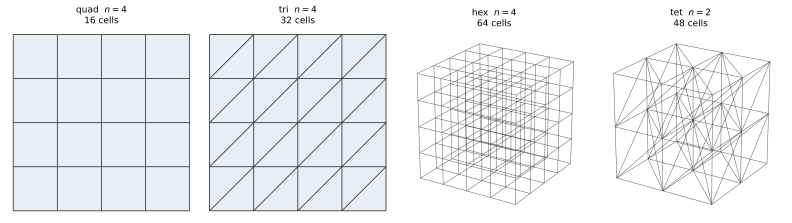

# 矩阵组装层级的正确性

## 1. 研究范围与算例设计

本实验以组装层级分类法 `FA/TA → LA → EA/EbE → PA/QA → UA/NONE` 为取证范围：`fa`（全局稀疏矩阵）、`ea`（逐单元稠密矩阵）、`pa`（逐积分点数据）、`ua`（零常驻，几何量每次 apply 现算）、`LA`（每 rank 的局部稀疏矩阵）。五级中只有 `LA` 尚无算例，它要多 rank 才有意义，而本目录整套是单线程。

各算例统一采用 $p=1$、CPU 单线程与 `--assembly-method fast`，以制造解求解链的 $L^2$ 误差收敛阶为纵向判据，以同一加密层上各层级的解与 Krylov 迭代数为横向判据。

| 验证内容 | 算例 | 主要指标 |
|---|---|---|
| 收敛性 | `convergence_fa` / `convergence_ea` / `convergence_pa` × 4 族网格，加 `convergence_ua` × 3 族，共 15 个数据点 | 末档 $L^2$ 阶、误差单调性、相对残差；Krylov 迭代数逐档整数相等 |
| 计算成本 | 同上 15 个数据点的 `seconds` 字段 | 整链累计耗时 |

EA 以下的层级都不组装全局矩阵（`ea` 只持有逐单元的 $\mathbf A_e$，`pa` 与 `ua` 连单元矩阵也不存），直接解法无从分解，只能配 Krylov 方法，本文一律取 CG（刚度阵 SPD）。

## 2. 收敛性与跨层级一致性

### 2.1 算例设置

四个层级都经 `soptx.fem.levels.create_level` 按层级名构造，即 `FullAssembly`、`ElementAssembly`、`PartialAssembly`、`UnassembledAssembly` 四个生产层级类本身；制造解问题取 2D 的 [`SinusoidalElasticity2D`](../../src/soptx/problems/elasticity/manufactured_2d.py) 与 3D 的 [`DivergenceFreePolynomialElasticity3D`](../../src/soptx/problems/elasticity/manufactured_3d.py)。

| 项 | 值 |
|---|---|
| 2D 制造解 | `sinusoidal`，平面应变，全 Dirichlet 边界 |
| 3D 制造解 | `divfree-poly`，三维弹性，全 Dirichlet 边界 |
| 空间 | Q1（quad、hex）／P1（tri、tet），两者 $L^2$ 理论阶同为 $2.0$ |
| 装配路径 | 四条链统一 `--assembly-method fast` |
| `fa` 求解 | MUMPS 直接解，`--mumps-sym 1`（刚度阵 SPD） |
| `ea`／`pa`／`ua` 求解 | CG，`--preconditioner none`，`rtol = atol = 1e-12`，`maxiter 5000` |
| 后端 | numpy 单线程，`OMP/OPENBLAS/MKL_NUM_THREADS = 1` |
| 机器 | WSL Ubuntu-24.04，i9-14900KF；python 3.12.13，numpy 2.5.1，scipy 1.18.0（scipy-openblas 0.3.33） |

### 2.2 网格与加密层级

四族网格均由 `.from_box` 生成，逐层二分加密。`fa`、`ea`、`pa` 在同一网格序列上各跑一遍，`ua` 跑 quad、tri、hex 三族。

图中为各族加密序列的最粗一档，其余各档按同一规则二分；单元数与下表首列逐项对应。绘图脚本 [`plot_meshes.py`](plot_meshes.py) 不读运行产物，剖分规则由 `.from_box` 自身决定。

| 网格 | 类 | 加密序列 | 单元数 | 位移自由度 |
|---|---|---|---|---:|
| quad | `QuadrangleMesh` | `4 -> 8 -> 16 -> 32 -> 64` | 16 → 4,096 | 50 → 8,450 |
| tri | `TriangleMesh` | `4 -> 8 -> 16 -> 32 -> 64` | 32 → 8,192 | 50 → 8,450 |
| hex | `HexahedronMesh` | `4 -> 8 -> 16 -> 32` | 64 → 32,768 | 375 → 107,811 |
| tet | `TetrahedronMesh` | `2 -> 4 -> 8 -> 16 -> 32` | 48 → 196,608 | 81 → 107,811 |

自由度数为施加 Dirichlet 约束前的数量。quad 与 tri 同 $n$ 下节点相同，故自由度相同，单元数差一倍；hex 与 tet 同理。**`hex` 从 $n = 4$ 起步而不是 2**，原因见 [`README.md`](README.md)；`hex` 因此取 4 档，最细一档仍停在 $n = 32$。

### 2.3 验证结果

表内 $L^2$ 误差为位移的绝对误差 $\|\mathbf u - \mathbf u_h\|_{L^2(\Omega)}$，积分精度取 $q = p + 3$。相对残差要求低于 $10^{-10}$，四族网格逐档均满足；`tet` 从 $n = 2$ 起步，前三档还在 pre-asymptotic 段，末档 1.891 才是有效阶。

**quad**（`QuadrangleMesh`，Q1）

| $n$ | 自由度 | `fa` 的 $L^2$ 误差 | `ea` 的 $L^2$ 误差 | `pa` 的 $L^2$ 误差 | `ua` 的 $L^2$ 误差 | 实测阶 | `ea`／`pa`／`ua` 迭代数 | 相对残差 `fa`／`ea`／`pa`／`ua` |
|---:|---:|---:|---:|---:|---:|---:|---:|---|
| 4 | 50 | 3.1124e-2 | 3.1124e-2 | 3.1124e-2 | 3.1124e-2 | — | 5 | 3.8e-16 / 4.0e-16 / 5.4e-16 / 5.4e-16 |
| 8 | 162 | 7.8988e-3 | 7.8988e-3 | 7.8988e-3 | 7.8988e-3 | 1.978 | 24 | 1.4e-15 / 6.5e-14 / 6.5e-14 / 6.5e-14 |
| 16 | 578 | 1.9839e-3 | 1.9839e-3 | 1.9839e-3 | 1.9839e-3 | 1.993 | 54 | 5.3e-15 / 5.8e-13 / 5.8e-13 / 5.8e-13 |
| 32 | 2,178 | 4.9659e-4 | 4.9659e-4 | 4.9659e-4 | 4.9659e-4 | 1.998 | 110 | 2.7e-14 / 2.2e-12 / 2.3e-12 / 2.3e-12 |
| 64 | 8,450 | 1.2419e-4 | 1.2419e-4 | 1.2419e-4 | 1.2419e-4 | 2.000 | 220 | 1.1e-13 / 5.6e-12 / 5.7e-12 / 5.7e-12 |

**tri**（`TriangleMesh`，P1）

| $n$ | 自由度 | `fa` 的 $L^2$ 误差 | `ea` 的 $L^2$ 误差 | `pa` 的 $L^2$ 误差 | `ua` 的 $L^2$ 误差 | 实测阶 | `ea`／`pa`／`ua` 迭代数 | 相对残差 `fa`／`ea`／`pa`／`ua` |
|---:|---:|---:|---:|---:|---:|---:|---:|---|
| 4 | 50 | 8.1765e-2 | 8.1765e-2 | 8.1765e-2 | 8.1765e-2 | — | 10 | 4.9e-16 / 1.6e-15 / 6.9e-16 / 6.9e-16 |
| 8 | 162 | 2.3053e-2 | 2.3053e-2 | 2.3053e-2 | 2.3053e-2 | 1.827 | 43 | 2.5e-15 / 3.4e-13 / 3.0e-13 / 3.0e-13 |
| 16 | 578 | 6.0159e-3 | 6.0159e-3 | 6.0159e-3 | 6.0159e-3 | 1.938 | 100 | 8.1e-15 / 9.8e-13 / 1.0e-12 / 1.0e-12 |
| 32 | 2,178 | 1.5230e-3 | 1.5230e-3 | 1.5230e-3 | 1.5230e-3 | 1.982 | 206 | 3.3e-14 / 2.8e-12 / 2.8e-12 / 2.8e-12 |
| 64 | 8,450 | 3.8203e-4 | 3.8203e-4 | 3.8203e-4 | 3.8203e-4 | 1.995 | 402 | 1.3e-13 / 6.5e-12 / 6.5e-12 / 6.5e-12 |

**hex**（`HexahedronMesh`，Q1）

| $n$ | 自由度 | `fa` 的 $L^2$ 误差 | `ea` 的 $L^2$ 误差 | `pa` 的 $L^2$ 误差 | `ua` 的 $L^2$ 误差 | 实测阶 | `ea`／`pa`／`ua` 迭代数 | 相对残差 `fa`／`ea`／`pa`／`ua` |
|---:|---:|---:|---:|---:|---:|---:|---:|---|
| 4 | 375 | 1.6810e-2 | 1.6810e-2 | 1.6810e-2 | 1.6810e-2 | — | 2 | 3.6e-16 / 2.5e-16 / 2.4e-16 / 2.4e-16 |
| 8 | 2,187 | 4.3349e-3 | 4.3349e-3 | 4.3349e-3 | 4.3349e-3 | 1.955 | 21 | 8.4e-16 / 2.1e-12 / 2.1e-12 / 2.1e-12 |
| 16 | 14,739 | 1.0881e-3 | 1.0881e-3 | 1.0881e-3 | 1.0881e-3 | 1.994 | 43 | 3.1e-15 / 1.3e-11 / 1.3e-11 / 1.3e-11 |
| 32 | 107,811 | 2.7223e-4 | 2.7223e-4 | 2.7223e-4 | 2.7223e-4 | 1.999 | 87 | 1.3e-14 / 3.2e-11 / 3.2e-11 / 3.2e-11 |

**tet**（`TetrahedronMesh`，P1）

| $n$ | 自由度 | `fa` 的 $L^2$ 误差 | `ea` 的 $L^2$ 误差 | `pa` 的 $L^2$ 误差 | 实测阶 | `ea`／`pa` 迭代数 | 相对残差 `fa`／`ea`／`pa` |
|---:|---:|---:|---:|---:|---:|---:|---|
| 2 | 81 | 4.4955e-2 | 4.4955e-2 | 4.4955e-2 | — | 3 | 1.2e-16 / 4.1e-16 / 3.7e-16 |
| 4 | 375 | 3.1630e-2 | 3.1630e-2 | 3.1630e-2 | 0.507 | 27 | 4.0e-16 / 1.1e-12 / 6.2e-13 |
| 8 | 2,187 | 1.3249e-2 | 1.3249e-2 | 1.3249e-2 | 1.255 | 69 | 1.7e-15 / 5.3e-12 / 5.7e-12 |
| 16 | 14,739 | 4.1449e-3 | 4.1449e-3 | 4.1449e-3 | 1.676 | 143 | 6.9e-15 / 1.1e-11 / 1.1e-11 |
| 32 | 107,811 | 1.1179e-3 | 1.1179e-3 | 1.1179e-3 | 1.891 | 261 | 2.8e-14 / 3.6e-11 / 3.6e-11 |

`ua` 与 `pa` 的三列在 quad、tri、hex 上**逐位相同**：$L^2$ 误差、迭代数、相对残差都不是吻合到求解容差，而是产物 JSON 里的浮点字面量一字不差。这不是巧合。两个层级的几何量同出 [`_quadrature.py`](../../src/soptx/fem/levels/_quadrature.py) 的 `quadrature_geometry`，之后喂进同一个 `DofToQuad` 与同一个 `LinearElasticQFunction`，浮点运算次序字面上一致，区别只在 `pa` 建表时算一次、`ua` 每次作用现算；算子逐位相同则 CG 的每一步迭代量逐位相同，整条链一路相同。因此这四列并排读到的不是"两个实现都对"，而是"同一串运算换了个求值时机"。`tet` 一格未跑，理由见 [`cases.toml`](cases.toml) 中 `convergence_ua` 段首。

结果来源：

- `fa`：[quad](outputs/manufactured_convergence_2d_quad_sinusoidal_p1_mumps_fast.json)、[tri](outputs/manufactured_convergence_2d_tri_sinusoidal_p1_mumps_fast.json)、[hex](outputs/manufactured_convergence_3d_hex_divfree-poly_p1_mumps_fast.json)、[tet](outputs/manufactured_convergence_3d_tet_divfree-poly_p1_mumps_fast.json)
- `ea`：[quad](outputs/manufactured_convergence_2d_quad_sinusoidal_p1_cg_fast_ea.json)、[tri](outputs/manufactured_convergence_2d_tri_sinusoidal_p1_cg_fast_ea.json)、[hex](outputs/manufactured_convergence_3d_hex_divfree-poly_p1_cg_fast_ea.json)、[tet](outputs/manufactured_convergence_3d_tet_divfree-poly_p1_cg_fast_ea.json)
- `pa`：[quad](outputs/manufactured_convergence_2d_quad_sinusoidal_p1_cg_fast_pa.json)、[tri](outputs/manufactured_convergence_2d_tri_sinusoidal_p1_cg_fast_pa.json)、[hex](outputs/manufactured_convergence_3d_hex_divfree-poly_p1_cg_fast_pa.json)、[tet](outputs/manufactured_convergence_3d_tet_divfree-poly_p1_cg_fast_pa.json)
- `ua`：[quad](outputs/manufactured_convergence_2d_quad_sinusoidal_p1_cg_fast_ua.json)、[tri](outputs/manufactured_convergence_2d_tri_sinusoidal_p1_cg_fast_ua.json)、[hex](outputs/manufactured_convergence_3d_hex_divfree-poly_p1_cg_fast_ua.json)

## 3. 计算成本

整条链累计耗时，取自第 2 节同一批运行的 `seconds` 字段，单位 s，单线程。

| 层级 | quad `4→64` | tri `4→64` | hex `4→32` | tet `2→32` |
|---|---:|---:|---:|---:|
| `fa`（MUMPS） | 0.33 | 0.33 | 6.45 | 6.19 |
| `ea`（CG） | 0.13 | 0.27 | 1.76 | 7.13 |
| `pa`（CG） | 2.26 | 4.93 | 40.58 | 225.44 |
| `ua`（CG） | 5.14 | 10.55 | 91.29 | — |

`ua` 对 `pa` 的倍数在三族网格上分别是 2.27、2.14、2.25，稳定在 2.2 附近，且不随维数与网格族漂移——这正是每次作用重算 $\mathbf J^{-1}_q$ 与 $w_q|\mathbf J_q|$ 的固定开销，它与 matvec 本身同阶。换来的是常驻量只剩 `cell2dof`：同一算例上 `pa`／`ua` 的常驻字节比二维为 11.3、三维为 17.7，三维更省是因为 `pa` 压着的 $\mathbf J^{-1}_q$ 是 $GD^2$ 的。按这个倍数，`tet` 那格约需 8.5 min，是四格中唯一超过一分钟的，故暂缺。
