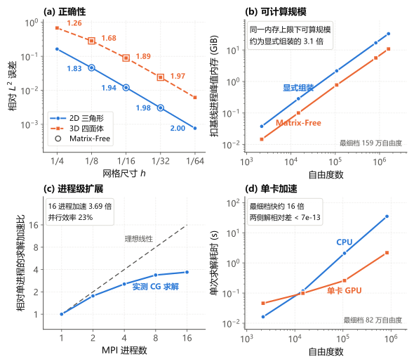
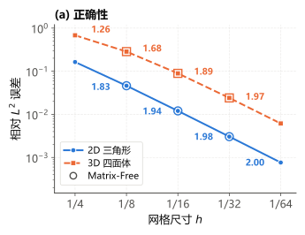
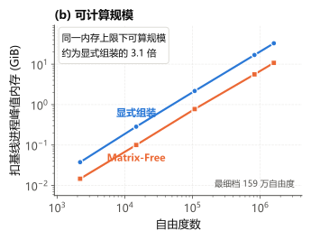
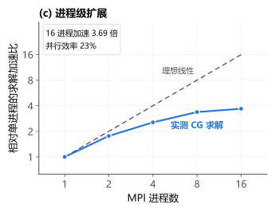
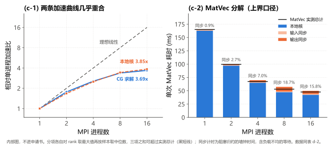
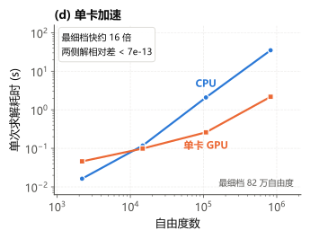

# 图 2「Matrix-Free 算子 / Krylov 求解」证据报告

本报告梳理申报书图 4（本目录内称图 2）四格的图面含义、实测数据与复现命令。采集契约、门禁清单、并行配置缺口与未闭环事项见 [`README.md`](README.md)；并行层级本身的定义与各层卡点见 `dut-postdoc:concepts/gpu-hpc/parallel-levels.md`。

---

## 1. 评测目标与核心结论



| 子图 | 科学问题 | 核心结论 | 支撑脚本 | 状态 |
|:---|:---|:---|:---|:---:|
| **(a)** | **对不对** | 显式组装（FA）的收敛阶朝 P1 理论阶 2 单调上升（末段 `1.995` / `1.969`），matrix-free（EA）与它在同档同解到 `1e-13`~`1e-14` | [`stage1_evidence.py`](../../examples/matrix_free_elasticity/stage1_evidence.py) | 实测 |
| **(b)** | **能算多大** | 同一主存上限下 EA 可算规模约为 FA 的 `3.1` 倍（最细档 `1,594,323` 自由度），优势来自从不物化全局 COO/CSR | [`benchmark_cpu_ea.py`](../../examples/matrix_free_elasticity/benchmark_cpu_ea.py) | 实测 |
| **(c)** | **切得开吗** | 同一算子按区域分解切到 16 个 MPI 进程，`823,875` 自由度上相对单进程加速 `3.69` 倍（并行效率 `23%`，同步仅占 `15.8%`）；五档 CG 迭代数恒为 `493`，分区没有改变代数 | [`benchmark_cpu_ea.py`](../../examples/matrix_free_elasticity/benchmark_cpu_ea.py) `--mode mpi-ea-strong` | 实测 |
| **(d)** | **能不能更快** | 同一算子换到单块 GPU，同一 `823,875` 自由度上 CG 求解比同后端 CPU 快约 `16` 倍，两侧解相对差 `<1e-12`、迭代数逐档相同；反算有效访存带宽 `410.4 GB/s`，为该卡标称 `960 GB/s` 的 `43%` | [`benchmark_device_ea.py`](../../examples/matrix_free_elasticity/benchmark_device_ea.py) | 实测（带宽为换算） |

⚠️ **(c) 与 (d) 分属两个并行层级，两个倍数不可相乘、也不可互推。** (c) 切进程（MPI，分母是单进程），(d) 切设备内（SIMT，分母是同后端 CPU 的 16 条线程）。图面左右并排只说明两条路都通，引用任一倍数必须连分母一起写。逐格并行配置见 §6.2。

命令里的 `--panel` 是数据组键名，与图面位置错开：图面 (c) 的数据在 `--panel d`，图面 (d) 的数据在 `--panel c`；本页表名 `表 c-*` / `表 d-*` 同样跟随数据组。由来见 [`README.md`](README.md)。

---

## 2. (a) 对不对 —— 收敛阶与 matrix-free 同解

### 2.1 误差分布



log–log 双轴：横轴网格尺寸 $h$，纵轴相对 $L_2$ 误差。两条实线是 FA 参考路径的五档误差链（2D `tri` / `sinusoidal`、3D `tet` / `divfree-poly`，均 P1），线上逐段标观测阶；三个空心环是 EA 在 `n = 8/16/32` 三档的误差。曲线回答「这个离散对不对」，空心环回答「matrix-free 复现没复现这条解」。

图面不画斜率三角、不写理论阶与门禁：`1.83→2.00` 自己就朝 `2` 收。代价是门禁 `1.5` 在图上没有载体（纵轴是误差不是收敛阶），判定只能读 §2.3 的表；空心环与实线「重合到什么量级」同理——两列相对差都比纵轴刻度小约 10 个量级，画不进图面。

### 2.2 支撑脚本与运行命令

调度命令见 [`README.md`](README.md) 的「命令」节，本格为 `run.py --panel a`。底层脚本：

```bash
python examples/lagrange_elasticity/manufactured_convergence_demo.py \
    --dim 2 --base 4 --solver mumps --mumps-sym 1
python examples/matrix_free_elasticity/stage1_evidence.py --dim all
```

⚠️ **`--base 4` 必须显式传**：`manufactured_convergence_demo.py` 缺省是 `{2: 8, 3: 4}`，2D 不传会从 `n=8` 起步，得到的是另一条误差链。此项已进 [`cases.toml`](cases.toml) 并由门禁校验。

### 2.3 实测数据

<!-- BEGIN generated: panel-a -->
**表 a-1　显式组装（FA）路径上数值解与制造解的误差及收敛阶**

**相对 L2** $=\lVert u-u_h\rVert_0/\lVert u\rVert_0$，$u$ 为解析已知的制造解，两个范数同以 `p+3 = 4` 阶求积算出（[`solution_error()`](../../src/soptx/fem/verification.py)）；**观测阶** $=\log_2(e_{\text{粗}}/e_{\text{细}})$，加密比恒为 2。⚠️ 观测阶按绝对误差计（产物字段 `l2_order`），与左列相对误差的阶差在第 6 位，本表 3 位小数看不出。

| | 网格 | 制造解 | 装配 | 求解器 |
|---|---|---|---|---|
| 2D | `triangle`（`plane_strain`） | [`SinusoidalPlaneStrainElasticity2D`](../../docs/problems/manufactured-elasticity.md) | `standard` | `mumps`（`sym=1`） |
| 3D | `tetrahedron` | [`DivergenceFreePolynomialElasticity3D`](../../docs/problems/manufactured-elasticity.md) | `fast` | `mumps`（`sym=1`） |

均 `p=1`，5 档 `n = 4…64`（`h = 1/4 … 1/64`）。两条链均走**稀疏直接解**，真相对残差最大值 2D `1.26e-13`、3D `1.14e-13`，比最细档的离散误差（2D `7.64e-04`、3D `6.14e-03`）小十个量级，本表测的基本是纯离散误差，故可充当参考路径。

两条链均由 [`examples/lagrange_elasticity/manufactured_convergence_demo.py`](../../examples/lagrange_elasticity/manufactured_convergence_demo.py) 以 `--base 4 --levels 5` 生成——`run.py` 以子进程调用、产物重定向到本目录 `outputs/`（[`cases.toml`](cases.toml) 的 `a-fa-2d`/`a-fa-3d`），与 [`examples/lagrange_elasticity` §4.2](../../examples/lagrange_elasticity/results_analysis.md) 的五档链同源同离散，打印精度内逐位一致。

**逐档结果**

| `n` | 2D 自由度 | 2D 相对 L2 | 2D 观测阶 | 3D 自由度 | 3D 相对 L2 | 3D 观测阶 |
|---:|---:|---:|---:|---:|---:|---:|
| 4 | 50 | `0.1635` | — | 375 | `0.6806` | — |
| 8 | 162 | `0.04611` | 1.827 | 2,187 | `0.2851` | 1.255 |
| 16 | 578 | `0.01203` | 1.938 | 14,739 | `0.08919` | 1.676 |
| 32 | 2,178 | `0.003046` | 1.982 | 107,811 | `0.02405` | 1.891 |
| 64 | 8,450 | `7.6406e-04` | 1.995 | 823,875 | `0.006143` | 1.969 |

两条链的末段观测阶 **1.995**（2D）与 **1.969**（3D）均过门禁 `1.5`，且朝 P1 理论阶 2 单调上升。

**表 a-2　matrix-free 三档的数值解误差**（EA，`coarse/medium/fine` 对应 `n = 8/16/32`）

EA 在三个网格档位（`n = 8/16/32`，CPU 串行）上相对制造解的 L2 误差，求解为 CG（`rtol=1e-10`）。三档误差即图 2(a) 的空心环数据。

| 维数 | `coarse` 相对 L2 | `medium` | `fine` |
|---:|---:|---:|---:|
| 2D | `0.04611` | `0.01203` | `0.003046` |
| 3D | `0.2851` | `0.08919` | `0.02405` |

**表 a-2′　同档 EA/FA 一致性**（同网格同参数，两个对象均以相对差计）

| 维数 | `n` | 解向量相对差 | 误差标量相对差 |
|---:|---:|---:|---:|
| 2D | 8 | `5.19878e-13` | `6.96708e-12` |
| 2D | 16 | `3.92183e-13` | `1.54305e-11` |
| 2D | 32 | `4.17771e-14` | `1.89290e-11` |
| 3D | 8 | `3.67167e-14` | `9.43765e-13` |
| 3D | 16 | `2.39792e-14` | `1.15589e-11` |
| 3D | 32 | `1.74570e-14` | `3.36878e-11` |

两列比的是两个对象，不可互换引用：左列是同网格同参数的两个 CG 解之差（验收阈值 `1e-09`），说的是解本身一样；右列是两条误差链在该档的相对 L2 误差值之差（验收阈值 `1e-08`），说的是落在同一条收敛曲线上。两列均由 `collect.py` 逐档算出，非估计。

解向量列三档实测均低于阈值 2D 最低 3.3 个量级（约 1924 倍）、3D 最低 4.4 个量级（约 27236 倍）。
误差标量列同样三档全过，2D 最低 2.7 个量级、3D 最低 2.5 个量级。

数据为 CPU 串行（单 rank）验证的结果，由 [`examples/matrix_free_elasticity/stage1_evidence.py`](../../examples/matrix_free_elasticity/stage1_evidence.py) 运行得到，存于 [`experiments/matrix_free_capability/outputs/stage1_evidence_validation.json`](../../experiments/matrix_free_capability/outputs/stage1_evidence_validation.json)；数值与档位说明见 [`examples/matrix_free_elasticity/results_analysis.md`](../../examples/matrix_free_elasticity/results_analysis.md) §2.5。

<!-- END generated: panel-a -->

### 2.4 读法与边界

- **首末两档只有实线。** EA 链固定在 `n = 8/16/32`，`n = 4` 与 `n = 64` 不在其上，图面因此如实呈现为「中间三档两条实现路径重合」。3D 前四档末段阶 `1.89` 是前渐近区而非离散缺陷——补上第五档即到 `1.969`，与 2D 同样贴近理论阶 2。
- **表 a-2′ 两列不是同一个对象。** 左列是同档同参数下两个 CG 解之差（`1e-13`~`1e-14`），右列是两条链误差标量之差（`1e-11`~`1e-13`）。右列大两个量级是正常的：误差标量是解经 L2 积分后的导出量，求解器差异在这里被放大。
- **别和黄金参考混。** 每档另有同网格 `spsolve` 直接解核对（`explicit_solution_reference`，最大相对差 `2.50e-11`，门禁 `1e-8`），CG 解因此已站在直接解上。`matrix_free_elasticity` §2.2 引的 `2.50e-11` 正是该黄金参考在 3D 最细档的值，与表 a-2′ 任一列都是两个对象。

---

## 3. (b) 能算多大 —— 进程峰值内存

### 3.1 内存标度



log–log 双轴：横轴自由度，纵轴扣掉解释器基线后的进程峰值 RSS。两条线是 FA 与 EA 的五档实测，斜率同为 1、垂直间距恒为 $\log 3$。结论框里的 `3.1` 倍由 `draw_panel_b` 从快照现算（最细档 `32.84 / 10.76 = 3.05`），不是写死的文案。

⚠️ **纵轴必须扣基线。** 未扣时按图量最粗档得峰值比 `1.13` 而非 `2.69`，左端两点几乎重合是基线稀释造成的假象，不是层级差异。

**不画 `47 GiB` 天花板线。** 结论的依据是扣基线内存对自由度线性（指数 `1.014` / `0.999`），故固定自由度的内存比等于固定内存的自由度比，与预算取值无关——这正是「不依赖外推」的意思；而线画着、交点不画，读者必然脑补延长线。天花板仍是快照事实（`47.04 GiB`），由 `make_figs.py` 的核对行打出，供写图注引用。

**口径**：`peak_rss` 取 `resource.getrusage(RUSAGE_SELF).ru_maxrss`，与 `/usr/bin/time -v` 的 `Maximum resident set size` 同义。这是进程级指标、无法按对象归因，所以每个数据点独占一个进程（同一进程里先建 FA 再建 EA，测出的 EA 峰值是被 FA 抬高过的）。

### 3.2 支撑脚本与运行命令

调度命令见 [`README.md`](README.md) 的「命令」节，本格为 `run.py --panel b`（十个数据点，FA/EA 各五档）。底层脚本：

```bash
python examples/matrix_free_elasticity/benchmark_cpu_ea.py --mode serial-peak-rss \
    --dim 3 --mesh-type tet --degree 1 --resolution 64 --assembly-method fast
```

⚠️ **`--assembly-method` 必须显式指定**：缺省的 `standard` 会把被求和掉的积分点轴物化成九个 `(NC, NQ, 4, 4)` 临时张量（`n=64` 单块 `3.75 GiB`），测出的是那条实现路径的峰值，不是组装层级的差别。此项已进 [`cases.toml`](cases.toml) 并由门禁逐项校验产物。

⚠️ `b-fa-n80` 峰值 `33.0 GiB`（本机 `47 GiB` 的七成），绝不要与其他大内存进程并行。

### 3.3 实测数据

<!-- BEGIN generated: panel-b -->
**表 b-1　五档进程峰值 RSS 对照**（3D `tet` P1、`--assembly-method fast`、单进程，本机可用内存 `47 GiB`）

| `n` | 自由度 | FA 峰值 / GiB | EA 峰值 / GiB | 峰值比 | 扣基线后比 | FA 长期存储 / GiB | EA 长期存储 / GiB |
|---:|---:|---:|---:|---:|---:|---:|---:|
| 8 | 2,187 | 0.195 | 0.172 | 1.13 | **2.69** | 0.0018 | 0.0036 |
| 16 | 14,739 | 0.442 | 0.258 | 1.71 | **2.85** | 0.0135 | 0.0286 |
| 32 | 107,811 | 2.327 | 0.932 | 2.50 | **2.80** | 0.1033 | 0.2285 |
| 64 | 823,875 | 17.022 | 5.749 | 2.96 | **3.02** | 0.8084 | 1.8281 |
| 80 | 1,594,323 | 33.001 | 10.921 | 3.02 | **3.05** | 1.5721 | 3.5706 |

基线（解释器 + FEALPy 导入）`0.157 GiB`，八次运行抖动 `0.711 MiB`。最粗档的峰值比 `1.13` 是基线稀释所致，不是层级差异；扣基线后从第二档起稳定。

**表 b-2　`n=80` 的分阶段高水位**（累积值，单位 GiB）

| 阶段 | FA | EA |
|---|---:|---:|
| `baseline`（解释器 + 导入） | 0.157 | 0.157 |
| `mesh`（网格 + 空间） | 1.719 | 1.719 |
| `operator`（组装 / 缓存 `K_e`） | 33.001 | 10.921 |
| `load`（体力向量全装配） | 33.001 | 10.921 |
| `bc`（Dirichlet 处理） | 33.001 | 10.921 |
| `solve`（CG） | 33.001 | 10.921 |

FA 在 `operator` 阶段比 `mesh` 高 `31.28 GiB`，而最终保留的 CSR 只有 `1.572 GiB`，约 95% 是 COO 转 CSR 的瞬态。EA 的长期存储反而是 FA 的 1.95 / 2.12 / 2.21 / 2.26 / 2.27 倍（逐档），它省的不是存得少，而是从不物化全局 COO/CSR。

扣基线后内存对自由度是线性的：`n` 从 16 到 80 自由度增 `108.2` 倍，FA 扣基线峰值增 `115.7` 倍（指数 `1.014`）、EA 扣基线峰值增 `107.9` 倍（指数 `0.999`）。两条都是 $O(N)$，故「同一内存上限下可算规模约 3.1 倍」是内插表述，不依赖外推。

**表 b-3　峰值的两段分解：必需存储 vs 组装瞬态**（逐档，单位 GiB；下界 = 基线 + 网格与空间 + 该层级必须长期持有的算子数据）

| `n` | FA 下界 | FA 瞬态 | FA 瞬态占比 | EA 下界 | EA 瞬态 | EA 瞬态占比 | 下界比 EA/FA |
|---:|---:|---:|---:|---:|---:|---:|---:|
| 8 | 0.162 | 0.034 | 17.2% | 0.164 | 0.008 | 4.6% | 1.02 |
| 16 | 0.187 | 0.255 | 57.7% | 0.202 | 0.056 | 21.6% | 1.08 |
| 32 | 0.368 | 1.959 | 84.2% | 0.494 | 0.438 | 47.0% | 1.34 |
| 64 | 1.790 | 15.233 | 89.5% | 2.810 | 2.939 | 51.1% | 1.57 |
| 80 | 3.291 | 29.710 | 90.0% | 5.289 | 5.631 | 51.6% | 1.61 |

⚠️ **下界比与峰值比方向相反。** 峰值比 EA 占优（最细档 3.02 倍），下界比却是 FA 占优（最细档 EA 是 FA 的 1.61 倍）：EA 的必需存储更大，它赢在瞬态。两条路径的峰值分别是各自下界的 10.0 倍与 2.1 倍（`n=80`），都远未触及各自的内存下界。

⚠️ 这里的下界是该实现路径的下界，不是问题本身的下界：`stored_operator` 一项随算子层级而变（FA 是全局 CSR，EA 是逐单元 `K_e` 缓存），换成只存积分点因子的 PA 路径会重新定义它。

正确性同时成立：五档 CG 迭代数逐档相同（`64/134/250/493/600`），最细档真残差 FA `1.44755e-10`、EA `1.44753e-10`；构造时间 EA 更短（`7.21 s` vs `61.71 s`），求解时间 EA 更长（`205.09 s` vs `138.15 s`）。
<!-- END generated: panel-b -->

### 3.4 读法与边界

- **因果方向别读反。** EA 省的不是「存得少」——它的长期存储反而比 FA 大一倍多——而是从不物化全局 COO/CSR。FA 的峰值几乎全部是组装瞬态，最终保留的 CSR 只占其中一小部分。
- **`3.1` 倍不是 matrix-free 的能力上限。** EA `n=64` 的 `5.749 GiB` 里仍有 `2.939 GiB`（`51.1%`）是瞬态，全部落在 `operator` 一格（`+4.767 GiB`，而长期保存的 `K_e` 只有 `1.828 GiB`）。早先流传的 `3.8` 与 `1.9` 两个数均已被实测推翻，不要再引用。
- ⚠️ **下界比与峰值比方向相反，引用时不可只取一侧。** 峰值比 EA 占优（最细档 `3.02` 倍），但必需存储的下界是 FA 更小（`3.291` vs `5.289 GiB`，EA 是 FA 的 `1.61` 倍）：若两条路径的瞬态都被治净，显式组装反而更省内存。EA 的地板——每单元一个稠密 `12×12` 的 `K_e`——本来就比全局 CSR 大，量级性的内存收益必须下沉到只存积分点因子的 PA 路径。
- **两条路径都远未触及各自的内存下界**（`n=80` 分别是下界的 `10.0` 倍与 `2.1` 倍，见表 b-3），瞬态占比随规模单调上升。故本格测到的是当前实现路径的上限，不是方法本身的上限。
- **这是 CPU 主机 RSS，不是 GPU 显存；绝对值不可跨机引用。** GiB 数绑定本机分配器、NumPy 版本与内存上限，可移植的是比值与线性关系。

---

## 4. (c) 切得开吗 —— 进程级 (MPI) 强扩展

### 4.1 强扩展曲线



log–log 双轴（横纵轴均以 2 为底）。蓝色实线是实测 CG 求解加速比，灰色虚线是理想线性 `y = x`——后者不是量出来的，故与实测实线在视觉上分开。规模固定在 `n = 64`（`823,875` 自由度），只加进程数。

横轴是进程数，本格因此不与 (b)(d) 同轴。这是内容决定的：(b)(d) 问「规模变大会怎样」，本格问「同一个问题切成更多份会怎样」，强行统一横轴只会造出一个没有意义的坐标系。

**内部拆解图（不进申请书）。** 图面版结论框只保留两行实测数字（`16` 进程加速 `3.69` 倍、并行效率 `23%`），诊断句「瓶颈是节点内访存带宽」写在申请书正文（研究基础第 1 条），支撑数据收在下图：左格把本地核加速（`3.85` 倍）与总加速（`3.69` 倍）画进同一坐标系，两线几乎重合即「通信不是瓶颈」；右格是表 d-2（§4.3）的图形化，黑色短横线是实测 MatVec 总计，堆叠高出它的部分就是「分项对 rank 取 max」的重叠计数——口径系统性高估同步，结论因此保守。



### 4.2 支撑脚本与运行命令

调度命令见 [`README.md`](README.md) 的「命令」节，本格为 `run.py --panel d`（键名与图面位置错开，见 §1）。底层脚本，五档共用同一条命令、只有 `-n` 不同：

```bash
OMP_NUM_THREADS=1 mpiexec -n 16 python examples/matrix_free_elasticity/benchmark_cpu_ea.py \
    --mode mpi-ea-strong --dim 3 --mesh-type tet --degree 1 --resolution 64 --assembly-method fast
```

⚠️ **`OMP_NUM_THREADS=1` 是必需的**：不锁死线程层，每个 rank 底下的 OpenBLAS 还会再开线程，测出来的就是「进程 × 线程」的乘积，那条曲线无法归因到任一层级。这也使 (c) 成为全图唯一能干净归因到进程层的一格。

### 4.3 实测数据

<!-- BEGIN generated: panel-d -->
**表 d-1　五档进程级强扩展**（3D `tet` P1、EA、`--assembly-method fast`、`numpy` 后端，规模固定 `n = 64` / `823,875` 自由度，`OMP_NUM_THREADS=1` 锁死线程层，⚠️ 计时口径未随产物落盘）

| 进程数 | CG 求解 / s | 加速比 | 并行效率 | CG 迭代数 | 真实相对残差 |
|---:|---:|---:|---:|---:|---:|
| 1 | 92.634 | **1.00** | 100.0% | 493 | `1.053e-10` |
| 2 | 52.527 | **1.76** | 88.2% | 493 | `1.053e-10` |
| 4 | 36.341 | **2.55** | 63.7% | 493 | `1.053e-10` |
| 8 | 27.472 | **3.37** | 42.1% | 493 | `1.053e-10` |
| 16 | 25.124 | **3.69** | 23.0% | 493 | `1.053e-10` |

分区没有改变代数。五档 CG 迭代数逐档相同（`493/493/493/493/493`），真实相对残差跨档相对离散仅 `6.5e-05`，这点差异来自归约次序随分区改变，是浮点求和的正常表现，不是误差；加速来自真的省了时间，不是少算。

**表 d-2　单次算子作用 (MatVec) 的分解**（`local_kernel` 是本地单元作用，两处 `sync` 是界面自由度的输入/输出同步归约）

| 进程数 | MatVec / ms | 本地核 / ms | 输入同步 / ms | 输出同步 / ms | 同步占比 |
|---:|---:|---:|---:|---:|---:|
| 1 | 165.04 | 162.65 | 1.08 | 0.46 | 0.9% |
| 2 | 99.61 | 97.19 | 0.87 | 1.83 | 2.7% |
| 4 | 67.33 | 65.12 | 0.75 | 3.97 | 7.0% |
| 8 | 52.98 | 47.38 | 1.14 | 8.76 | 18.7% |
| 16 | 47.58 | 42.27 | 1.70 | 5.80 | 15.8% |

⚠️ **分项是上界，不是精确划分。** 三个分项各自对 rank 取最大值再按样本取中位数（`examples/matrix_free_elasticity/benchmark_cpu_ea.py` 的 `measure_profiled_parallel_matvec`），不同项的最大值可能来自不同进程，因此三项之和会超过 MatVec 总计：16 进程档 `49.77 ms` vs `47.58 ms`，同步占比与本地核占比相加也随之大于 `100%`。方向是保守的：这个口径高估同步，故下面「通信不是瓶颈」的结论只会更稳。1 进程档反而少 `0.86 ms`：单 rank 取最大值没有意义，而 MatVec 总计还含 Dirichlet 边界投影，它不在三个分项里。

⚠️ **同步时间里含等待。** 两处 `sync` 计的是包住阻塞式 `dof_comm.sync_add` 的墙钟时间（`soptx:src/soptx/fem/distributed/operator.py:80-91`），先算完的进程在这里等最慢的，负载不均会被记成同步开销。输出同步比输入同步贵 `3.4` 倍而两者搬运的数据量相同，最可能的解释是它紧跟本地核、吸收了这份不均衡。⚠️ 这是推断，现有计时分不开真通信与等待，要拆开须用 MPI profiler 看各 rank 到达同步点的时刻分布。若成立，纯通信成本比表中占比还低。

效率掉下去不是通信造成的。最大规模档同步只占一次 MatVec 的 `15.8%`，本地核占 `88.8%`；而本地核本身从 1 进程到 16 进程只快了 `3.85` 倍，远不到 `16` 倍。更直接的一条是末两档：进程数翻 `2` 倍，本地核只快 `1.12` 倍，多出来的核已经吃不到更多内存带宽。EA 的算术强度约 `0.25 flop/byte`，本来就是 memory-bound，节点内加进程买到的是更多算力而不是更多带宽，所以曲线在这里压平。

**表 d-3　算子构造时间**（同一批运行，不上图）

| 进程数 | 构造 / s | 加速比 | 端到端管线 / s |
|---:|---:|---:|---:|
| 1 | 8.809 | 1.00 | 101.443 |
| 2 | 4.675 | 1.88 | 57.202 |
| 4 | 2.892 | 3.05 | 39.233 |
| 8 | 2.188 | 4.03 | 29.660 |
| 16 | 2.122 | 4.15 | 27.245 |

⚠️ **这批数是单次采样。** 产物里没有 `warmup` / `repeats` 字段，说明它们跑在脚本记录该字段之前；实跑用的是 `--warmup 0 --repeats 1`（脚本默认为 `1` / `3`）。单次采样足以定曲线形状（迭代数与残差逐档一致本身就是一次跨档自洽性检验），但任何一档的秒数都不带误差棒，写进正式图件前应按默认口径重跑。
<!-- END generated: panel-d -->

### 4.4 读法与边界

- **不能与 (d) 的 GPU 加速比相乘，也不能互推**（见 §1）。`3.69` 与 `16` 不是可叠加的两笔收益，图面相邻不等于口径可比；分母与层级区分由申请书的图 4 说明逐字写死（(c) 相对单进程、(d) 相对同后端 16 线程 CPU），图面结论框只留实测断言。
- **四种执行配置在同一个问题上的横向对照**（`n = 64`、`823,875` 自由度、`fast` 装配，四者 CG 迭代数均为 `493`、真实相对残差均约 `1.05e-10`，即解的是同一个离散问题）：

  | 配置 | 后端 | 并行层 | CG 求解 / s | 产物 |
  |---|---|---|---:|---|
  | MPI 1 进程 | `numpy` | 进程 ×1 | 92.634 | `outputs/mpi/mpi_strong_3d_n64_fast_p1.json` |
  | MPI 16 进程 | `numpy` | 进程 ×16 | 25.124 | `outputs/mpi/mpi_strong_3d_n64_fast_p16.json` |
  | torch CPU | `pytorch` | 线程 ×16 | 35.006 | `outputs/device_speedup_..._n64.json` 的 `cpu` 段 |
  | torch CUDA | `pytorch` | 设备内 | 2.177 | 同上的 `cuda` 段 |

  由此夹出的 GPU 加速比区间：对 16 进程是 `11.5` 倍，对单进程是 `42.6` 倍；正文引用的 `16` 倍（对 16 条 `torch` CPU 线程）落在区间内，三个数分母不同，必须连分母一起写。⚠️ 这张表跨格手工汇总、不由 `collect.py` 生成，且带一个未消掉的混杂变量——MPI 两行走 `numpy`、torch 两行走 `pytorch`（装配方式已统一为 `fast`），故「16 进程比 16 条线程快 `1.39` 倍」只能读作这两条现成路径的实测对比，不是「进程级优于线程级」的一般结论。
- **为什么用 `n = 64` 而不是更小的档。** `n = 32`（`107,811` 自由度）在本机 P=8 处就已掉头（`2.67` → `2.61` 倍），每 rank 只剩约 `6,738` 自由度、局部核不再随分区下降——那是问题过小的伪影，不是方法性质。
- ⚠️ **本批暴露并修掉了一处静默缺陷。** `--assembly-method` 此前在 MPI 分支上不生效：`benchmark_mpi_ea` 未把它转发给 `ElasticityEAOperator`，无论命令行给什么一律回落到 `standard`；已于 `2026-08-24` 修复（算子门面补参数并转发，产物同时补记 `assembly_method` 与计时口径）。此前所有 MPI 产物的装配方式标注都不可信，本节五档是修复后重跑的。

---

## 5. (d) 能不能更快 —— CPU 与单卡 GPU 对照

### 5.1 耗时与加速比



log–log 双轴，横轴与 (b) 同为自由度，取同一批算例的前四档（3D `tet` P1，`n = 8/16/32/64`）。两条线是同一个 EA matrix-free 算子在 CPU 与单块 GPU 上的单次 CG 求解耗时。合并图是 2×2，(b) 在右上、(d) 在右下，属同列换行接续，故两格横轴范围必须逐字相同；左下的 (c) 横轴是进程数，不在这条轴上。

唯一的变量是设备：两侧都走 FEALPy 的 `pytorch` 后端，只切 `bm.set_default_device("cpu" / "cuda")`。CPU 侧若改用 `numpy` 后端，加速比里就混进了后端差异，量到的不再是「这个算子能不能上加速器」。这是单卡对 CPU，不是多卡强扩展——一块卡就能证完，多卡扩展是研究内容 2 的题目，放进研究基础会让评审以为多卡结果已经有了。

**口径**：纵轴只含 CG 求解（含边界条件包装后的算子作用），不含建网格、算子构造与体力向量组装——构造时间单列表 c-3、不上图。每档 warmup 1 次后计时 3 次取中位数；CUDA 侧每个计时边界前后都做 `torch.cuda.synchronize`，否则量到的是 kernel 派发时间而非执行时间。

⚠️ **(d) 比 (b) 少最细一档，原因是显存不是性能。** `823,875` 自由度上 GPU 峰值分配已达 `12.800 GiB`，占整卡 `15.920 GiB` 的 `80.4%`，峰值随自由度近似线性，`n=80` 需约 `24.8 GiB`。实测过一次：WDDM 驱动不报 OOM，而是把超出部分换页到主机内存，表现为利用率 100% 但速度掉约两个量级，跑了 13 分 41 秒后手动终止——那种数既不是 GPU 性能也不是 CPU 性能。该 case 已从 [`cases.toml`](cases.toml) 撤销，采集侧的同轴门禁相应改为前缀判定。

### 5.2 支撑脚本与运行命令

调度命令见 [`README.md`](README.md) 的「命令」节，本格为 `run.py --panel c`（键名与图面位置错开，见 §1）。底层脚本：

```bash
python examples/matrix_free_elasticity/benchmark_device_ea.py \
    --dim 3 --mesh-type tet --degree 1 --resolution 64 --assembly-method fast \
    --warmup 1 --repeats 3
```

### 5.3 实测数据

<!-- BEGIN generated: panel-c -->
**表 c-1　四档 CPU / 单卡 GPU 求解耗时对照**（3D `tet` P1、EA、`--assembly-method fast`、`pytorch` 后端，warmup 1 次后计时 3 次取中位数，GPU 为 `NVIDIA GeForce RTX 5080`）

| `n` | 自由度 | CPU 求解 / s | GPU 求解 / s | 加速比 | CG 迭代数 | 两侧解相对差 |
|---:|---:|---:|---:|---:|---:|---:|
| 8 | 2,187 | 0.016 | 0.046 | **0.35** | 64 | `3.3e-13` |
| 16 | 14,739 | 0.118 | 0.099 | **1.19** | 134 | `6.9e-13` |
| 32 | 107,811 | 2.091 | 0.260 | **8.04** | 250 | `3.3e-15` |
| 64 | 823,875 | 35.006 | 2.177 | **16.08** | 493 | `3.4e-15` |

加速比只在两侧算同一个问题时才有意义。四档解的相对差最差 `6.9e-13`，比门禁 `1e-09` 松 3 个量级；更强的一条是两侧 CG 迭代数逐档相同（`64/134/250/493`），即整条 Krylov 轨迹一致，而不只是碰巧收敛到附近。两侧唯一的差别是 `bm.set_default_device`，后端同为 `pytorch`。

**表 c-2　逐档有效访存带宽**（由 `cells × 1152 B ÷ 单次 CG 迭代耗时` 反算；只计 K_e 流量，未计索引数组与向量，故为下界）

| `n` | K_e / GB | 单次迭代 CPU / ms | 单次迭代 GPU / ms | CPU 有效带宽 | GPU 有效带宽 |
|---:|---:|---:|---:|---:|---:|
| 8 | 0.004 | 0.255 | 0.718 | 13.9 GB/s | **4.9 GB/s** |
| 16 | 0.028 | 0.881 | 0.738 | 32.1 GB/s | **38.4 GB/s** |
| 32 | 0.226 | 8.366 | 1.041 | 27.1 GB/s | **217.6 GB/s** |
| 64 | 1.812 | 71.007 | 4.415 | 25.5 GB/s | **410.4 GB/s** |

加速曲线的形状就是 GPU 的带宽饱和曲线。CPU 端逐档基本恒定（`14`–`32` GB/s，规模再大也吃不到更多带宽），GPU 端从 `4.9` GB/s 一路爬到 `410` GB/s：最粗档远未填满卡，算子作用的时间几乎全花在核函数启动与同步上；到最细档才把卡喂饱。加速比即这两条带宽曲线的比值。

**表 c-3　算子构造时间**（同一批运行，不上图）

| `n` | CPU 构造 / s | GPU 构造 / s | 加速比 |
|---:|---:|---:|---:|
| 8 | 0.011 | 0.019 | 0.57 |
| 16 | 0.030 | 0.019 | 1.58 |
| 32 | 0.231 | 0.045 | 5.11 |
| 64 | 2.109 | 0.389 | 5.42 |

最粗档 GPU 更慢（`2,187` 自由度上 0.35 倍）：核函数启动与同步的固定开销吃掉全部收益。交叉点落在`2,187` 与 `14,739` 自由度之间，最细档 `823,875` 自由度上加速 **约 16 倍**（中位数 `16.08`，但 warmup 1 次 / 计时 3 次的样本只把它夹在 `14.9`–`16.6` 之间，不要引用小数点后第二位）。最粗一档保留在表内，因为交叉点本身就是「什么时候该用 GPU」这个结论。

⚠️ **这一格的天花板是显存，不是速度。** 最细档 GPU 峰值分配 `12.800 GiB`，已占整卡 `15.920 GiB` 的 **80.4%**，同一块卡上这条路线再上一档就装不下。但长期持有的 K_e 只有 `1.688 GiB`，峰值的 86.8% 是装配期瞬态：占住卡的是构造过程，而非 matrix-free 要长期留的数据，也正是研究内容 2 的 PA 路径要去掉的那一部分。
<!-- END generated: panel-c -->

### 5.4 加速机理：由耗时反算的有效访存带宽

这不是新实验，是 (d) 的换算。三个输入（`cells` / `solve_seconds` / `cg_iterations`）全部已在快照 `panels.c` 里，与 (d) 同一批运行、同一份出处；`make_figs.py::data_bandwidth()` 与表 c-2 用同一个式子，两处数值逐位可对。没有为它跑过任何算例。

每次 CG 迭代把全部单元刚度阵流过一遍，故

> 带宽 = `cells` × `EA_BYTES_PER_CELL` ÷ (`solve_seconds` / `cg_iterations`)

其中 `EA_BYTES_PER_CELL` = `12×12×8` = `1152 B`（3D 四面体 P1 矢量弹性：每单元 4 节点 × 3 分量 = 12 个自由度，float64）。

由此可答「为什么快」与「还能快多少」两问：CPU 侧四档持平在 `13.9`–`32.1 GB/s`，已抵住内存带宽墙——这正是 (d) 里 CPU 耗时随自由度近乎严格线性的原因；GPU 侧自 `4.9` 单调升至 `410.4 GB/s`，即 (d) 那条加速曲线本质上就是 GPU 的带宽饱和曲线，规模越大越接近饱和，而不是算法层面多出来的收益。而 `410.4 / 960 = 43%` 说明单卡尚有过半带宽未被用满，那半张卡正是研究内容 2 的量化起点。

**这是下界，不是精确访存量。** 分子只算了 `K_e`，没算单元—自由度索引数组、输入输出向量与 CG 自身的向量操作；真实访存量更大，故真实带宽利用率比图上更高。用下界是有意的：本格的结论是「离标称还有距离、值得优化」，高估分子会把这个结论说过头。

⚠️ **`960 GB/s` 是厂商规格，不是实测。** RTX 5080 的 GDDR7 256-bit 标称带宽，写在 `make_figs.py` 常量 `GPU_SPEC_BANDWIDTH_GB_S`。「为标称的 `43%`」这句自 `2026-08-24` 起不再出现在任何图面上（诊断性数字，图面只留实测断言），只写在申请书正文（研究基础第 1 条）和本节。换机器时必须连同该常量与正文那句一起改，否则「标称的百分之多少」会静默说谎。本页其余数字一律为实测或实测的换算。

**优化目标不是标称的 100%，而是实测可达上限。** 标称带宽是「位宽 × 等效频率」的纸面峰值，扣除 DRAM 刷新、行激活/预充电、读写切换等协议开销后，纯顺序流式访问（STREAM/`memcpy` 类基准）经验上一般也只能达到标称的七至八成（本卡的实测上限待实测）。CG 求解还包含内积全局归约、向量更新、`index_add` 原子加等非纯流式环节，全程平均带宽天然低于单内核峰值。两头一夹——真实利用率高于 `43%`（分子是下界）、可达上限低于 `100%`（标称达不到）——真实余量小于「57 个百分点」的表面读数，但「距可达上限仍有明显空间」的方向判断不变。研究内容 2 的正确参照系是：先实测本卡带宽上限（roofline 天花板），再量化 MatVec 内核与它的差距并定位损耗（访存合并度、原子加冲突、同步），而不是逼近标称。

**这条带宽墙与 (c) 的效率下滑是同一件事的两面。** (c) 里 16 进程只拿到 `3.69` 倍，而同步仅占单次算子作用的 `15.8%`，剩下的损失出在本地核吃不到更多节点内带宽（末两档进程翻倍、本地核只快 `1.12` 倍）；(d) 这边 GPU 只吃到标称带宽的四成出头。两侧都是 memory-bound（EA 算术强度约 `0.25 flop/byte`）。这是全图唯一一处横跨两个并行层级仍然成立的陈述，因为它讲的不是加速比而是瓶颈的性质；加速比该分层还是分层。

### 5.5 读法与边界

- **加速比不等于「算子已经调好了」。** 这批数只说明 EA 算子换设备即能跑、且跑得更快，没有说明它跑得够快：CG 无预条件，`n=64` 需 `493` 次迭代；表 c-2 反算的 `410 GB/s` 只是下界，而占用率、访存合并程度一概未测。那才是研究内容 2 要回答的。
- **分母是同后端 CPU 的 16 条线程，不是一个核**，也不是 SIMT 意义上的「多线程」（见 §6.3）。CPU 侧走 PyTorch 默认线程数，实测 `torch.get_num_threads() = 16`。按单核折算会得到一个大得多、也没有意义的数。
- **CPU 侧不是被跑瘸的分母。** 同一 `n=64` 算例，`numpy` 后端 + 内存插桩的求解耗时 `84.74 s`（见表 b-3 下方），而本节 `pytorch` 后端的 CPU 侧是 `35.0 s`，快 `2.4` 倍——(d) 的分母比 (b) 用的那条 CPU 路径更强，加速比不是靠压低分母得来的。⚠️ 也正因口径不同（后端、是否插桩、是否取中位数），这两处的秒数不可相减。
- **绝对值不可跨机引用。** 倍数绑定 `RTX 5080` + 16 线程 PyTorch 这一对硬件；可移植的是形状（小规模不划算、大规模拉开）与同机同批次的相对关系。
- **`examples/gpu_elasticity/` 那批旧 GPU 结果不能混用。** 它走 2D 三角形 + 全组装路径（加速比 `0.46` / `0.98` / `2.43` 倍），既不是本格的算子，横轴也与 (b) 的 3D 四面体对不上。

---

## 6. 测试环境与并行配置

### 6.1 软硬件配置

* **操作系统**：Ubuntu 24.04 LTS (WSL2)
* **计算软件栈**：Python 3.12.13、NumPy 2.5.1、FEALPy 4.0.0、PyTorch (+cu130)
* **硬件设备**：
  * CPU: 13th Gen Intel Core i9-13900K（16 物理核 / 32 逻辑核）
  * GPU: NVIDIA GeForce RTX 5080（16 GiB GDDR7，标称显存带宽 `960 GB/s`）
  * 本机物理内存：`47 GiB`

### 6.2 四格的并行配置

| 格 | 后端 | 设备 | 进程 | 线程层（OS 线程） | 设备内 |
|---|---|---|---|---|---|
| (a)&nbsp;FA&nbsp;链&nbsp;（收敛阶参考） | `numpy` | CPU | 1 | 32 条 | SIMD：AVX2，`float64` 4 lane/指令 |
| (a)&nbsp;EA&nbsp;环&nbsp;（同解核对） | `numpy` | CPU | 1 | 1 条 | SIMD：AVX2，`float64` 4 lane/指令 |
| (b)&nbsp;FA&nbsp;线&nbsp;（显式组装） | `numpy` | CPU | 1 | 1 条 | SIMD：AVX2，`float64` 4 lane/指令 |
| (b)&nbsp;EA&nbsp;线&nbsp;（matrix-free） | `numpy` | CPU | 1 | 1 条 | SIMD：AVX2，`float64` 4 lane/指令 |
| (c)&nbsp;实测线&nbsp;（MPI 强扩展） | `numpy` | CPU | 1/2/4/8/16 | 1 条（`OMP_NUM_THREADS=1` 显式锁死） | SIMD：AVX2，`float64` 4 lane/指令 |
| (d)&nbsp;蓝线&nbsp;（CPU 侧） | `pytorch` | CPU | 1 | 16 条 | SIMD：AVX2，`float64` 4 lane/指令 |
| (d)&nbsp;橙线&nbsp;（GPU 侧） | `pytorch` | CUDA | 1 | 1 条 | SIMT：约 `10^5` 条硬件线程 |

有效访存带宽（§5.4）不在表内：它由 (d) 同一批耗时换算得到，没有独立运行，故没有自己的并行配置。

**线程数从何而来。** 除 (c) 那行外没有一处是本目录显式设定的，其余全是库的默认值：

- **32 条（(a) FA 链）**：不是 MUMPS 开的（`ICNTL(16) = 0`，且 `libdmumps-5.6.so` 不链 `libgomp`），是它链接的系统 `libopenblas.so.0` 开的，默认取逻辑核数（本机实测 `openblas_get_num_threads() = 32`）。只有这一格多线程，因为稀疏直接法的核心——稠密前沿矩阵的 LU——是 BLAS-3，那是 OpenBLAS 唯一会开线程的地方。
- **16 条（(d) 蓝线）**：`torch` 默认取物理核数（不含 SMT），本机为 16；脚本不设该值、如实落盘。与上一条 `32` 的差别纯粹是两个库的默认口径不同，不是配置差异。
- **1 条（(a) EA 环、(b) 两条线）**：`numpy` 路径上线程只有 OpenBLAS 一个入口，而这三处全程没有 BLAS-3 稠密块——算子作用是 `einsum`（不进 BLAS）、显式组装侧是 scipy 稀疏 SpMV、散射是 `index_add`、内积是 `bm.sum(x * y)`。故「1 条」的含义是没有可并行的 BLAS 调用，不是「用了 CG 所以串行」。
- **1 条（(d) 橙线主机侧）**：该线程不做浮点计算，只发 kernel launch 并等结果，真正的并行在「设备内」列。⚠️ 但它并非纯异步：`soptx:src/soptx/fem/matrix_free/krylov.py:146-147` 的回退内积 `float(bm.sum(x * y))` 会把设备上的标量拉回主机，强制阻塞直到 GPU 排空队列——CG 每步 2 次内积，`n=64`（`493` 次迭代）一次求解被强制同步约 `986` 次，同时切断 launch 流水。这是一处不需写自定义 kernel 就能改的点（把标量留在设备上、或每 `k` 步才同步一次），属研究内容 2 的低垂果实；但修掉它能带来多少加速尚无实测，Nsight 时间线拿到前不得写成收益。

**除 (c) 外进程数为何全是 1。** 三行的「1」性质完全不同，不可混读：

- **(a) 两行、(d) 两行：脚本根本没有 MPI 路径**（`manufactured_convergence_demo.py`、`stage1_evidence.py`、`benchmark_device_ea.py` 全部零 `mpi4py`）。对 (d) 而言这同时定义了加速比的分母——「一块卡对一个 CPU 进程（内含 16 条线程）」。
- **(b) 两行：脚本有 MPI 路径（`benchmark_cpu_ea.py:425-427`），本格刻意不用。** (b) 问的是「同一主存上限下能算多大」，一旦允许多进程，答案立刻变成「看你有几个节点」，与装配层级无关，整条论证垮掉。锁死 P=1 是 (b) 的前提，不是 (b) 的局限；且「峰值内存」在 P>1 时必须重新定义——单 rank 峰值还是全节点求和，两个数含义完全不同。

### 6.3 三条口径锁

1. **「多线程」只能用于「线程层」那一列**，单位是「条 OS 线程」，量级 `1`–`10^2`；橙线的并行在「设备内」列，单位是「条硬件线程」，量级 `10^5`，叫 SIMT 不叫多线程。两列的数字不可比、也不可加——它们是两根正交坐标轴上的刻度。
2. **在本目录，「串行」一律只能读作「单进程」，不得读作「单线程」**——(a) FA 链的 MUMPS 段默认会拉起最多 32 条 OpenBLAS 线程。
3. **线程层是实验常量，不是优化对象。** EA 这种 `0.25 flop/byte` 的负载在线程层很快撞上共享内存带宽墙（`torch` 侧实测 4 条线程已拿到 16 条收益的 `86%`）；(a) FA 链那 32 条线程近乎白给——同一套库标定下 `21.6` 万未知量只换来 `1.22` 倍，`8.5` 万未知量反比单线程慢 `15%`。要拿量级收益只能换层（设备内）或换装配层级（PA）。

### 6.4 本次快照溯源

<!-- BEGIN generated: provenance -->
⚠️ **不可复现**　`git_revision = e07287fb4dddb0d6d8918ebbd017e363d5a5d78b`（`main`，`git_dirty = True`）

| 项 | 值 |
|---|---|
| 采集时间 | `2026-08-24T00:47:21+00:00` |
| 平台 | `Linux-6.18.33.2-microsoft-standard-WSL2-x86_64-with-glibc2.39` |
| Python / NumPy / FEALPy | `3.12.13` / `2.5.1` / `4.0.0` |
| 本机物理内存 | `47.0 GiB` |
| 源文件 | 22 个，逐个记 `sha256` |

门禁：全部通过。
- 提示：(c) 比 (b) 少 1 档: (b) 最细到 1,594,323 自由度, (c) 止于 823,875 —— 更细的档在单卡显存里装不下, 见 cases.toml 中撤销 c-dev-n80 的说明。
<!-- END generated: provenance -->
