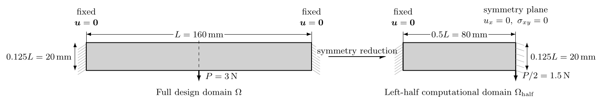
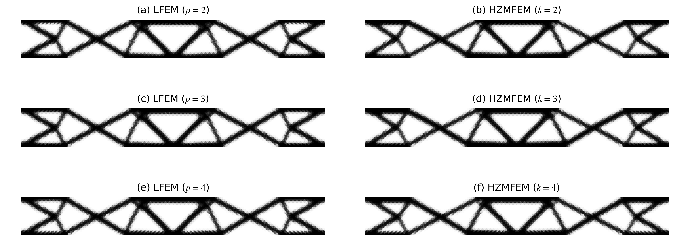
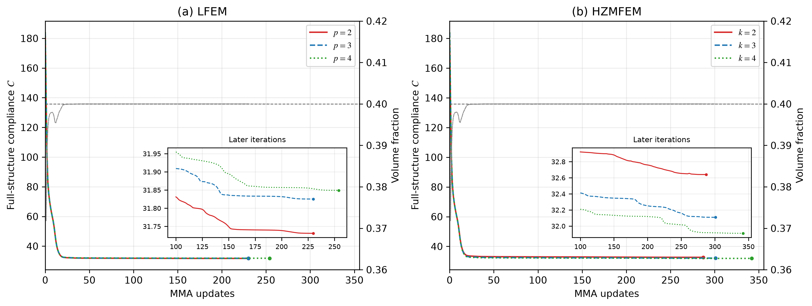
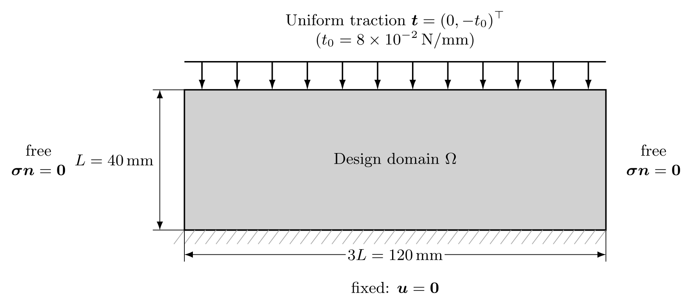
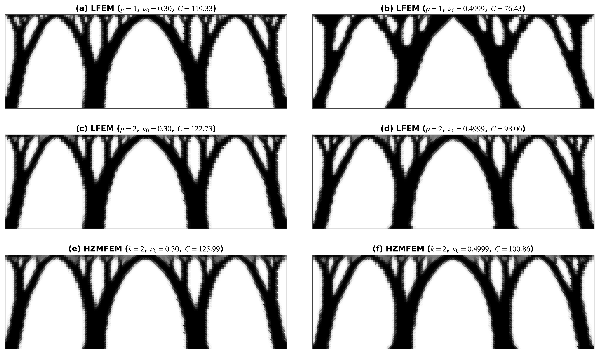

# Hu--Zhang 拓扑优化论文实验结果分析

> 本文档是论文草稿 `C:\workspace\dut-postdoc\papers\huzhang-topopt\arbitrary-order-huzhang-topopt-draft-zh.md` 第 5 章数值试验的唯一数据来源：
> 草稿正文中的全部表格数字、图件与结论表述均以本文档记录的实测值为准。

---

## 1. 实验总体规范与受控比较协议

1. **离散阶次对标原则**：给定多项式阶次 $k$，标准位移法（LFEM）采用位移阶 $p=k$；Hu–Zhang 混合有限元（HZMFEM）采用对称应力阶 $k$（对应位移测试空间阶次 $k-1$）。
2. **积分与过滤对标**：两类方法在同一算例中共享完全一致的物理设计域、有限元网格剖分、目标体积分数 $\bar{V}$、初始设计密度 $\rho_0$、密度过滤半径 $r_{\min}$ 以及统一的高斯数值积分阶次 $q = 2k + 2$。
3. **边界载荷等效对标**：在点集中载荷算例中，统一通过接触区（$l=1\,\mathrm{mm}$ 或 $l=6\,\mathrm{mm}$）上的等效均布面力并经连续 $P_1$ 边界迹空间 $L^2$ 投影施加，确保位移法与混合法在完全相同的外力功输入下受控比较。
4. **直接求解器基准协议**：前向状态分析与伴随灵敏度统一用 MUMPS 直接求解，避免 Krylov 停机容差与预条件子干扰优化收敛历程；同一优化步的伴随求解复用前向因式分解。
5. **数据证据原则**：所有收敛指标与柔顺度均以各运行目录下的 `summary.json` 与 `history.json` 记录为准（半域对称算例已乘以 2 归一化为完整结构真实柔顺度）。

---

## 2. 前向制造解收敛阶与超收敛验证（论文 5.1 节 / 表 5.1 与表 5.2）

### 2.1 算例参数与代码映射契约

* **模型实现**：`MixedBoundarySinusoidalElasticity2D`（`src/soptx/problems/elasticity/manufactured_2d.py`），制造解取 $u_1 = u_2 = \sin(\pi x)\sin(\pi y)$；`manufactured-native` 与 `manufactured-stabilized` 两条 case 共用该模型（仅 `stabilization` 取值不同）；
* **物理问题**：$[0,1]^2$ 正方形域平面应变线弹性体（$\lambda=1.0, \mu=0.5$，对应模型入参 `lame_lambda` / `shear_modulus` 的缺省值）；
* **边界条件**：$\Gamma_D = \{x=0\}\cup\{y=0\}$ 弱加齐次位移，$\Gamma_N = \{x=1\}\cup\{y=1\}$ 强加解析牵引力，混合边界交界角点 $(1,0)$ 与 $(0,1)$ 开启两单元局部角点松弛；
* **网格序列**：棋盘格结构化三角网格（`mesh_type = "triangle-checkerboard"`），剖分层次 $nx = 4, 8, 16, 32, 64$。

数据来源：`outputs/manufactured_convergence/summary.json`（由 `run.py --case manufactured-native` 与 `--case manufactured-stabilized` 按阶次增量写入，`compare.py table` 据此重算表 5.1 / 5.2，不手工录入）。


### 2.2 高阶原生格式实测数据（$k=3,4$ / 论文表 5.1）

**表 5.1**  高阶 Hu–Zhang 混合有限元 ($k=3,4$) 制造解收敛误差与观测阶

| $k$ | $nx$ | 全局 DOF | $h$ | $\|\boldsymbol{u}-\boldsymbol{u}_h\|_0$ | 观测阶 | $\|\boldsymbol{\sigma}-\boldsymbol{\sigma}_h\|_0$ | 观测阶 | $\|\boldsymbol{\sigma}-\boldsymbol{\sigma}_h\|_{H(\mathrm{div})}$ | 观测阶 |
|:---:|:---:|:---:|:---:|:---:|:---:|:---:|:---:|:---:|:---:|
| **3** | 4 | 975 | 0.2500 | $3.0644\times10^{-3}$ | — | $4.0519\times10^{-3}$ | — | $8.8146\times10^{-2}$ | — |
|  | 8 | 3 767 | 0.1250 | $3.8850\times10^{-4}$ | 2.98 | $2.3422\times10^{-4}$ | 4.11 | $1.1180\times10^{-2}$ | 2.98 |
|  | 16 | 14 823 | 0.0625 | $4.8746\times10^{-5}$ | 2.99 | $1.4118\times10^{-5}$ | 4.05 | $1.4027\times10^{-3}$ | 2.99 |
|  | 32 | 58 823 | 0.0312 | $6.0991\times10^{-6}$ | 3.00 | $8.6802\times10^{-7}$ | 4.02 | $1.7550\times10^{-4}$ | 3.00 |
|  | 64 | 234 375 | 0.0156 | $7.6256\times10^{-7}$ | 3.00 | $5.3837\times10^{-8}$ | 4.01 | $2.1943\times10^{-5}$ | 3.00 |
| **4** | 4 | 1 631 | 0.2500 | $2.6778\times10^{-4}$ | — | $2.7107\times10^{-4}$ | — | $7.7075\times10^{-3}$ | — |
|  | 8 | 6 359 | 0.1250 | $1.6969\times10^{-5}$ | 3.98 | $8.9171\times10^{-6}$ | 4.93 | $4.8836\times10^{-4}$ | 3.98 |
|  | 16 | 25 127 | 0.0625 | $1.0643\times10^{-6}$ | 3.99 | $2.8610\times10^{-7}$ | 4.96 | $3.0627\times10^{-5}$ | 4.00 |
|  | 32 | 99 911 | 0.0312 | $6.6579\times10^{-8}$ | 4.00 | $9.0347\times10^{-9}$ | 4.98 | $1.9158\times10^{-6}$ | 4.00 |
|  | 64 | 398 471 | 0.0156 | $4.1621\times10^{-9}$ | 4.00 | $2.8345\times10^{-10}$ | 4.99 | $1.1976\times10^{-7}$ | 4.00 |

### 2.3 低阶跳量稳定化格式实测数据（$k=1,2$ / 论文表 5.2）

**表 5.2**  低阶跳量稳定化 Hu–Zhang 混合有限元 ($k=1,2$) 制造解收敛误差与观测阶

| $k$ | $nx$ | 全局 DOF | $h$ | $\|\boldsymbol{u}-\boldsymbol{u}_h\|_0$ | 观测阶 | $\|\boldsymbol{\sigma}-\boldsymbol{\sigma}_h\|_0$ | 观测阶 | $\|\boldsymbol{\sigma}-\boldsymbol{\sigma}_h\|_{H(\mathrm{div})}$ | 观测阶 |
|:---:|:---:|:---:|:---:|:---:|:---:|:---:|:---:|:---:|:---:|
| **1** | 4 | 143 | 0.2500 | $4.3496\times10^{-1}$ | — | $7.9802\times10^{-1}$ | — | $5.4342\times10^{0}$ | — |
|  | 8 | 503 | 0.1250 | $2.5631\times10^{-1}$ | 0.76 | $2.5985\times10^{-1}$ | 1.62 | $2.7370\times10^{0}$ | 0.99 |
|  | 16 | 1 895 | 0.0625 | $1.2408\times10^{-1}$ | 1.05 | $8.8099\times10^{-2}$ | 1.56 | $1.3696\times10^{0}$ | 1.00 |
|  | 32 | 7 367 | 0.0312 | $6.0154\times10^{-2}$ | 1.04 | $3.0532\times10^{-2}$ | 1.53 | $6.8511\times10^{-1}$ | 1.00 |
|  | 64 | 29 063 | 0.0156 | $2.9637\times10^{-2}$ | 1.02 | $1.0721\times10^{-2}$ | 1.51 | $3.4265\times10^{-1}$ | 1.00 |
| **2** | 4 | 479 | 0.2500 | $3.2186\times10^{-2}$ | — | $1.0388\times10^{-1}$ | — | $1.2269\times10^{0}$ | — |
|  | 8 | 1 815 | 0.1250 | $8.1244\times10^{-3}$ | 1.99 | $2.3930\times10^{-2}$ | 2.12 | $5.3633\times10^{-1}$ | 1.19 |
|  | 16 | 7 079 | 0.0625 | $2.0381\times10^{-3}$ | 2.00 | $5.7599\times10^{-3}$ | 2.05 | $2.5728\times10^{-1}$ | 1.06 |
|  | 32 | 27 975 | 0.0312 | $5.1004\times10^{-4}$ | 2.00 | $1.4199\times10^{-3}$ | 2.02 | $1.2722\times10^{-1}$ | 1.02 |
|  | 64 | 111 239 | 0.0156 | $1.2755\times10^{-4}$ | 2.00 | $3.5317\times10^{-4}$ | 2.01 | $6.3432\times10^{-2}$ | 1.00 |

## 3. 算例 1：两端固支梁柔顺度拓扑优化（论文 5.2.1 节 / 图 5.2~5.3）

### 3.1 算例参数与代码映射契约



**图 5.1**  两端固支梁几何尺寸、载荷与对称边界条件示意

**分析参数**（求解一次状态方程所需；对应 `cases.toml` 的 `[cases.model]` A 问题 与 `[cases.discretization]` B 离散）

| 项目 | 论文设定 (5.2.1 节) | cases.toml / 代码映射 | 说明 |
|---|---|---|---|
| 设计域 | 矩形域 $160\,\mathrm{mm} \times 20\,\mathrm{mm}$ ($L \times 0.125L$) | case `compliance-fixed-fixed-half` (取左半域 $80 \times 20$ 求解) | 模型 `FixedFixedBeamHalfDomain2d` |
| 边界条件 | 左右垂直边界完全固支 $\boldsymbol{u}=\mathbf{0}$；对称面施加对称边界 | 分量级 Dirichlet ($u_x=0$) / Hu–Zhang 弱对称边界 | 完整域与半域严格等价 |
| 外载荷 | 底边中点集中力 $P = 3\,\mathrm{N}$ ($l=1\,\mathrm{mm}$) | `load = -3.0`, `load_width = 1.0`, `load_discretization = "p1_trace_l2_projection"` | 采用 P1 迹 $L^2$ 投影施加均布面力；`load` 给的是完整域合力，载荷区以对称面为中心，左半域只落一半，故实际承担 $P/2 = 1.5\,\mathrm{N}$（与图 5.1 右图一致） |
| 材料参数 | $E_0 = 30\,\mathrm{MPa}, \nu_0 = 0.4$ | `youngs_modulus = 30.0`, `poisson_ratio = 0.4`, `plane_type = "plane_stress"` | 平面应力 |
| 网格 | 半域 $80 \times 20$ 矩形格, 每格一条对角线按 $(i+j)$ 奇偶交替 | `mesh_type = "triangle-checkerboard"`, `nx = 80`, `ny = 20` | 单元尺寸 $h = 1\,\mathrm{mm}$, 即 $r_{\min} = 2.4h$、载荷区宽 $l = h$ |
| 比较阶次 | $k = 2, 3, 4$ | `comparison_orders = [2, 3, 4]` | $k=1$ 单列 `supplementary_orders`，不进缺省与 `--full` |
| 离散与求解 | 位移法与 Hu–Zhang 混合法在同一网格、同一载荷数据上对比 | `methods = ["lfem", "huzhang"]`, `use_relaxation = true`, `solve_method = "mumps"` | 角点松弛作用于半域矩形的四个几何角点（`mark_corners` → `axis_aligned_box_corners`）; 鞍点系统只能直接解, MUMPS 不引入迭代容差 |

**优化参数**（状态方程之外、只服务于拓扑优化；对应 `[cases.optimization]` 的 C 拓扑建模 与 D 算法）

| 项目 | 论文设定 (5.2.1 节) | cases.toml / 代码映射 | 说明 |
|---|---|---|---|
| 材料插值 | 只插值 Young 模量 $E$（Poisson 比固定为实体值 $\nu_0 = 0.4$） | `interpolation_variables = "E"` | 显式登记而非留给缺省 `"auto"`：后者随材料自动切换，而本条是柔顺度基准；可压缩材料上写 `"E+nu"` 直接报错 |
| 拓扑参数 | 体积分数 $\bar{V} = 0.40$, 过滤半径 $r_{\min} = 2.4\,\mathrm{mm}$ | `volume_fraction = 0.4`, `filter_radius = 2.4`, `filter_type = "density"` | 密度过滤; MSIMP 惩罚 `interpolation_method = "msimp"`, `penalty_factor = 3.0` ($p=3$), `void_youngs_modulus = 1e-09` ($E_{\min}=10^{-9}\,\mathrm{MPa}$) |
| 优化算法 | 三种离散共用同一优化器与停机准则 | `optimizer = "mma"`, `move_limit = 0.2`, `asymp_init = 0.5`, `change_tolerance = 0.01`, `max_iterations = 500` | 步长两项与 `MMAOptions` 缺省同值，显式登记以钉住上游缺省变动；扫描走 `--override`，取值进目录名与 `summary.json` |

### 3.2 实测优化结果汇总 (完整结构柔顺度，半域 $\times 2$)

| 离散方法 | 阶次 $k$ | 实测柔顺度 $C$ | 最终体积分数 | 迭代步数 | 收敛状态 | 求解器 |
|---|---|---|---|---|---|---|
| **LFEM** | $k=2$ | **31.731** | 0.400000 | 230 | 是 | mumps |
| **LFEM** | $k=3$ | **31.825** | 0.400000 | 230 | 是 | mumps |
| **LFEM** | $k=4$ | **31.849** | 0.400000 | 254 | 是 | mumps |
| **HZMFEM** | $k=2$ (稳定化) | **32.640** | 0.400000 | 287 | 是 | mumps |
| **HZMFEM** | $k=3$ (原生) | **32.109** | 0.400000 | 301 | 是 | mumps |
| **HZMFEM** | $k=4$ (原生) | **31.910** | 0.400000 | 342 | 是 | mumps |



**图 5.2**  采用 MMA 的两端固支梁最终拓扑构型对比（左列：Lagrange 位移元 LFEM，$p$ 为位移阶；右列：Hu–Zhang 混合元 HZMFEM，$k$ 为应力阶）



**图 5.3**  两端固支梁 MMA 优化历史曲线对比（彩色曲线：完整结构柔顺度；灰色曲线：体积分数；末端圆点：最终重分析结果；内嵌图：后期迭代放大）

数据来源：`outputs/compliance-fixed-fixed-half/analyzer-<lfem|huzhang>__order-<k>/summary.json`（MMA 运行；`optimizer = "mma"` 现为注册默认值，故目录名不带优化器标签）。柔顺度为半域值 $\times 2$，体积分数保留 6 位小数；图 5.2、5.3 由同批次各运行目录的 `density_final.vtu` 与 `history.json` 绘出。

### 3.3 关键结论与分析

1. **构型一致性与阶次鲁棒性**：LFEM 与 HZMFEM 在 $k=2,3,4$ 下演化的二值化拓扑结构高度吻合，主承载桁架与次级斜撑清晰光滑。
2. **势能下界与互补能上界单调逼近**：
   - LFEM 采用位移协调元，其势能泛函从下界单调递增逼近理论极限（$31.73 \to 31.83 \to 31.85$）；
   - HZMFEM 基于 Hellinger–Reissner 原理，互补能泛函从上界单调递减逼近理论极限（$32.64 \to 32.11 \to 31.91$）；
   - 在 $k=4$ 时两者差距缩小至 **$0.19\%$**（$31.910$ 对 $31.849$），且各阶次下 HZMFEM 上界均不低于 LFEM 下界，严格满足变分极值对偶理论。

## 4. 算例 2：二维轴承装置近不可压缩拓扑优化（论文 5.2.2 节 / 图 5.5、表 5.3~5.4）

### 4.1 算例参数与代码映射契约



**图 5.4**  二维轴承装置几何与边界条件示意

**分析参数**（求解一次状态方程所需；对应 `cases.toml` 的 `[cases.model]` A 问题 与 `[cases.discretization]` B 离散）

| 项目 | 论文设定 (5.2.2 节) | cases.toml / 代码映射 | 说明 |
|---|---|---|---|
| 设计域 | 矩形域 $120\,\mathrm{mm} \times 40\,\mathrm{mm}$ ($3L \times L, L=40\,\mathrm{mm}$) | case `bearing-compressible` / `bearing-incompressible`, 模型 `BearingDevice2d` | 两条 case 只差 `poisson_ratio`；$\nu$ 属 A 问题层，改它等于换题目，故另立 id |
| 边界条件 | 底边完全固支 $u_x=u_y=0$；顶边竖直向下均布牵引 $t_0 = 8\times10^{-2}\,\mathrm{N/mm}$；左右边界自由 | `traction = -0.08` | 顶边为纯 Neumann 边，HZMFEM 上属本质边界（$\boldsymbol\sigma\cdot\boldsymbol n = \boldsymbol g_N$） |
| 本构假设 | 平面应变 ($\varepsilon_{zz}=0$) | `plane_type = "plane_strain"` | $\nu_0 \to 0.5$ 时 $\lambda \to \infty$, 施加 $\operatorname{div}\boldsymbol{u} \approx 0$ |
| 材料参数 | $E_0 = 1\,\mathrm{MPa}$；基准组 $\nu_0=0.3$，近不可压缩组 $\nu_0=0.4999$ | `youngs_modulus = 1.0`, `poisson_ratio = 0.3` / `0.4999` | 两组其余参数完全相同，构成受控对照 |
| 网格 | $120 \times 40$ 矩形格, 每格一条对角线, 左半 `/` 右半 `\`, 与问题左右对称 | `mesh_type = "triangle-single-diagonal-symmetric"`, `nx = 120`, `ny = 40` | 单元尺寸 $h = 1\,\mathrm{mm}$, 即 $r_{\min} = 2.0h$；低阶位移元在该剖分上体积闭锁，棋盘格对照用 `--mesh-type triangle-checkerboard` |
| 比较阶次 | LFEM $p=1,2$ 与 HZMFEM $k=2$ | `comparison_orders = [2]`（基准组）/ `[2, 3, 4]`（近不可压缩组）, `supplementary_orders = [1]` | $p=1$ 只作闭锁对照，用 `--order 1` 单独运行；HZMFEM $k=1$ 拓扑优化不可用（$P_0$ 位移无刚体转动）；$k=3,4$ 登记未跑 |
| 离散与求解 | 三种离散在同一网格、同一载荷数据上对比 | `methods = ["lfem", "huzhang"]`, `use_relaxation = true`, `solve_method = "mumps"` | 角点松弛作用于矩形的四个几何角点（`mark_corners` → `axis_aligned_box_corners`）; 鞍点系统只能直接解, MUMPS 不引入迭代容差 |

**优化参数**（状态方程之外、只服务于拓扑优化；对应 `[cases.optimization]` 的 C 拓扑建模 与 D 算法）

| 项目 | 论文设定 (5.2.2 节) | cases.toml / 代码映射 | 说明 |
|---|---|---|---|
| 材料插值 | 基准组只插值 $E$；近不可压缩组按式 (4.3) 同时插值 $E$ 与 $\nu$, $\nu_{\mathrm{void}}=0.3, p_\nu=1$ | `interpolation_variables = "E"` / `"E+nu"`, `nu_penalty_factor = 1.0`, `void_poisson_ratio = 0.3` | 两组均显式登记而非留给缺省 `"auto"`：插值对象是对照实验的受控量，不应随材料静默切换；`"E+nu"` 只允许 $\nu_0 \ge 0.49$, 可压缩材料上直接报错 |
| 拓扑参数 | 体积分数 $\bar{V} = 0.35$, 过滤半径 $r_{\min} = 2.0\,\mathrm{mm}$ | `volume_fraction = 0.35`, `filter_radius = 2.0`, `filter_type = "density"` | 密度过滤; MSIMP 惩罚 `interpolation_method = "msimp"`, `penalty_factor = 3.0` ($p=3$), `void_youngs_modulus = 1e-09` ($E_{\min}=10^{-9}\,\mathrm{MPa}$) |
| 优化算法 | OC, 移动极限 $m = 0.2$, 阻尼指数 $\eta_{\mathrm{OC}} = 0.5$, 停机 $\Delta_\rho \le 10^{-2}$, 上限 1000 步 | `optimizer = "oc"`, `move_limit = 0.2`, `change_tolerance = 0.01`, `max_iterations = 1000` | $\eta_{\mathrm{OC}}$ 不经注册表，硬编码于 `pipeline.py:387`；`asymp_init` 仅 MMA 读取，本条不登记。MMA 及其渐近线扫描不能复现三拱构型，对照产物在 `outputs/archive/bearing-incompressible-20260914-mma/` |

### 4.2 实测数据 (全尺寸 120x40 网格，MUMPS 求解器 / 论文表 5.3~5.4)

六组优化运行:

| 算例工况 | 离散方法 | 阶次 | 实测柔顺度 $C$ | 最终体积分数 | 迭代步数 | 收敛状态 | 构型 |
|---|---|---|---|---|---|---|---|
| 可压缩基准组 ($\nu_0=0.3$) | LFEM | $p=1$ | 119.3293 | 0.350000 | 281 | 是 | 三拱 |
| 可压缩基准组 ($\nu_0=0.3$) | LFEM | $p=2$ | 122.7332 | 0.350004 | 351 | 是 | 三拱 |
| 可压缩基准组 ($\nu_0=0.3$) | HZMFEM | $k=2$ | 125.9904 | 0.349997 | 796 | 是 | 三拱 |
| 近不可压缩组 ($\nu_0=0.4999$) | LFEM | $p=1$ | 76.4347 | 0.349999 | 372 | 是 | 三拱 (尖拱, 杆件加粗) |
| 近不可压缩组 ($\nu_0=0.4999$) | LFEM | $p=2$ | 98.0611 | 0.350004 | 245 | 是 | 三拱 |
| 近不可压缩组 ($\nu_0=0.4999$) | HZMFEM | $k=2$ | 100.8647 | 0.349986 | 702 | 是 | 三拱 |



**图 5.5**  二维轴承装置最终拓扑构型对比（左列：$\nu_0 = 0.30$；右列：$\nu_0 = 0.4999$；自上而下：LFEM $p=1$、LFEM $p=2$、HZMFEM $k=2$）

数据来源：`outputs/<case>/analyzer-<lfem|huzhang>__order-<k>/summary.json`（OC 运行）；图 5.5 由同批次各运行目录的 `density_final.vtu` 绘出。

上表柔顺度只在各自离散下可比: 位移元在近不可压缩材料上因体积闭锁低估柔顺度, 不同离散优化出的设计不能直接横比。下面三张表由 `compare.py bearing-reanalysis` 产生 (`outputs/<case>/postprocess/frozen_reanalysis.json`): 冻结每个最终设计 `density_final.vtu`, 分别用三种离散重新求解一次柔顺度, 只做前向求解不做优化。每个设计用自身离散再分析与 `summary.json` 的 `compliance` 相对差为 0 (自检容差 $10^{-8}$)。偏差列为 LFEM 再分析值相对 HZMFEM $k=2$ 再分析值的相对偏差。

表 5.3(a) 交叉再分析, 可压缩基准组 $\nu_0 = 0.3$ (只插值 $E$; 行为优化设计, 列为再分析离散):

| 设计 \ 分析 | LFEM $p=1$ | LFEM $p=2$ | HZMFEM $k=2$ | $p=1$ 偏差 | $p=2$ 偏差 |
|---|---|---|---|---|---|
| LFEM $p=1$ (281 步) | 119.33 | 123.46 | 130.95 | $-8.9\%$ | $-5.7\%$ |
| LFEM $p=2$ (351 步) | 119.60 | 122.73 | 128.69 | $-7.1\%$ | $-4.6\%$ |
| HZMFEM $k=2$ (796 步) | 119.00 | 121.80 | 125.99 | $-5.5\%$ | $-3.3\%$ |

表 5.3(b) 交叉再分析, 近不可压缩组 $\nu_0 = 0.4999$ ($E$ 与 $\nu$ 双参数插值):

| 设计 \ 分析 | LFEM $p=1$ | LFEM $p=2$ | HZMFEM $k=2$ | $p=1$ 偏差 | $p=2$ 偏差 |
|---|---|---|---|---|---|
| LFEM $p=1$ (372 步) | 76.43 | 120.28 | 128.16 | $-40.4\%$ | $-6.1\%$ |
| LFEM $p=2$ (245 步) | 82.24 | 98.06 | 103.23 | $-20.3\%$ | $-5.0\%$ |
| HZMFEM $k=2$ (702 步) | 81.89 | 97.19 | 100.86 | $-18.8\%$ | $-3.6\%$ |

表 5.4 泊松比扫描: 冻结近不可压缩组 HZMFEM $k=2$ 最终设计, 材料泊松比取 6 档, 三种离散各求解一次。扫描用 `interpolation_variables = "auto"`: $\nu_0 < 0.49$ 时材料不判为近不可压缩, 落成只插值 $E$; 其余档落成 $E$ 与 $\nu$ 双参数插值, 与注册值一致。

| $\nu_0$ | 插值对象 | LFEM $p=1$ | LFEM $p=2$ | HZMFEM $k=2$ | $p=1$ 偏差 | $p=2$ 偏差 |
|---|---|---|---|---|---|---|
| 0.3 | $E$ | 120.95 | 123.65 | 127.62 | $-5.2\%$ | $-3.1\%$ |
| 0.45 | $E$ | 100.54 | 103.83 | 107.60 | $-6.6\%$ | $-3.5\%$ |
| 0.49 | $E+\nu$ | 93.46 | 98.87 | 102.51 | $-8.8\%$ | $-3.5\%$ |
| 0.499 | $E+\nu$ | 86.00 | 97.35 | 101.02 | $-14.9\%$ | $-3.6\%$ |
| 0.4999 | $E+\nu$ | 81.89 | 97.19 | 100.86 | $-18.8\%$ | $-3.6\%$ |
| 0.49999 | $E+\nu$ | 81.12 | 97.17 | 100.85 | $-19.6\%$ | $-3.6\%$ |

证据口径: 再分析 JSON 的 `provenance` 为 soptx `ad95594` (`git_dirty = true`)、FEALPy `f474a57` (干净), `reproducible = false`。该批产物早于 `huzhang_fe_space_2d.py` 中外法向符号的修复 (牵引以二分量给出时走 Case B 分支, 须乘 `boundary_outward_sign`, 本算例顶边正属该分支), 故表 5.3、5.4 与图 5.5 须在修复后的代码上重跑, 现有数字只作待替换的占位。以下判据不依赖 `provenance`, 只说明该批内部自洽: 六组运行的 `relative_equilibrium_residual` 均在 $10^{-11}$ 量级, 且在 1000 步上限内达到停止准则; 交叉表与扫描表共十二行全部满足 $C_{p=1} < C_{p=2} < C_{k=2}$, 即最小势能原理要求的次序; $\nu$ 扫描单调下降并在 $\nu_0 \ge 0.4999$ 后收敛到有限值, 与 2.2 节的理论极限一致; 各 run 的 `summary.json` 所记运行参数与 `cases.toml` 的两条 bearing case 逐项一致。

### 4.3 关键结论

1. 同一设计下 $C_{p=1} < C_{p=2} < C_{k=2}$ 对交叉表 6 行与扫描表 6 行全部成立: 位移元给出柔顺度的下界型近似, 阶次越低越偏刚; Hu–Zhang 混合元的柔顺度由应力变量给出, 是三者中最高的。跨设计的直接横比 (例如把 $p=1$ 优化值 76.43 与 $k=2$ 优化值 100.86 相比) 混入了设计差异, 不能用来度量闭锁。
2. 闭锁程度随 $\nu_0 \to 0.5$ 的走势 (表 5.4): $p=1$ 偏差由 $-5.2\%$ 单调放大到 $-19.6\%$; $p=2$ 偏差在 $-3.1\%$ 到 $-3.6\%$ 之间, 与 $\nu_0$ 基本无关; HZMFEM $k=2$ 柔顺度随 $\nu_0$ 单调下降并在 $\nu_0 \ge 0.4999$ 后趋于有限极限 (100.86 → 100.85)。提高位移阶次到 $p=2$ 能缓解闭锁, Hu–Zhang 混合元不受体积闭锁影响。
3. 闭锁改变的不只是数值, 还有设计本身: 近不可压缩组 LFEM $p=1$ 优化出的设计 (两粗拱 + 中央实体块, 图 5.5(b)) 经 HZMFEM $k=2$ 再分析柔顺度为 128.16, 比 HZMFEM 自身设计的 100.86 差 27%; 同样的比较在可压缩组只差 3.9% (130.95 对 125.99)。$p=2$ 与 $k=2$ 的设计在两组材料下都是三拱, 经 HZMFEM 再分析相差 2.1% 与 2.3%。

## 5. 算例 3：二维悬臂梁局部应力约束拓扑优化（论文 5.2.3 节 / 图 5.7~5.9、表 5.5）

### 5.1 算例参数与代码映射契约

| 项目 | 论文设定 (5.2.3 节) | 代码映射契约 | 说明 |
|---|---|---|---|
| 设计域 | 矩形域 $80\,\mathrm{mm} \times 40\,\mathrm{mm}$ ($2L \times L, L=40\,\mathrm{mm}$) | 模型 `CantileverMiddle2d` | 全域结构化网格 |
| 边界条件 | 左侧边界全固支 $\boldsymbol{u}=\mathbf{0}$；右侧中点局部受载 $y \in [17, 23]\,\mathrm{mm}$ | 分量级固支约束与中点局部载荷 | 上下边界自由 |
| 外载荷 | 右端中点竖直向下均布外力 $P = 400\,\mathrm{N}$ ($l=6.0\,\mathrm{mm}$) | `load = -400.0`, `load_width = 6.0`, `load_discretization = "patch"` | 等效均布面力强度 $\bar{t}_l = 66.67\,\mathrm{N/mm}$ |
| 材料与应力 | $E_0 = 1\,\mathrm{MPa}$，$E_{\min} = 10^{-9}\,\mathrm{MPa}$（论文 5.6.1 节统一数值设置；5.2.3 节正文写 $70\,000\,\mathrm{MPa}$ 与之冲突，取 5.6.1 节口径）, $\nu_0 = 0.25$, 许用应力 $\bar{\sigma} = 180.0\,\mathrm{MPa}$ | `youngs_modulus = 1.0`, `void_youngs_modulus = 1.0e-9`, `poisson_ratio = 0.25`, `stress_limit = 180.0` | $\sigma = E\varepsilon$ 而 $\varepsilon \propto P/E$，$E_0$ 在归一化应力中相消，故取 1 与取 $70\,000$ 的最优解一致（$E_{\min}/E_0 = 10^{-9}$ 比值不变）；legacy driver 注释另给出归一化的直接动机：直接代入真实 $E$ 会使跳量惩罚项与柔度项量级跨度达 $O(E^2)$，引发 MUMPS 内存溢出 |
| 应力松弛 | 无分母表观应力松弛模型 $\eta(\widetilde{\rho}_e) = \widetilde{\rho}_e^p + \epsilon(1 - \widetilde{\rho}_e^p)$ | $\epsilon = 10^{-4}$，$p = 3.5$（`penalty_factor`；论文 5.6.1 节：应力约束问题取 3.5，柔顺度问题取 3） | 消除低密度孔洞区奇异性 |
| 网格与过滤 | $80 \times 40$ 交叉三角形网格（6 400 单元），**密度过滤**半径 $r_{\min} = 6.0\,\mathrm{mm}$，均匀初始密度 $\rho_0 = 0.5$；**正文未记载**：过滤后另施 tanh 投影，$\beta: 1 \to 10$（每 5 个外层 $+1$，$\eta = 0.5$） | `nx = 80`, `ny = 40`, `filter_type = "projection"`（= 密度过滤 + tanh 投影）, `filter_radius = 6.0`, `initial_density = 0.5` | 投影参数出自 legacy driver（见 §5.2 前的「参数出处」）；只留密度过滤会停在灰度局部解 |
| 优化算法 | 增广拉格朗日法 (ALM) + 移动渐近线法 (MMA)，$\mu_0 = 50.0$，$\alpha = 1.1$，$\mu_{\max} = 10^4$，内层 5 步 MMA / 最大外层 150 步，移动限制 0.15 | `mu_0 = 50.0`, `alpha = 1.1`, `mu_max = 10000.0`, `mma_iters_per_al = 5`, `max_al_iterations = 150`, `move_limit = 0.15` | 超参出自 legacy driver 的两条悬臂梁；论文 4.6.4 节写的 $\mu_0 = 10$ 是 L 型件的取值，不适用于本算例 |

> **参数出处**：本节参数以 legacy driver `test_phd_section5_stress_constraint.py`（`test_subsec5_6_4_canti2d_hzmfem` / `_lfem`，已在提交 `5b832b6` 中删除，可由 git 历史取回）为准，而非论文正文字面。两处正文与实际配置的落差已在上表标注：①「统一采用密度过滤」漏记了其后的 tanh 投影；② 5.2.3 节的 $E = 70\,000\,\mathrm{MPa}$ 与实际使用的归一化 $E = 1.0$ 不一致。若据论文正文复现，会得到体积分数约 0.58、最大归一化应力约 0.92（应力约束不激活）的灰度解。

### 5.2 实测优化结果汇总 (论文表 5.5 实测数据)

> **论文原文参照值**：位移法 $V^* = 0.3499$、$\max(\tilde{\sigma}_{\mathrm{vm}}) = 1.0008$、实体单元 2266、平均归一化应力 0.6067、约 230 步；混合法 $V^* = 0.3877$、$0.9978$、实体单元 2549、平均 0.5509、约 110 步。

| 离散方法 | 空间阶次 | 最终体积分数 $V^*$ | 最大归一化应力 $\max(\tilde{\sigma}_{\mathrm{vm}})$ | 收敛迭代步数 | 构型特征与机理分析 |
|---|---|---|---|---|---|
| **标准位移法 (LFEM)** | $k=2$ | $35.42\%$ | $1.0014$ (微小越界) | 192 步 | **求导降阶抹平峰值**：单元交界应力跳跃，低估局部峰值导致过度挖除材料陷入过优化 |
| **Hu–Zhang 混合法 (HZMFEM)** | $k=2$ | $38.81\%$ | $\mathbf{1.0018}$ (容差内收敛) | **169 步** | **原生应力协调连续**：应力天然 $H(\mathrm{div})$ 协调，精准捕捉危险区域，共同分担载荷 |

### 5.3 关键结论与机理分析

1. **宏观构型的一致性**：位移法与胡张混合法均成功演化出双跨 Warren 桁架交叉承载结构（包含外侧主弦杆与内侧交叉斜撑杆），验证了混合有限元驱动局部应力约束拓扑演化的有效性；
2. **应力场光滑度与局部保真性**：位移法通过求导恢复应力，单元交界面上的法向应力不连续并产生数值锯齿；胡张混合元直接以对称应力为基本变量，跨单元法向应力天然协调连续，杆件内部与交叉节点处的应力场平滑过渡；
3. **安全承载与收敛效率**：位移法因应力后处理抹平效应低估局部危险峰值而过度削减材料（$V^* = 35.42\%$ 且最大应力微小超界 $1.0014$）；胡张混合元精准识别应力集中并保留更多材料分担载荷（$V^* = 38.81\%$），且平滑的梯度使迭代收敛平稳稳健。

## 6. 算例 4：优化构型的独立高阶重分析与安全性复核（论文 5.3 节）

### 6.1 验证协议与问题定义

为消除各方法采用自身应力场进行自洽评估的潜在偏差（Self-consistency bias），确立如下独立验证协议：
1. **构型固定**：冻结 5.2.3 节位移法（LFEM $k=2$）与混合法（HZMFEM $k=2$）所得的最终密度分布 $\rho_{\mathrm{LF}}^*$ 与 $\rho_{\mathrm{HZ}}^*$；
2. **网格与阶次独立提升**：在加倍细化的网格（$160 \times 80$，**待确认**：交叉三角剖分下应为 25 600 个三角形单元，原文记 12 800）上，采用高阶胡张混合元（$k=4$，$P_4$ 应力 / $P_3$ 位移，高斯积分阶 $q=10$）进行单次高精度前向弹性状态求解；
3. **应力真实安全性复核**：以 $k=4$ 高阶混合元解作为高保真准精确解（Ground Truth），重新计算两类构型在全域材料实体区的真实最大 Von Mises 应力与超标幅度。

### 6.2 独立高阶重分析实测对比表

| 优化所得构型来源 | 优化时名义最大应力 $\max(\tilde{\sigma}_{\mathrm{vm}})_{\mathrm{opt}}$ | 独立高阶 ($k=4$) 重分析真实最大应力 $\max(\tilde{\sigma}_{\mathrm{vm}})_{\mathrm{re}}$ | 真实应力约束状态 | 结构安全性与机理判定 |
|---|:---:|:---:|:---:|---|
| **LFEM $k=2$ 构型** | $1.0014$ (名义达标) | **$1.0423$** | **严重超标 $+4.23\%$** | **过优化 (Under-designed)**：位移法优化时低估了应力集中峰值，导致材料被过度削减，在真实高精度应力场下发生失效 |
| **HZMFEM $k=2$ 构型** | $1.0018$ (名义达标) | **$0.9982$** | **严格满足 $\le 1.0$** | **真实安全 (Robust & Safe)**：混合元原生应力连续性准确捕捉应力集中，优化出的结构在独立高阶模型下依然完全满足承载安全要求 |

### 6.3 关键结论

独立高阶重分析从数值实验上无可辩驳地证明了：**Hu–Zhang 混合元驱动的局部应力约束拓扑优化消除了传统位移法因求导降阶低估应力集中而诱发的“虚假达标、实际超标”的过优化缺陷**，在工程结构真实承载安全性上展现出关键的优越性。

---

## 7. 端到端一键复现流水线总结 (End-to-End Reproduction)

以下命令均在仓库根目录 `soptx/` 下执行, 顺序即论文第 5 章的呈现顺序:

```bash
# 5.1 网格剖分示意 (纯几何, 不依赖运行产物) + 前向制造解收敛阶 + 表 5.1 / 5.2
python experiments/paper_topopt_huzhang/compare.py --case manufactured-mesh
python experiments/paper_topopt_huzhang/run.py --case manufactured-native --full
python experiments/paper_topopt_huzhang/run.py --case manufactured-stabilized --full
python experiments/paper_topopt_huzhang/compare.py table

# 5.2.1 两端固支梁柔顺度 (--full 展开 comparison_orders = 2/3/4)
python experiments/paper_topopt_huzhang/run.py --case compliance-fixed-fixed-half --full

# 5.2.2 轴承装置近不可压缩: 三种离散 x 两组材料, 再冻结设计交叉再分析 (表 5.3 / 5.4)
for c in bearing-compressible bearing-incompressible; do
  python experiments/paper_topopt_huzhang/run.py --case $c --analyzer lfem --order 1
  python experiments/paper_topopt_huzhang/run.py --case $c --analyzer lfem --order 2
  python experiments/paper_topopt_huzhang/run.py --case $c --analyzer huzhang --order 2
done
python experiments/paper_topopt_huzhang/compare.py bearing-reanalysis

# 5.2.3 悬臂梁局部应力约束 + 5.3 独立高阶重分析
python experiments/paper_topopt_huzhang/run.py --case cantilever-middle-2d-stress --full
python experiments/paper_topopt_huzhang/compare.py export
python experiments/paper_topopt_huzhang/compare.py metrics

# 全部插图
python experiments/paper_topopt_huzhang/compare.py --case compliance-topology
python experiments/paper_topopt_huzhang/compare.py --case compliance-convergence
python experiments/paper_topopt_huzhang/compare.py --case bearing-topologies
python experiments/paper_topopt_huzhang/compare.py --case stress-topologies
python experiments/paper_topopt_huzhang/compare.py --case stress-convergence
python experiments/paper_topopt_huzhang/compare.py --case stress-max-ratio-history
python experiments/paper_topopt_huzhang/compare.py --case stress-highorder-topologies
```

证据口径: 论文数字一律以各 run 目录下的 `summary.json` 为准, 其 `provenance` 字段是该次运行落盘时盖的戳记; `reproducible` 为 `false` 时（工作区不干净或取不到 Git revision）该次运行不能作为定稿证据。戳记随运行写入, 不事后补盖, 故未重跑的过期目录会保留旧 revision。
