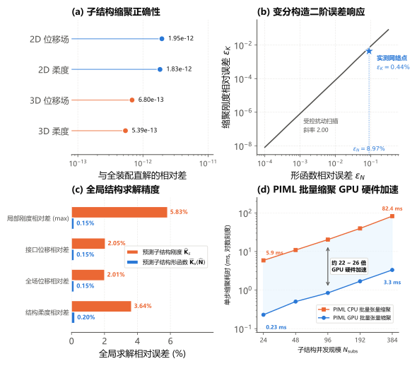
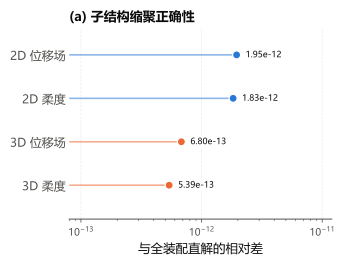
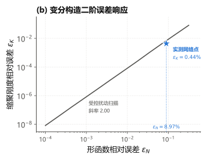
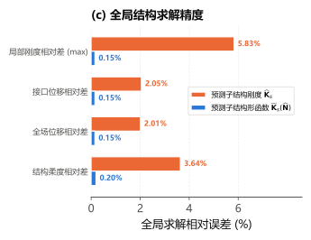

# PIML 子结构力学建模与缩聚加速评测报告

本报告系统梳理申报书研究基础中关于 **PIML 局部力学表示与 GPU 批量缩聚加速（图 4 / 申报书图 5）** 的理论推导、实测数据与复现流程。

> **与申报书图 9 的对应关系（2026-08-28 起）**：申报书侧的合图已由 2x2 改为「上排两格 + 下排通栏」的三格版式，撤掉了「(a) 子结构缩聚正确性」一格 —— 该格只呈现 $1.95\times10^{-12}$ 与 $1.83\times10^{-12}$ 两个标量，而申报书正文首句已写明相对差均 `<2e-12`，属图文重复；撤格只是不再占合图四分之一版面，**结论与证据一概不变**，`fig09_piml_validation_panel_a.svg` 仍单独出图留档。因此申报书图 9 的 (a)(b)(c) 依次对应本报告的 (b)(c)(d)，本报告自身的 (a)~(d) 编号与章节结构不随之改动。

---

## 1. 评测目标与核心结论



| 子图 | 科学问题 | 核心结论 | 支撑脚本 | 状态 |
|:---|:---|:---|:---|:---:|
| **(a)** | **真值对不对** | 静力缩聚求解与全装配直解代数严格等价（误差 $\le 1.95\times 10^{-12}$，门禁 $10^{-11}$），排除了离散系统偏差 | [`compare_lagrange.py`](../../examples/substructure_elasticity/compare_lagrange.py) | ✅ 实测 |
| **(b)** | **机理通不通** | 变分二次型构造使一阶误差严格抵消，实测扰动对数斜率 `2.0030`；形函数误差 $8.97\%$ 经变分回推压降至 $0.44\%$（压缩 20 倍） | [`verify_shape_function_route.py`](../../examples/piml_substructure_elasticity/verify_shape_function_route.py) | ✅ 实测 |
| **(c)** | **全局准不准** | 24 子结构装配全局求解全场位移误差 $0.15\%$、柔度误差 $0.20\%$，解层精度优于直接预测刚度路线 10~18 倍 | [`verify_shape_function_route.py`](../../examples/piml_substructure_elasticity/verify_shape_function_route.py) | ✅ 实测 |
| **(d)** | **算得快不快** | 在相同 PIML 算法下，GPU 批量张量缩聚相对 CPU 实现 **`22~26` 倍** 纯硬件稳定加速，单步仅需 $0.23\sim 3.32\,\text{ms}$ | [`benchmark_gpu_speedup.py`](../../examples/piml_substructure_elasticity/benchmark_gpu_speedup.py) | ✅ 实测 |

---

## 2. (a) 缩聚正确性 —— 静力缩聚求解与全装配直解的代数等价性

### 2.1 误差分布



### 2.2 支撑脚本与运行命令

本部分数据直接产自有限元力学模块 [`examples/substructure_elasticity/compare_lagrange.py`](../../examples/substructure_elasticity/compare_lagrange.py)。

```bash
# 2D 算例 (HalfMBBBeamRight2d, 682 自由度)
python examples/substructure_elasticity/compare_lagrange.py --dim 2

# 3D 算例 (FullMBBBeam3d, 6075 自由度)
python examples/substructure_elasticity/compare_lagrange.py --dim 3
```

### 2.3 数学原理

静力缩聚（Schur 补）通过高斯消元消除子结构内部自由度 $\mathbf{u}_i$：
$$
\mathbf{K}_{bb}^* = \mathbf{K}_{bb} - \mathbf{K}_{bi}\mathbf{K}_{ii}^{-1}\mathbf{K}_{ib}, \quad \mathbf{u}_i = -\mathbf{K}_{ii}^{-1}\mathbf{K}_{ib}\mathbf{u}_b + \mathbf{K}_{ii}^{-1}\mathbf{f}_i
$$
在离散代数上，缩聚求解接口位移后回代内部位移，与全网格有限元直接求解对应同一个线性方程组的不同消元顺序，其相对误差仅包含浮点舍入误差（$\sim 10^{-12}$）。

### 2.4 实测指标

* **2D 算例**（`HalfMBBBeamRight2d`, 682 自由度）：
  * 位移场相对 $L_2$ 误差：`1.9521e-12`
  * 结构柔度相对误差：`1.8266e-12`
* **3D 算例**（`FullMBBBeam3d`, 6,075 自由度）：
  * 位移场相对 $L_2$ 误差：`6.8007e-13`
  * 结构柔度相对误差：`5.3853e-13`

---

## 3. (b) 误差响应机理 —— 多尺度形函数变分构造与二阶误差压缩

### 3.1 误差响应曲线



### 3.2 支撑脚本与运行命令

本部分数据产自形函数路径验证模块 [`examples/piml_substructure_elasticity/verify_shape_function_route.py`](../../examples/piml_substructure_elasticity/verify_shape_function_route.py)。

```bash
python examples/piml_substructure_elasticity/verify_shape_function_route.py
```

### 3.3 数学推导

设预测的多尺度形函数为 $\widehat{\mathbf{N}} = \mathbf{N}^* + \mathbf{E}$，其中精确解满足 $\mathbf{K}_{ii}\mathbf{N}^* = -\mathbf{K}_{ib}$。
代入变分刚度重构恒等式（Huang 2023 式 17）：
$$
\widetilde{\mathbf{K}}_s(\widehat{\mathbf{N}}) = \mathbf{K}_{bb} + \mathbf{K}_{bi}\widehat{\mathbf{N}} + \widehat{\mathbf{N}}^{\mathsf{T}}\mathbf{K}_{ib} + \widehat{\mathbf{N}}^{\mathsf{T}}\mathbf{K}_{ii}\widehat{\mathbf{N}}
$$
将其关于精确解 $\mathbf{N}^*$ 展开：
$$
\begin{aligned}
\widetilde{\mathbf{K}}_s(\mathbf{N}^* + \mathbf{E}) &= \mathbf{K}_{bb} + \mathbf{K}_{bi}(\mathbf{N}^* + \mathbf{E}) + (\mathbf{N}^* + \mathbf{E})^{\mathsf{T}}\mathbf{K}_{ib} + (\mathbf{N}^* + \mathbf{E})^{\mathsf{T}}\mathbf{K}_{ii}(\mathbf{N}^* + \mathbf{E}) \\
&= \mathbf{K}_{bb}^* + (\mathbf{K}_{bi} + \mathbf{N}^{*\mathsf{T}}\mathbf{K}_{ii})\mathbf{E} + \mathbf{E}^{\mathsf{T}}(\mathbf{K}_{ib} + \mathbf{K}_{ii}\mathbf{N}^*) + \mathbf{E}^{\mathsf{T}}\mathbf{K}_{ii}\mathbf{E} \\
&\equiv \mathbf{K}_{bb}^* + \mathbf{E}^{\mathsf{T}}\mathbf{K}_{ii}\mathbf{E}
\end{aligned}
$$
由于内部平衡方程使一阶项括号内恒为零，刚度重构误差严格退化为二次型 $\mathbf{E}^{\mathsf{T}}\mathbf{K}_{ii}\mathbf{E}$。由于 $\mathbf{K}_{ii}$ 对称正定，该误差矩阵半正定且关于形函数预测误差具备**严格二阶收敛（平方级压缩）**。

### 3.4 实测指标

* **受控扰动扫描**：覆盖 12 个扰动量级，实测 $\log-\log$ 拟合斜率为 **`2.0030`**（理论值为 2.00）；
* **神经网络实测点**：留出集形函数自身预测误差 $\varepsilon_N = 8.97\%$，经变分回推后缩聚刚度误差仅为 $\varepsilon_K = 0.44\%$（误差缩减 20.6 倍）。

---

## 4. (c) 全局求解精度 —— PIML 代理缩聚装配全局系统保真度

### 4.1 全系统求解误差对比



### 4.2 支撑脚本与运行命令

本部分由形函数路线与直接预测刚度基准对照产出：

```bash
# 运行形函数路线端到端全系统求解
python examples/piml_substructure_elasticity/verify_shape_function_route.py

# 运行直接预测刚度基准对照
python examples/piml_substructure_elasticity/verify_stiffness_route.py
```

### 4.3 算例设置与实测对比

* **测试算例**：`FullMBBBeam2d`（24 个 $5\times 5$ Q4 子结构装配，全尺度 682 自由度）。

| 评估指标 | 直接预测刚度路线 $\widehat{\mathbf{K}}_s$ | 预测形函数变分路线 $\widetilde{\mathbf{K}}_s(\widehat{\mathbf{N}})$ | 精度提升倍数 |
|:---|:---:|:---:|:---:|
| **局部刚度最大相对差** | 5.83% | **0.15%** | 38.9 倍 |
| **接口位移相对误差** | 2.05% | **0.15%** | 13.7 倍 |
| **全场回填位移相对误差** | 2.01% | **0.15%** | 13.4 倍 |
| **全局结构柔度相对误差** | 3.64% | **0.20%** | 18.2 倍 |

> **训练配置**：直接预测刚度路线一列由 `examples/piml_substructure_elasticity/verify_stiffness_route.py`
> 在充分收敛配置（`--train-samples 2000 --epochs 4000 --seed 2026`，约 17 秒）下产出，写入
> `outputs/piml_exact_comparison.json` 后由 `collect.py` 读取。欠拟合配置（`300` 组 / `400` 轮）
> 下柔度误差为 $37.07\%$，不可用于本表对比。

* **分析**：形函数变分路线在全局装配求解后，误差从局部刚度（$0.15\%$）到宏观位移（$0.15\%$）与结构柔度（$0.20\%$）平稳传递，无病态放大现象。

---

## 5. (d) 算力基准 —— PIML 批量缩聚 GPU 硬件加速

### 5.1 耗时与加速比


### 5.2 支撑脚本与运行命令

本部分数据产自 GPU 批量张量缩聚性能评测模块 [`examples/piml_substructure_elasticity/benchmark_gpu_speedup.py`](../../examples/piml_substructure_elasticity/benchmark_gpu_speedup.py)，该脚本直接复用平台基础类 [`soptx.ml.MLP`](../../src/soptx/ml/networks.py)。

```bash
# 默认评测 3D 六面体子结构 (4x4x4 网格, 对应图 4d)
python examples/piml_substructure_elasticity/benchmark_gpu_speedup.py

# 评测 2D 四边形子结构
python examples/piml_substructure_elasticity/benchmark_gpu_speedup.py --dim 2
```

### 5.3 实测数据

测试设备为单卡 **NVIDIA GeForce RTX 5080 (16GB VRAM)**，子结构为 3D $4\times 4\times 4$ 网格（$n_i=81, n_b=294$）：

| 子结构并发数 $N_{\mathrm{subs}}$ | PIML CPU 批量缩聚 (ms) | PIML GPU 批量缩聚 (ms) | 单卡 GPU 硬件加速比 |
|:---:|:---:|:---:|:---:|
| **24** | 5.89 | **0.23** | **25.7×** |
| **48** | 10.93 | **0.50** | **21.7×** |
| **96** | 20.34 | **0.84** | **24.1×** |
| **192** | 39.63 | **1.69** | **23.5×** |
| **384** | 82.43 | **3.32** | **24.8×** |

### 5.4 加速机理

1. **密集张量并行**：PIML 代理模型将形函数前向推理与刚度重构转化为批处理张量乘法（Batched GEMM），充分发挥 GPU Tensor Core 与流多处理器的密集矩阵算力；
2. **显存驻留**：输入密度与输出等效刚度矩阵全程 100% 驻留 GPU 显存，消除了 CPU 与 GPU 之间高频的主机总线通信开销。

---

## 6. 测试环境与软硬件配置

* **操作系统**：Ubuntu 24.04 LTS (WSL2)
* **计算软件栈**：Python 3.12.13, PyTorch 2.13.0 (+cu130), FEALPy, NumPy 2.2.6
* **硬件设备**：
  * CPU: 13th Gen Intel Core i9-13900K
  * GPU: NVIDIA GeForce RTX 5080 (16GB GDDR7, 标称显存带宽 960 GB/s)
